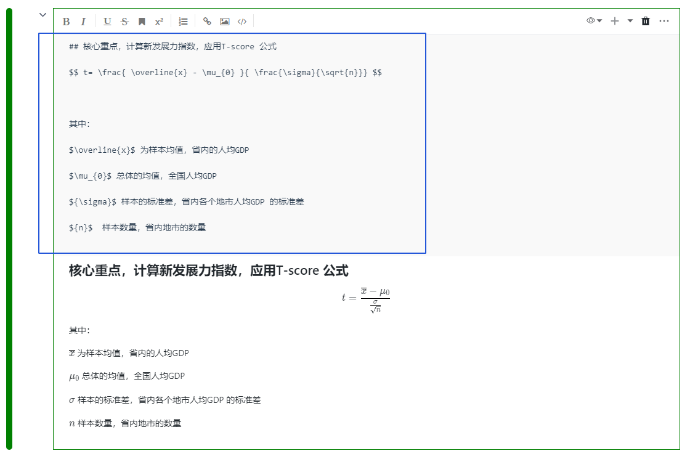

# 代码块（Cell）

在Notebook中，代码块是编写、运行、分享 `代码/图表/MarkDown` 的最小单元，代码块处于运行状态，会有标志。


目前代码块支持的类型有：

<b>Code类型：</b>

* `Python代码`
* `SQL代码`
* `MarkDown`

<b>Data Display：</b> 
* `Chart`：详见<a href="./Visualization.md" title="可视化">可视化组件</a>
* `Snb table`:详见<a href="./Visualization.md" title="可视化">可视化组件</a>
* `EDA分析`:详见<a href="./EDA.md" title="EDA组件">EDA组件</a>
* `EDA概览`:详见<a href="./EDA.md" title="EDA组件">EDA组件</a>

<b>Data Display：</b> 
* `数据透视表`:详见<a href="./DataTransform.md" title="数据透视表">数据透视表</a>


## 代码块的操作

* 执行代码
* 折叠/展开
  * input 折叠：折叠状态下只显示一行，或一行的高度内；状态切换
  * output 折叠：折叠状态下只显示一行，或一行的高度内；状态切换
* 新增cell
* 转换cell类型
* 删除cell
* 向上插入cell
* 向下插入cell
* 分享单元格输出
* 全屏/退出全屏
* 执行以上所有代码
* 代码自动补全
  * 引号补齐，包括单引号、双引号，英文半角下单双引号，`'`  --&gt; `''`    `"`--&gt; `""`
  * 三引号补齐，包括三单引号、三双引号，英文半角下三单双引号 `"""` -&gt;`""""""`   `'''`  --&gt; `''''''`
  * 文本选定，添加单双引号,选定文本输入单引号或双引号 ，文本添加双引号
  * 单行或多行注释快捷键
* SQL代码块类型下
  * 选择数据库
  * 变量名
* 代码块状态
* 代码框左侧颜色
* 鼠标处于代码框内右键操作
  * 剪切
  * 拷贝

## 代码块的状态

Cell的状态为两种：**编辑状态**、**命令状态** ，两者可以相互切换。

* 编辑状态：input 输入框处于编辑状态，焦点处于代码输入框中
* 命令状态：当前Cell 处于选定状态，焦点不位于input输入框中。
* 状态切换：
  * Enter 回车：命令状态 --转化为--&gt;编辑状态
  * ESC   取消：编辑状态--转化为--&gt;命令状态

> [!Tip]
> 可根据Cell代码块左侧颜色来判断Cell处于`编辑状态`还是`命令状态`。蓝色为`命令状态`，显示绿色为`编辑状态`。

## 代码块操作快捷键

* 删除当前CELL   连续按两次`d`键
* 插入Code单元格（在当前单元格前插入）`a`键
* 插入Code单元格（在当前单元格后插入）`b`键
* 单元格复制`c`键
* 单元格剪切`x`键
* 单元格黏贴`v`键   粘贴于当前选定的单元格下面

`注：快捷键只有"命令状态" 才有效`

## 代码块运行快捷键

* 运行当前单元格\(cell\) `Ctrl+Enter`
* 运行当前单元格\(cell\),并选定下面一个单元格  `Shift+Enter`
* 运行当前单元格\(cell\),并下面插入一个code 单元格\(code cell\)  `Alt+Enter`

`注：命令状态与编辑状态 都支持运行快捷键`

> [!Tip]
> 代码块操作的快捷键详见<a href="./Shortcuts.md" title="快捷键">快捷键</a>

## 上下键切换代码块

在当前选定的单元格是命令状态时，可以上下键切换单元格（移动选定的单元格），上键往上移动选定，直到最上面一个单元为止。下键往下移动选定单元格，直到最下面的单元格为止。

# Python代码

Python是Cell代码块默认的代码类型。用户可以在Python代码块中编辑和执行任何有效的Python。

## 创建Python代码块

增加Python代码块的两种方式：

* 直接单击代码块右上角的 `+` 号
* 鼠标移动到代码块的下方，当显示悬浮操作框时，单击`insert code cell`


## 运行Python代码块

* 编写Python代码
* 点击Cell左上角的运行按钮 开始执行代码，运行完毕后按钮右侧将显示运行时长
* 打印代码输出区域
* 折叠代码输入区域
* 行号
* 折叠打印输出区域

  

当代码存在错误，报错信息会打印在代码输出区域

  

# SQL代码

SmartNoteBook通过SQL代码块提供一流的SQL支持，每个SQL代码块都是一个完全成熟的查询IDE，具有自动补全、数据预览等功能。项目可以有无限数量的SQL代码块与MarkDown文本、代码、图表和各类可视化组件交错，从而创建非常灵活的查询环境。

## SQL代码块的特性/要点

在SmartNoteBook中使用SQL代码块会使数据查询变的非常便捷高效，区别于您之前所使用的SQL查询工具，使用SmartNoteBook编写SQL，有以下几个特性/要点需要您了解：

- SmartNoteBook中有两种类型的SQL查询：既可以通过连接远程数据库或数据仓库来运行SQL查询（DBSQL），也可以直接使用SQL查询DataFrame或.csv数据格式文件（DFSQL）。SmartNoteBook将两种方式融合，帮助您执行一些非常强大的工作流程。
  
- SQL查询数据库返回的结果可以作为DataFrame返回：默认情况下，SQL查询将整个结果集作为可在内存中操作的DataFrame类型返回。

- SQL查询可以“串联”在一起：后面执行的SQL查询可以引用NoteBook中之前已执行的SQL查询结果，就像我们写复杂SQL中包含许多CTE（公共表表达式） 一样。您可以使用这种方式将复杂SQL按照逻辑进行拆分，使整个查询过程更具可读性。

- SQL查询可以嵌入变量参数及流程控制参数：您可使用[Jinja2](http://docs.jinkan.org/docs/jinja2/templates.html)语法将NoteBook中其他代码部分定义或运行的值插入到当前的SQL查询中。这种机制可以帮助您自定义用户输入、将之前已运行的SQL或Python代码块输出作为查询条件进行参数化查询,并在SQL代码中加入流程控制（if...else.../for循环等等），从而构建由SQL提供的支持面向用户的复杂数据应用程序。


## 何时使用DBSQL或DFSQL？

如果查询数据库或数据仓库，则必须使用DBSQL。如果查询DataFrame的数据或.csv文件，则需使用DFSQL。

您可以通过组合DBSQL和DFSQL，以更流畅的方式构建复杂的数据处理流程，比如：

- 当你需要用Python对数据做一个中间处理：假设你刚运行完一个DBSQL查询，然后需要使用Python对某一列进行地理编码处理。这时你可以利用DFSQL对DataFrame进行SQL操作，此时数据其实已不在数据库表中。
  
- 如果需要从.csv文件查询数据。DFSQL可以直接对上传的文件运行查询，您只需`SELECT * FROM "文件名.csv"`
- 如果需要跨不同数据源连接数据。您可以运行两个DBSQL查询，一个针对MySQL连接，另一个针对Oracle连接，然后使用DFSQL查询将两个DataFrame进行连接。

> [!NOTE]
> DFSQL需要在内存中加载数据集，因此如果数据量非常大的情况下不建议使用。

## 创建SQL代码块

创建SQL代码块的两种方法：

* 鼠标移动到代码块的下方，当显示悬浮操作框时，单击`More cell types`，然后选择`SQL`。

  


* 直接单击代码块右上角的 `+` 号或者单元格下方的`Add Code Cell`，然后点击右上角的，选择`Convert to SQL`。


## SQL查询远程数据库/数据仓库（DBSQL)

* 选择已有数据源（连接数据源操作详见<a href="../WorkSpace/DataSource.md" title="数据源">数据源</a>）
* 填写结果集的名称 `结果将保存为DataFrame`
* 点击执行代码

经以上三个步骤，SQL查询远程数据库（DBSQL）的结果将保存在DataFrame中，可供后续代码操作和引用。


## SQL查询DataFrame（DFSQL）

通过SmartNoteBook的DFSQL功能，可以通过SQL操作DataFrame执行数据筛选、过滤、排序、统计汇总、转换、合并等数据处理过程。以下我们只介绍了一个使用DFSQL简单样例，关于DFSQL支持的操作可参考[SQLite3 Documentation](https://www.sqlite.org/docs.html)。


## 示例说明

```
lat =pd.read_excel('http://172.30.21.57/lat.xlsx')
lat.columns=['Province','d','d','lot','lat']
lat

import pandas as pd
gdp=pd.read_excel('http://172.30.21.57/gdpData.xlsx')
gdp['per_gdp']=gdp['GDP2020']/gdp['Population2020']
gdp

import numpy as np
df2['gdp_all_avg']=sum(df2['gdp_sum'])/sum(df2['popu_sum'])
df2['t_score']=(df2['gdp_avg']-df2['gdp_all_avg'])/(df2['gdp_std']/np.sqrt(df2['dist_count']))
df2['A']='all'
for c in ['gdp_sum','popu_sum','gdp_avg','gdp_std','gdp_all_avg','t_score']:
    df2[c]=round(df2[c],2)
df2

select Province,sum(GDP2020) as gdp_sum, sum(Population2020) as popu_sum,sum(GDP2020) / sum(Population2020) as gdp_avg,
count(distinct District) as dist_count,stddev(per_gdp) as gdp_std from gdp  group by Province

select Province,gdp_sum,popu_sum,gdp_avg,gdp_std,t_score as XL_Index,rank() over(partition by A order by gdp_sum desc) as gdp_rank ,
rank() over(partition by A order by popu_sum desc) as popu_rank ,rank() over(partition by A order by gdp_avg desc) as gdp_avg_rank ,
rank() over(partition by A order by t_score desc) as XL_Index_rank
from df2

select df3.*,lat.lat,lat.lot from df3,lat where df3.Province=lat.Province

```

## SQLTemplate

通过SmartNoteBook提供的SQLTemplate语法，可以实现对SQL语句替换变量，流程控制及动态拼接。以下我们只介绍SQLTemplate变量替换和流程控制的格式说明和简单样例，关于SQLTemplate的详细语法可参考[Jinja2 模板](http://docs.jinkan.org/docs/jinja2/templates.html)。

* 变量替换：
  ``` 
  {{VAR}}
  
  ```
* 判断：  
  ```
  
    ,{{a}}  
  
  
  ```

* 循环：
  ```
    
  , {{i}}
  
  
  ```

* 字典：  
  ```
  data ={"a":100,"b":200}  
  {{data.a}} 
  {{data.b}}
  
  ```

## 示例说明


```
Province='山东省'

df2=_smartnotebook_execute_dataframesql("""
select Province,sum(GDP2020) as gdp_sum, sum(Population2020) as popu_sum,sum(GDP2020) / sum
(Population2020) as gdp_avg,
count(distinct District) as dist_count,stddev(per_gdp) as gdp_std from gdp
where Province > "{{Province}}"
group by Province
""",context=globals())
df2

```

    

  ```
a=111
b=0
df_2 = _smartnotebook_execute_sql(""" select 1

,{{a}}

""", "861437dfd11e-11ed1944-cba5b0be-93b0", context=globals())
print(df_2)

```

```
a=111
b=0
list_1=[1,2,3,4]
df_2 = _smartnotebook_execute_sql("""    select 1

,{{a}}



, {{i}}


""", "861437dfd11e-11ed1944-cba5b0be-93b0", context=globals())
print(df_2)

```

```
data={"a":100,"b":200}
df_2 = _smartnotebook_execute_sql("""    select 1

,{{data.a}}
,{{data.b}}

""", "861437dfd11e-11ed1944-cba5b0be-93b0", context=globals())
print(df_2)

```

# Markdown

Markdown代码块，文本编辑单元，支持 Markdown 语法，可利用它编写数据分析报告、解释算法和模型的搭建过程。

## 创建MarkDown

创建MarkDown的两种方法：

* 鼠标移动到代码块的下方，当显示悬浮操作框时，单击`More cell types`，然后选择`MarkDown`。

  


* 直接单击代码块右上角的 `+` 号或者单元格下方的`Add Code Cell`，然后点击右上角的，选择`Convert to Markdown`。


## MarkDown的操作

* 编写MarkDown

Markdown 语法可参考此[Markdown基本语法](http://markdown.p2hp.com/basic-syntax/)。

* 执行代码块

MarkDown编写完成后无需执行，将鼠标移动至代码块以外即可保存和显示。


* 在MarkDown中插入图片

SmartNoteBook支持直接复制粘贴图片即可将图片插入MarkDown代码块。

* LaTeX数学公式

您可以使用Markdown中的`$`分隔符以LaTeX样式插入数学表达式。

- 行内公式 `$x`=`1$` 与文字混排

- 行间公式 `$$ x`=`1 $$` 独立成行

语法和样例可参考[LaTex中文手册](https://1024th.github.io/MathJax_Tutorial_CN/#/)。

  

## MarkDown快捷键操作

MarkDown操作的快捷键详见<a href="./Shortcuts.md" title="快捷键">快捷键</a>

