# 单元格（cell）概述
---

<!-- 单元格（cell）是编写、运行、分享 `代码/组件` 的核心单元。 -->

单元格(Cell)是核心编写、运行和分享代码/组件的单元，支持交互式数据探索和展示结果。

多功能的单元格(Cell)适用于数据科学家、研究人员和程序员，促进逐步开发和测试代码，并即时查看输出。

交互性的单元格(Cell)使团队协作、教学和分享工作成果更便捷，以模块化方式组织代码简化复杂任务，单元格(Cell)提供灵活、交互式、可视化的环境，助力代码开发、数据探索和文档编写。


## 输入/输出区域

- 输入区域用于编写代码和使用组件

- 输出区域用来显示代码或一些组件运行的结果

<!-- 
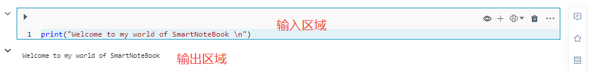  
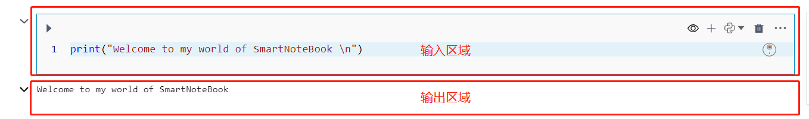   -->
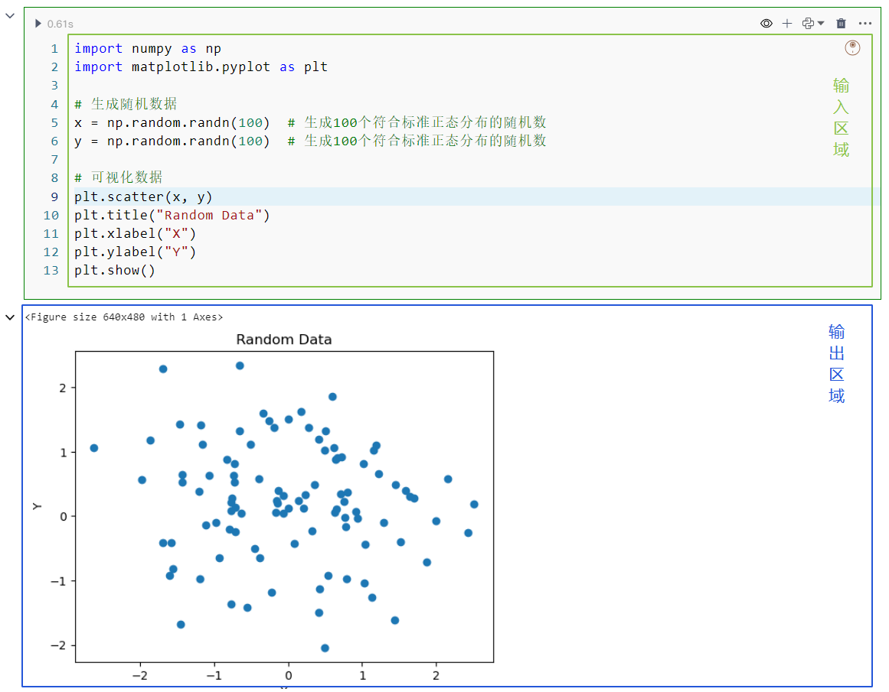  


## 单元格运行状态


- 未运行：执行按钮为小三角且左侧未显示行号

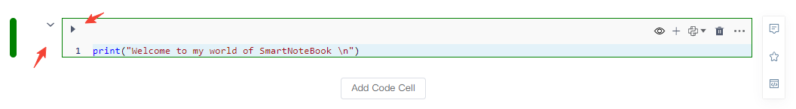  

- 正在运行：执行按钮变为黑色正方形且旁边显示加载中的图标


此时点击黑色正方形执行按钮会强制中断单元格的执行。

- 已运行：执行按钮为小三角，按钮旁显示运行时长，单元格的左上方显示执行序号(execution_count)

  

## 选中状态

单元格（cell）的选中状态有两种：

- `编辑状态`：单元格左侧显示绿色。此时焦点处于代码输入框中，输入框处于编辑状态。用于书写代码或配置低代码组件参数。

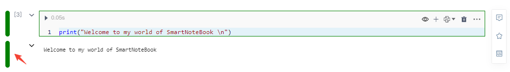  

- `命令状态`：单元格左侧显示蓝色。当前单元格处于选定状态，但焦点不位于输入框。用于单元格间的操作，比如利用快捷键快速插入新单元格。

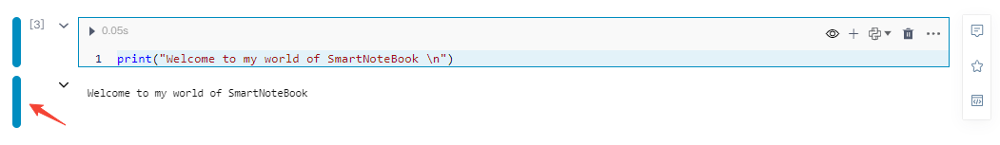  

 ## 选中状态的切换

 当使用鼠标点击单元格输入框的代码编辑区域时，单元格的选中状态变为`编辑状态`，除此之外，当点击单元格的其他区域单元格的选中状态都为`命令状态`。
 
 除使用鼠标点击来切换单元格的选中状态，也可以使用快捷键进行切换：

* `Enter 回车`：命令状态 --> 编辑状态
* `ESC   取消`：编辑状态 --> 命令状态
 
> [!Tip]
> 不同选中状态下有不同的快捷键。详见<a href="./Shortcuts.md" title="快捷键">快捷键</a>

## 单元格的类型

<b>Code：</b>

* `Python`：详见 <a href="./Python.md" title="Python单元格">Python单元格</a>
* `SQL`：详见 <a href="./SQL.md" title="SQL单元格">SQL单元格</a>
* `MarkDown`：详见 <a href="./Markdown.md" title="Markdown单元格">Markdown单元格</a>

<b>Data Display：</b> 
* `Chart`：详见 <a href="./Visualization.md" title="可视化">可视化组件</a>
* `Table`:详见 <a href="./Visualization.md" title="可视化">可视化组件</a>
* `EDA分析`:详见 <a href="./EDA.md" title="EDA组件">EDA组件</a>
* `EDA概览`:详见 <a href="./EDA.md" title="EDA组件">EDA组件</a>

<b>Data Transform：</b> 
* `数据透视表`:详见 <a href="./DataTransform.md" title="数据透视表">数据透视表</a>

<!-- <b>ChatGPT：</b> 
* `ChatGPT`:详见 <a href="./ChatGPT.md" title="ChatGPT">ChatGPT</a> -->


<!--    -->
  


## 单元格的操作一览

### 通用操作

| 图标 | 操作 | 解释 | 备注 |
| :-----| :-----| :---- | :---- | 
|    | 运行单元格| 运行代码或低代码组件 | |
|   | 输入输出显隐设置| 配置分享NoteBook页面单元格输入和输出区域的隐藏/显示 | |
|   | 下方新增单元格 | 在当前单元格下方新增默认类型为Python语言的单元格 |  |
|  | Python代码类型  | 显示当前单元格的代码类型 | 点击可选择转换为其他代码单元格类型 |
|   | 删除当前单元格 | 删除当前单元格 |  |
|  | AIGC功能 | AI辅助生成/编辑/修复/解释代码 |  |


<!-- | 代码补全| 代码自动补全 | 行2列2内容 | 见[代码自动补全](#code) | -->

### 更多操作

| 图标 | 操作 | 解释 | 备注 |
| :-----| :-----| :---- | :---- | 
|  | 向上插入单元格 | 在当前单元格上方新增默认类型为Python语言的单元格 | 命令状态下快捷键`A` |
|  | 向下插入单元格 | 在当前单元格下方新增默认类型为Python语言的单元格 | 命令状态下快捷键`B` |
|   | 剪切单元格 | 剪切当前单元格内容 |  命令状态下快捷键`X` |
|   | 复制单元格 | 复制当前单元格内容 | 命令状态下快捷键`C` |
|   | 粘贴单元格 | 内容粘贴至当前单元格 | 命令状态下快捷键`V` |
|   | 上移一格 | 将当前单元格上移一格 |  |
|   | 下移一格 | 将当前单元格下移一格 |  |
|   | 注册服务API（FASS) | 将当前单元格内容注册为API服务 | 此功能详见 <a href="../WorkSpace/FaasService.md" title="服务API">服务API</a> |
|   | 全屏显示 | 可将当前单元格全屏显示（专注模式） | 命令状态下快捷键`FF` |
|   | 拷贝出代码 | 拷贝出当前单元格的代码 | 该功能可以将低代码组件背后的代码拷贝出来，粘贴到 Python 单元格中运行，这个功能为用户提供了更多的自由度和灵活性。|

### 悬浮按钮

| 图标 | 操作 | 解释 | 备注 |
| :-----| :-----| :---- | :---- | 
|  | 评论 | 成员可对当前单元格评论 |此功能详见 <a href="./Comments.md" title="评论">评论</a>  | 
|  | 收藏 | 可收藏当前单元格内容 | 此功能详见 <a href="./Collections.md" title="代码收藏">代码收藏</a>  | 
|   | 分享单元格输出 | 分享当前单元格的输入内容，生成分享链接 | 此功能详见 <a href="./Share.md" title="分享">分享</a>  |

### SQL单元格

| 图标 | 操作 | 解释 | 备注 |
| :-----| :-----| :---- | :---- | 
|   | SQL代码类型  | 显示当前单元格的代码类型 | 点击可选择转换为其他代码单元格类型 |
| `数据源` | 数据源 | 选择数据库或选用dfSQL | |
| `链式输入` | 链式输入 | 使用链式SQL功能时将前面链式输出的变量作为本单元格的输入 |  |
| `链式输出` | 链式输出 | 使用链式SQL功能时将本单元格输出的变量作为后续单元格的输入 |  |
| `结果保存为` | 结果保存为 | 将SQL或dfSQL的查询结果保存为新的变量 |  |


### MarkDown单元格

| 图标 | 操作 | 解释 | 备注 |
| :-----| :-----| :---- | :---- | 
|  | MarkDown代码类型  | 显示当前单元格的代码类型 | 点击可选择转换为其他代码单元格类型 |
|   | 粗体 | **粗体** | MarkDown单元格类型下 |
|   | 斜体 | *斜体* | MarkDown单元格类型下 |
|   | 下划线 | <u>下划线</u>| MarkDown单元格类型下 |
| 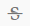  | 中划线 | ~~中划线~~ | MarkDown单元格类型下 |
|   | 标记 | <mark>标记</mark>| MarkDown单元格类型下 |
| 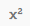  | 上角标 | 上角标<sup>2</sup>| MarkDown单元格类型下 |
|   | 有序列表 | 1. 第一项</br> 2. 第二项 </br>3. 第三项 </br>4. 第四项 | MarkDown单元格类型下 |
|   | 上传图片 |  | MarkDown单元格类型下 |
|   | 代码 | ```print(x)``` | MarkDown单元格类型下 |
  
<!-- |   | 链接 | / | MarkDown单元格类型下 | -->


### 折叠/伸展单元格

* input 折叠：折叠状态下只显示一行，或一行的高度内
* input 伸展：恢复input的自适应显示高度
* output 折叠：折叠状态下只显示一行，或一行的高度内
* output 折叠：恢复output的自适应显示高度

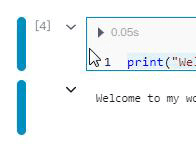 

### 全屏显示/退出全屏

<span id="show"></span>

点击单元格右上方的`更多`按钮，选择`全屏显示`，或在单元格为命令状态下按下快捷键`FF` ，可将当前单元格全屏显示。

在全屏模式下，可以正常执行或隐藏、转换单元格。点击右上角的切换按钮，可以将代码的输入输出框切换为`双栏/单栏`显示（双栏为水平布局、单栏为垂直布局）

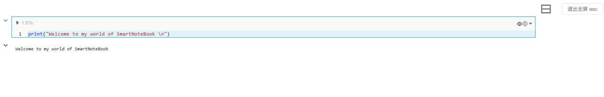  

点击右上角`退出全屏`将回到NoteBook文档页面


### 代码自动补全

<span id="code"></span>

  * 引号补齐，包括单引号、双引号，英文半角下单双引号，`'`  --&gt; `''`    `"`--&gt; `""`
  * 三引号补齐，包括三单引号、三双引号，英文半角下三单双引号 `"""` -&gt;`""""""`   `'''`  --&gt; `''''''`
  * 文本选定，添加单双引号,选定文本输入单引号或双引号 ，文本添加双引号
  * 单行或多行注释快捷键/取消注释快捷键，选中代码内容后按下`Ctrl`+`/`。

### 其他操作

- `添加单元格`:鼠标移动至单元格的下边界处显示该菜单，点击在下方增加一个默认类型的单元格
- `更多类型`：鼠标移动至单元格的下边界处显示该菜单，选择所需增加的单元格类型
- `Add Code Cell`：点击在下方增加一个默认类型的单元格

## 常用快捷键

* `Ctrl+Enter`：运行当前单元格 
* `Shift+Enter`：运行当前单元格,并选定下方单元格  
* `Alt+Enter`：运行当前单元格,并在下方插入一个 code 单元格 


以下快捷键只有"命令状态" 才有效`：

* `DD`：删除当前单元格 
* `A`：在当前单元格前插入一个单元格
* `B`：在当前单元格后插入一个单元格
* `C`：复制当前单元格的全部内容
* `X`：剪切当前单元格的全部内容
* `V`：粘贴全部内容

> [!Tip]
> NoteBook支持的全部快捷键详见 <a href="./Shortcuts.md" title="快捷键">快捷键</a>

## 魔法指令

<div style='display: none'> 内容待补充</div>

通过魔法指令（magic commands）可以增强SmartNoteBook的功能和灵活性。

以下是常用的一些魔法指令：

1.  %run：运行 Python 脚本
2.  %load：加载一个 Python 脚本
3.  %time：测试一个语句或函数的执行时间
4.  %matplotlib：集成 matplotlib 绘图库，实现 inline 绘图
5.  %pwd：显示当前工作目录
6.  %cd：更改当前工作目录
7.  %ls：显示当前目录下的文件和目录
8.  %who：显示当前命名空间中定义的变量
9.  %reset：清空当前命名空间中定义的变量
10.  %%timeit：测试一个语句或函数的平均执行时间

这些魔法指令只需要在NoteBook的代码单元格中输入，以百分号`%`或两个百分号`%%`开头即可。

- %：行魔法指令
- %%：单元格(cell）魔法指令

在输入魔法指令时，可以使用`?`查看更多帮助信息。例如，输入`%run?` 可以查看`%run`魔法指令的详细用法。

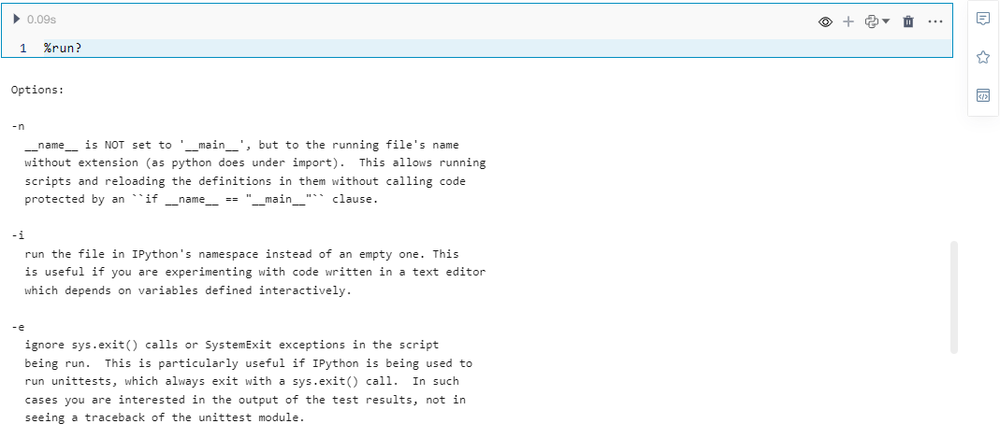  

> 更多的魔法指令可以参考[Useful Magic Commands](https://storage.googleapis.com/coderzcolumn/static/tutorials/python/pdf/Useful%20Magic%20Commands%20of%20Jupyter%20Notebooks.pdf)