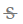
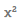

# 单元格/代码块（Cell）概述
---
在NoteBook中，单元格/代码块（Cell）是编写、运行、分享 `代码/低代码组件` 的最小单元，也是最核心单元。

## 输入/输出区域

- 输入区域用于书写代码、配置低代码组件等操作

- 输出区域显示执行结果

  

## 运行状态

单元格/代码块（Cell）运行有以下种状态:

- 未运行：执行按钮为小三角且左侧未显示行号

  

- 正在运行：执行按钮变为黑色正方形且旁边显示加载中的图标

此时点击黑色正方形执行按钮会强制中断代码块的执行。

- 已执行：执行按钮为小三角，按钮旁显示运行时长，代码块的左上方显示行号

  

## 选中状态

单元格/代码块（Cell）的选中状态有两种：

- `编辑状态`：单元格左侧显示绿色。此时焦点处于代码输入框中，输入框处于编辑状态。用于书写代码或配置低代码组件参数。

  

- `命令状态`：单元格左侧显示蓝色。当前单元格处于选定状态，但焦点不位于输入框。用于单元格间的操作，比如利用快捷键快速插入新单元格。

  

 ## 选中状态的切换

 当使用鼠标点击单元格输入框的代码编辑区域时，单元格的选中状态变为`编辑状态`，除此之外，当点击单元格的其他区域单元格的选中状态都为`命令状态`。
 
 除使用鼠标点击来切换单元格的选中状态，也可以使用快捷键进行切换：

* `Enter 回车`：命令状态 --> 编辑状态
* `ESC   取消`：编辑状态 --> 命令状态
 
> [!Tip]
> 不同选中状态下有不同的快捷键。详见<a href="./Shortcuts.md" title="快捷键">快捷键</a>

## 单元格的类型

<b>Code：</b>

* `Python代码`：详见 <a href="./Python.md" title="Python代码块">Python代码块</a>
* `SQL代码`：详见 <a href="./SQL.md" title="SQL代码块">SQL代码块</a>
* `MarkDown`：详见 <a href="./Markdown.md" title="Markdown代码块">Markdown代码块</a>

<b>Data Display：</b> 
* `Chart`：详见 <a href="./Visualization.md" title="可视化">可视化组件</a>
* `Snb table`:详见 <a href="./Visualization.md" title="可视化">可视化组件</a>
* `EDA分析`:详见 <a href="./EDA.md" title="EDA组件">EDA组件</a>
* `EDA概览`:详见 <a href="./EDA.md" title="EDA组件">EDA组件</a>

<b>Data Transform：</b> 
* `数据透视表`:详见 <a href="./DataTransform.md" title="数据透视表">数据透视表</a>

<!-- <b>ChatGPT：</b> 
* `ChatGPT`:详见 <a href="./ChatGPT.md" title="ChatGPT">ChatGPT</a> -->

<!--    -->
  

## 单元格的操作一览

| 图标 | 操作 | 解释 | 备注 |
| :-----| :-----| :---- | :---- | 
|    | 运行单元格| 运行代码或低代码组件 | |
|   | 输入输出显隐设置| 配置分享Notebook页面单元格输入和输出区域的隐藏/显示 | |
|   | 下方新增单元格 | 在当前单元格下方新增默认类型为Python语言的单元格 |  |
|  | 转换当前单元格类型  | 转换当前单元格类型为其他代码类型 |  |
|   | 删除当前单元格 | 删除当前单元格 |  |
|  更多| 向上插入单元格 | 在当前单元格上方新增默认类型为Python语言的单元格 | 命令状态下快捷键`A` |
|  更多| 向下插入单元格 | 在当前单元格下方新增默认类型为Python语言的单元格 | 命令状态下快捷键`B` |
|   更多| 剪切单元格 | 剪切当前单元格内容 |  命令状态下快捷键`X` |
|   更多| 复制单元格 | 复制当前单元格内容 | 命令状态下快捷键`C` |
|   更多| 粘贴单元格 | 内容粘贴至当前单元格 | 命令状态下快捷键`V` |
|   更多| 上移一格 | 将当前单元格上移一格 |  |
|  更多 | 下移一格 | 将当前单元格下移一格 |  |
|  更多 | 注册服务API（FASS) | 将当前单元格内容注册为API服务 | 此功能详见 <a href="../WorkSpace/FaasService.md" title="服务API">服务API</a> |
|   更多| 全屏显示 | 可将当前单元格全屏显示（专注模式） | 命令状态下快捷键`FF` |
|  | 评论 | 成员可对当前单元格评论 |此功能详见 <a href="./Comments.md" title="评论">评论</a>  | 
|  | 收藏 | 可收藏当前单元格内容 | 此功能详见 <a href="./Collections.md" title="代码收藏">代码收藏</a>  | 
|   | 分享单元格输出 | 分享当前单元格的输入内容，生成分享链接 | 此功能详见 <a href="./Share.md" title="分享">分享</a>  |
| 其他| 代码自动补全 | 行2列2内容 | 见[代码自动补全](#code) |
| `数据源` | 数据源 | 选择数据库或选用dfSQL | SQL代码块类型下 |
| `结果保存为` | 结果保存为 | 将SQL或dfSQL的查询结果保存为新的变量 | SQL代码块类型下 |
| 右键 |  剪切 | 剪切选中的内容 | 鼠标处于代码框内右键操作 |
| 右键 |  拷贝 | 拷贝选中的内容 | 鼠标处于代码框内右键操作 |
|   | 粗体 | / | MarkDown代码块类型下 |
|   | 斜体 |  | MarkDown代码块类型下 |
|   | 下划线 | / | MarkDown代码块类型下 |
|   | 中划线 | / | MarkDown代码块类型下 |
|   | 标记 | / | MarkDown代码块类型下 |
|   | 上角标 | / | MarkDown代码块类型下 |
|   | 有序列表 | / | MarkDown代码块类型下 |
|   | 链接 | / | MarkDown代码块类型下 |
|   | 上传图片 | / | MarkDown代码块类型下 |
|   | 代码块 | / | MarkDown代码块类型下 |

### 折叠/伸展单元格

* input 折叠：折叠状态下只显示一行，或一行的高度内
* input 伸展：恢复input的自适应显示高度
* output 折叠：折叠状态下只显示一行，或一行的高度内
* output 折叠：恢复output的自适应显示高度

 

### 全屏显示/退出全屏

点击单元格右上方的`更多`按钮，选择`全屏显示`，或在单元格为命令状态下按下快捷键`FF` ，可将当前单元格全屏显示。

在全屏模式下，可以正常执行或隐藏、转换代码块。点击右上角的切换按钮，可以将代码的输入输出框切换为`双栏/单栏`显示

  

点击右上角`退出全屏`将回到Notebook文档页面

### 代码自动补全

  * 引号补齐，包括单引号、双引号，英文半角下单双引号，`'`  --&gt; `''`    `"`--&gt; `""`
  * 三引号补齐，包括三单引号、三双引号，英文半角下三单双引号 `"""` -&gt;`""""""`   `'''`  --&gt; `''''''`
  * 文本选定，添加单双引号,选定文本输入单引号或双引号 ，文本添加双引号
  * 单行或多行注释快捷键

### 其他操作

- `添加单元格`:鼠标移动至单元格的下边界处显示该菜单，点击在下方增加一个默认类型的单元格
- `更多类型`：鼠标移动至单元格的下边界处显示该菜单，选择所需增加的单元格类型
- `Add Code Cell`：点击在下方增加一个默认类型的单元格

## 常用快捷键

* `Ctrl+Enter`：运行当前单元格 
* `Shift+Enter`：运行当前单元格,并选定下方单元格  
* `Alt+Enter`：运行当前单元格,并在下方插入一个单元格 

以下快捷键只有"命令状态" 才有效`：

* `DD`：删除当前单元格 
* `A`：在当前单元格前插入一个单元格
* `B`：在当前单元格后插入一个单元格
* `C`：复制当前单元格的全部内容
* `X`：剪切当前单元格的全部内容
* `V`：粘贴全部内容

> [!Tip]
> Notebook支持的全部快捷键详见 <a href="./Shortcuts.md" title="快捷键">快捷键</a>

## 魔法指令

 内容待补充

通过魔法指令（magic commands）可以增强SmartNoteBook的功能和灵活性。

以下是常用的一些魔法指令：

1.  %run：运行 Python 脚本
2.  %load：加载一个 Python 脚本
3.  %time：测试一个语句或函数的执行时间
4.  %matplotlib：集成 matplotlib 绘图库，实现 inline 绘图
5.  %pwd：显示当前工作目录
6.  %cd：更改当前工作目录
7.  %ls：显示当前目录下的文件和目录
8.  %who：显示当前命名空间中定义的变量
9.  %reset：清空当前命名空间中定义的变量
10.  %%timeit：测试一个语句或函数的平均执行时间

这些魔法指令只需要在Notebook的代码单元格中输入，以百分号`%`或两个百分号`%%`开头即可。

在输入魔法指令时，可以使用`?`查看更多帮助信息。例如，输入`%run?` 可以查看`%run`魔法指令的详细用法。

  

> 更多的魔法指令可以参考这份文档[Useful Magic Commands](https://storage.googleapis.com/coderzcolumn/static/tutorials/python/pdf/Useful%20Magic%20Commands%20of%20Jupyter%20Notebooks.pdf)。