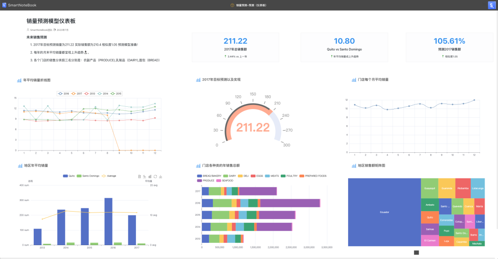
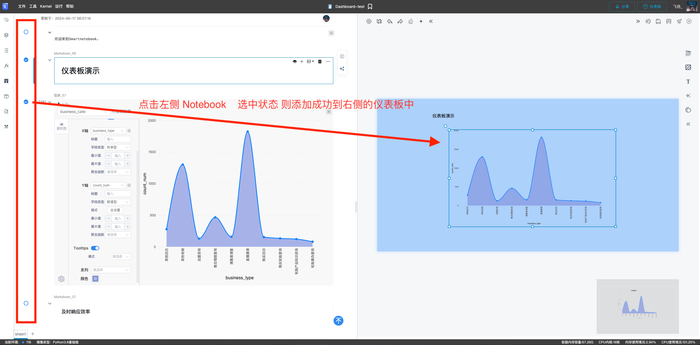
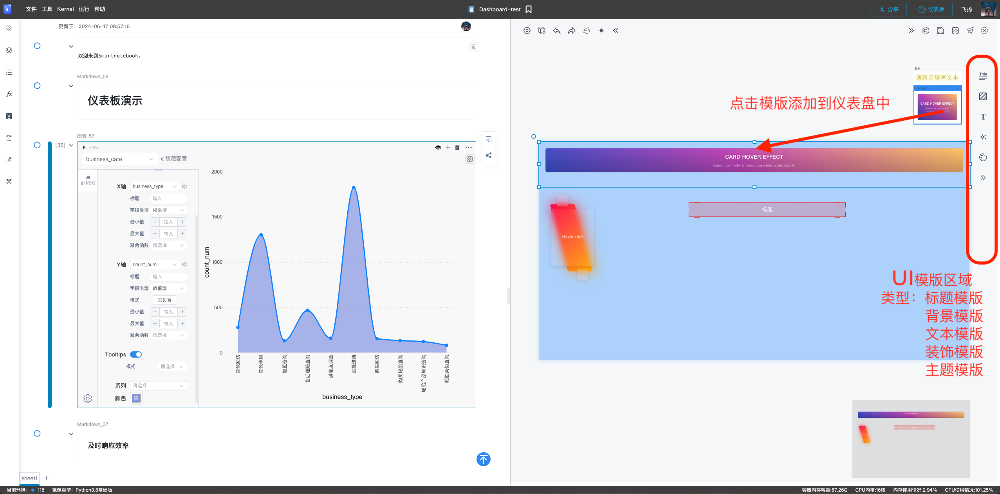
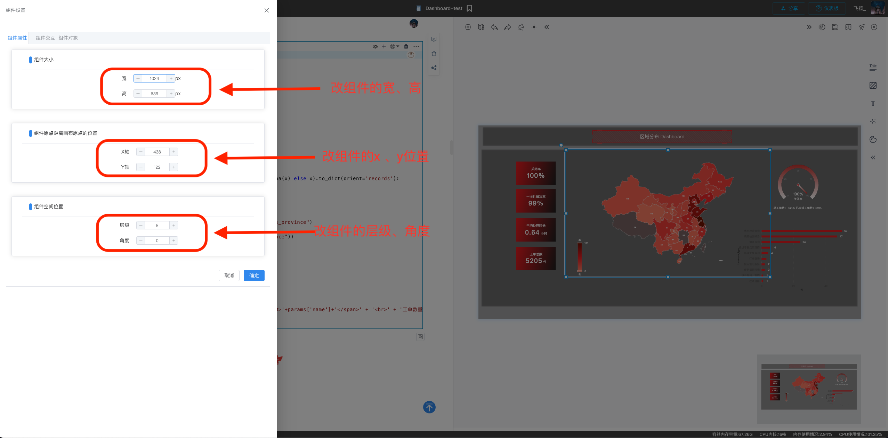
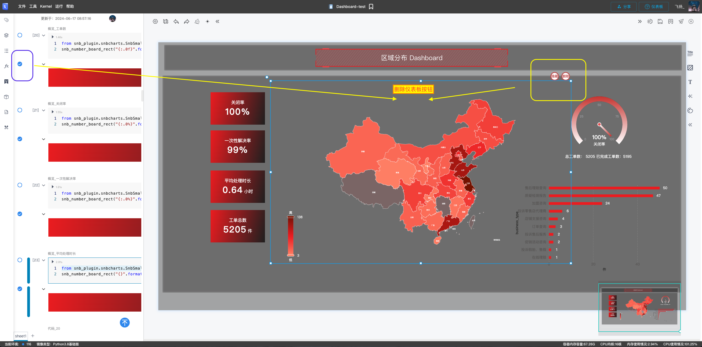

# 基础仪表板配置
---

基础仪表板的配置方案：

  

## 配置仪表板步骤：

- 新增仪表板单元 （包括Notebook基础单元格(输入，输出)、UI模版）
- 编辑仪表板单元的基础属性（在相对仪表板左上顶点的x、y轴位置、单元的宽、高、层级基础属性）
- 编辑仪表板单元 （x、y、宽、高、层级）
- 删除仪表板单元
- 预览仪表板
- 保存仪表板
- 发布仪表板

---

## 添加仪表板单元（包括Notebook基础单元格(输入，输出)、UI模版）
### 添加Notebook基础单元格到仪表板
  点击Notebook左侧的选中框、Notebook的选中的输入和输出会自动排版到仪表盘中。
 

  演示示例：
 

### 添加UI模版到仪表板
  点击仪表盘左侧的模版区域，添加UI模版到仪表盘中。
  UI模版类型：标题模版、背景模版、文本模版、装饰模版、主题模版。模版定义请跳转
  <a href="/WorkSpace/DashboardTemplates.md#jump_1">模版定义</a>
 

  演示示例：
 

---

## 编辑仪表板单元的基础属性（在相对仪表板左上顶点的x、y轴位置、单元的宽、高、层级基础属性）
 双击仪表板上需要编辑的单元、右侧弹出抽屉可以修改单元格基础属性（宽高、位置、层级等）
 同时也支持鼠标操作： 
    改变
<宽、高>
: 鼠标移入要修改的单元，拖动线框矩形柄则完成相对应的编辑操作。 
    改变
<位置>
: 鼠标移入要修改的单元，鼠标右击不放，移动鼠标则完成相对应的移动操作。

 

 演示示例
 
---

## 删除仪表板单元
  删除如下图： 
    a:鼠标移入要删除的单元，点击单元右上角的删除按钮。 
    b:点击Notebook 选中按钮，则也会删除右侧的单元。 
 

---
## 预览

设计完成后，可以先点击  查看效果。

  

## 发布/更新发布

点击 可以发布正式的仪表板链接。

用户可以直接通过打开链接在网络浏览器中实时查看和互动这个仪表板。此外，这个链接也可以轻松地嵌入到其他应用程序中，为您的业务流程提供即时的数据洞察。如果需要，您也可以将此链接投射到大屏幕上，以便在团队会议或演示中展示数据。这种多元化的展示方式为数据分析带来前所未有的灵活性和方便性，让您可以随时随地获取到最新、最准确的业务洞察。

每当您对仪表板进行更改时，您的仪表板都不会自动重新发布。您需要在更改完之后重新保存并 “更新发布”。

> [!NOTE]
> 已发布的仪表板的 URL 在更新发布后保持不变，因此您不必担心重新共享或在应用中修改URL的问题。

## 以上就是设计/保存/发布基本仪表板的演示流程。更高级的交互请点击<a href="xxx">更多高级设置</a>

