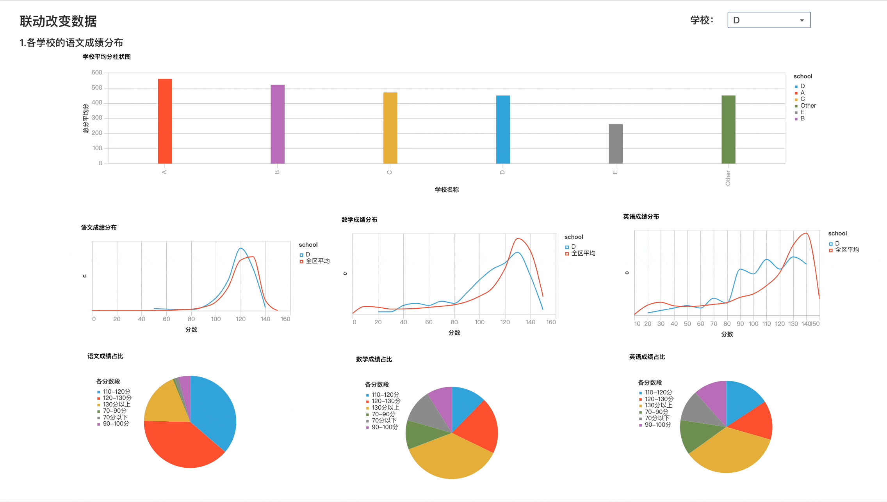
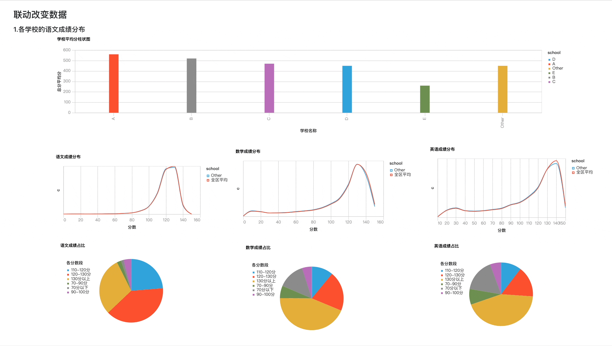

# 高级交互仪表板配置

---

仪表板（Dashboard）允许用户快速轻松地将逻辑视图中的元素组合成任何人都可以使用的交互式、美观的 Web 应用程序。通过提供直观的图形化界面，仪表板能够展示和解析大量数据，将复杂的数据集转化为易于理解的图表和图形。这使得业务决策者能够迅速掌握数据，并据此做出明智的决策。

通过仪表板，我们可以将原始数据转化为可行的见解和战略成果，从而提升决策过程。

除了定期展示数据外，仪表板还可以满足更高级的交互需求：

## 更高级的交互需求

### 条件筛选与时间范围动态展示
**条件筛选与时间范围动态展示**：例如，通过设置条件筛选和时间范围，可以动态展示数据的变化规律。
<video tabindex="0" controls class="video-stream html5-main-video" webkit-playsinline="" playsinline="" controlslist="nodownload" style="width: 1200px; height: 800px; left: 0px; top: 0px;">
  <source src="../assets/dashboard/202406201158.mp4" type="video/mp4">
  Your browser does not support the video tag.
</video>

### 图表联动
**图表联动**：例如，点击地图的某区域，根据该区域条件联动其他相应的图表，展示在特定条件下的数据变化。
   
<video tabindex="0" controls class="video-stream html5-main-video" webkit-playsinline="" playsinline="" controlslist="nodownload" style="width: 1200px; height: 800px; left: 0px; top: 0px;">
  <source src="../assets/dashboard/2024062011581.mp4" type="video/mp4">
  Your browser does not support the video tag.
</video>

### 条件跳转
**条件跳转**：例如，点击图表后，根据设定的过滤条件跳转到不同的仪表板页面，以展示更加详细的数据和分析。
   
   1. **点击图表跳转**
    <video tabindex="0" controls class="video-stream html5-main-video" webkit-playsinline="" playsinline="" controlslist="nodownload" style="width: 1200px; height: 800px; left: 0px; top: 0px;">
      <source src="../assets/dashboard/2024062011582.mp4" type="video/mp4">
      Your browser does not support the video tag.
    </video>

   2. **点击按钮跳转**
  
      

## 条件筛选
- 1.把互动组件添加到 左侧的仪表板中。
- 2.双击要关联互动的单元格。
- 3.弹出右侧抽屉，点击组件交互
- 4.设置关联互动单元格：引用互动组件（引用其它组件的全局变量）；执行单元格（改变当前组件的值，需要执行的单元格）
- 5.保存并预览
- 6.发布
  
   <video tabindex="0" controls class="video-stream html5-main-video" webkit-playsinline="" playsinline="" controlslist="nodownload" style="width: 1200px; height: 800px; left: 0px; top: 0px;">
      <source src="../assets/dashboard/2024062011585.mp4" type="video/mp4">
      Your browser does not support the video tag.
    </video>

> [!NOTE]
> 请注意，每个互动组件都关联全局唯一一个python的全局变量。仪表板中互动组件关联的单元格必须有引用该变量，如果没引用即使刷新该组件数据也不起效果。

------------------

## 日期筛选和交互组件联合查询
- 1.把互动组件都添加到 左侧的仪表板中。
- 2.双击要设置关联互动的单元格。
- 3.弹出右侧抽屉，点击组件交互
- 4.设置关联互动单元格：引用互动组件（引用其它组件的全局变量）；执行单元格（改变当前组件的值，需要执行的单元格）
- 5.保存并预览
- 6.发布
  
   <video tabindex="0" controls class="video-stream html5-main-video" webkit-playsinline="" playsinline="" controlslist="nodownload" style="width: 1200px; height: 800px; left: 0px; top: 0px;">
      <source src="../assets/dashboard/2024062011586.mp4" type="video/mp4">
      Your browser does not support the video tag.
    </video>

> [!NOTE]
> 请注意，每个互动组件都关联全局唯一一个python的全局变量。仪表板中互动组件关联的单元格必须有引用该变量，如果没引用即使刷新该组件数据也不起效果。

## 当前仪表板图标联动
  交互组件联合查询我们上面图例已经介绍了，如下示例：
    

  当我们需要点击图表，达到我们选择筛选组件的效果：如下图
   

- 1.把互动组件都添加到 左侧的仪表板中。
- 2.双击要设置关联互动的单元格。
- 3.弹出右侧抽屉，点击组件交互
- 4.设置《图表单击关联互动单元格》
- 5.保存并预览
- 6.发布  
<video tabindex="0" controls class="video-stream html5-main-video" webkit-playsinline="" playsinline="" controlslist="nodownload" style="width: 1200px; height: 800px; left: 0px; top: 0px;">
  <source src="../assets/dashboard/20240620115899.mp4" type="video/mp4">
    Your browser does not support the video tag.
</video> 

