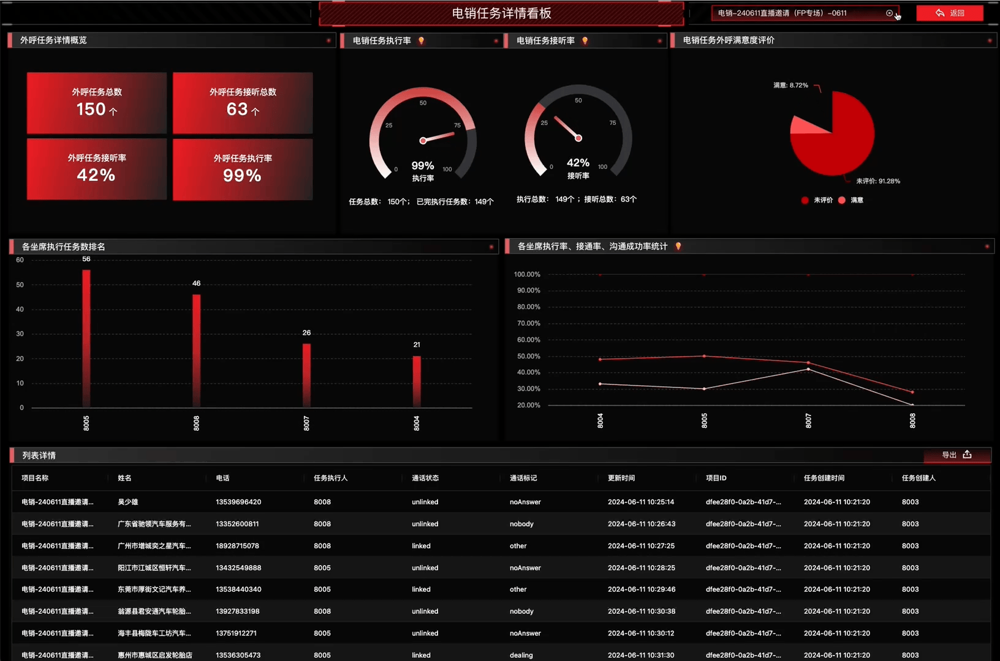
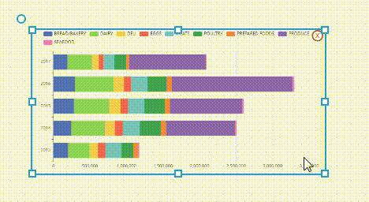
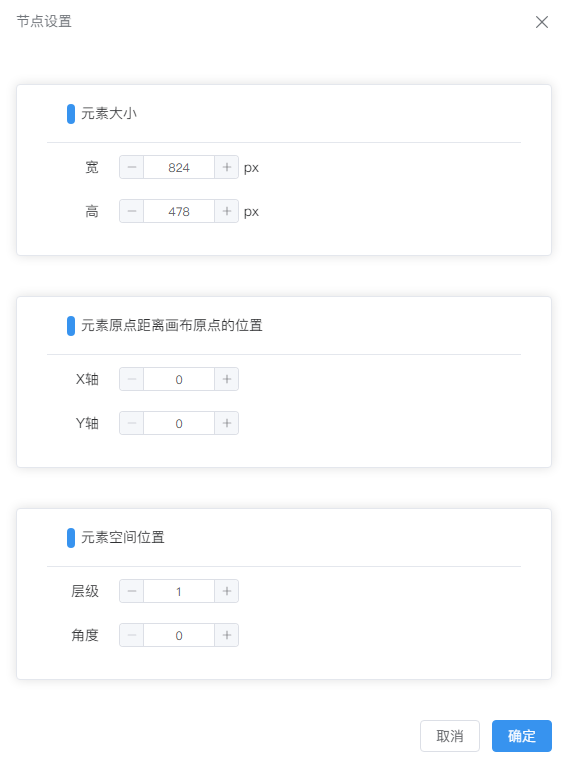
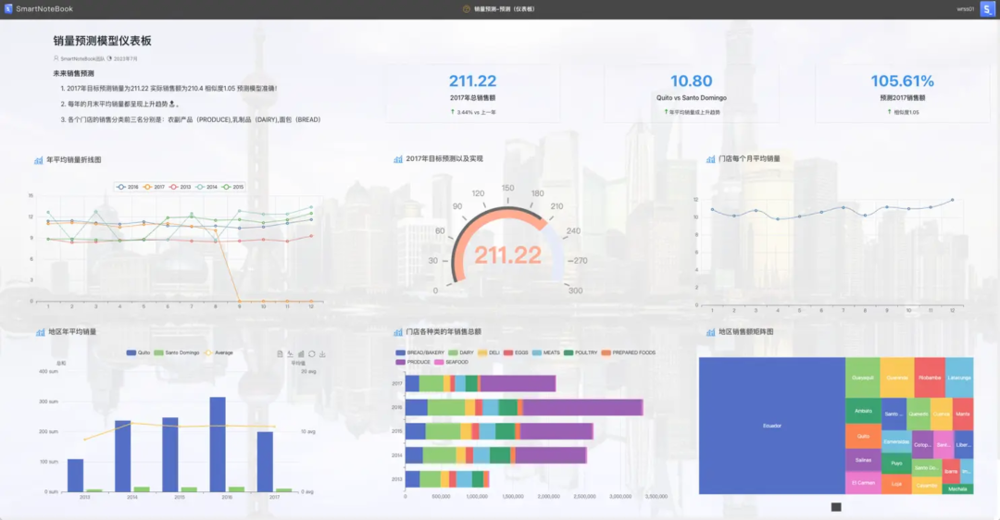

# 高级交互仪表板配置

---

仪表板（Dashboard）允许用户快速轻松地将逻辑视图中的元素组合成任何人都可以使用的交互式、美观的 Web 应用程序。通过提供直观的图形化界面，仪表板能够展示和解析大量数据，将复杂的数据集转化为易于理解的图表和图形。这使得业务决策者能够迅速掌握数据，并据此做出明智的决策。

通过仪表板，我们可以将原始数据转化为可行的见解和战略成果，从而提升决策过程。

除了定期展示数据外，仪表板还可以满足更高级的交互需求：

## 更高级的交互需求

### 条件筛选与时间范围动态展示
**条件筛选与时间范围动态展示**：例如，通过设置条件筛选和时间范围，可以动态展示数据的变化规律。
<video tabindex="0" controls class="video-stream html5-main-video" webkit-playsinline="" playsinline="" controlslist="nodownload" style="width: 1200px; height: 800px; left: 0px; top: 0px;">
  <source src="../assets/dashboard/202406201158.mp4" type="video/mp4">
  Your browser does not support the video tag.
</video>

### 图表联动
**图表联动**：例如，点击地图的某区域，根据该区域条件联动其他相应的图表，展示在特定条件下的数据变化。
   
<video tabindex="0" controls class="video-stream html5-main-video" webkit-playsinline="" playsinline="" controlslist="nodownload" style="width: 1200px; height: 800px; left: 0px; top: 0px;">
  <source src="../assets/dashboard/2024062011581.mp4" type="video/mp4">
  Your browser does not support the video tag.
</video>

### 条件跳转
**条件跳转**：例如，点击图表后，根据设定的过滤条件跳转到不同的仪表板页面，以展示更加详细的数据和分析。
   
   1. **点击图表跳转**
    <video tabindex="0" controls class="video-stream html5-main-video" webkit-playsinline="" playsinline="" controlslist="nodownload" style="width: 1200px; height: 800px; left: 0px; top: 0px;">
      <source src="../assets/dashboard/2024062011582.mp4" type="video/mp4">
      Your browser does not support the video tag.
    </video>

   2. **点击按钮跳转**
  
      

## 条件筛选
- 1.把互动组件添加到 左侧的仪表中。
- 2.双击要关联互动的单元格。
- 3.弹出右侧抽屉，点击组件交互
- 4.设置关联互动单元格：引用互动组件（引用其它组件的全局变量）；执行单元格（改变当前组件的值，需要执行的单元格）
- 5.保存并预览
- 6.发布
   <video tabindex="0" controls class="video-stream html5-main-video" webkit-playsinline="" playsinline="" controlslist="nodownload" style="width: 1200px; height: 800px; left: 0px; top: 0px;">
      <source src="../assets/dashboard/2024062011585.mp4" type="video/mp4">
      Your browser does not support the video tag.
    </video>

> [!NOTE]
> 请注意，每个互动组件都关联全局唯一一个python的全局变量。仪表板中互动组件关联的单元格必须有引用该变量，如果没引用即使刷新该组件数据也不起效果。

------------------

## 画布设置

点击  可以对画布大小、背景及水印进行设置。

  

## 小地图

点击  可开启/关闭小地图显示。

  

## 预览

设计完成后，可以先点击  查看效果。

  

## 发布/更新发布

点击 可以发布正式的仪表板链接。

用户可以直接通过打开链接在网络浏览器中实时查看和互动这个仪表板。此外，这个链接也可以轻松地嵌入到其他应用程序中，为您的业务流程提供即时的数据洞察。如果需要，您也可以将此链接投射到大屏幕上，以便在团队会议或演示中展示数据。这种多元化的展示方式为数据分析带来前所未有的灵活性和方便性，让您可以随时随地获取到最新、最准确的业务洞察。

每当您对仪表板进行更改时，您的仪表板都不会自动重新发布。您需要在更改完之后重新保存并 “更新发布”。

> [!NOTE]
> 已发布的仪表板的 URL 在更新发布后保持不变，因此您不必担心重新共享或在应用中修改URL的问题。

## 拖动/旋转 

选中元素后可以按下鼠标拖动到合适的位置。

点击元素左上角的圆点并按下鼠标可以调整元素的角度。

  

## 元素设置

双击画布中的元素可以对元素的相关属性（像素大小、位置、层级和旋转角度）进行配置。

  

## 案例展示（销售KPI仪表板）

  
