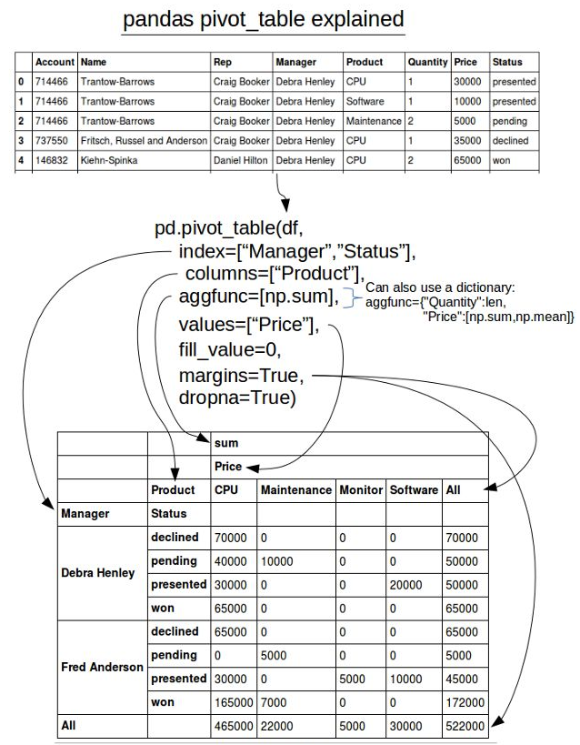

# 数据透视表

使用数据透视表可以让您用可视化交互方式聚合和透视数据。

数据透视表将DataFrame作为输入，根据您的配置对其进行聚合，并返回输出一个DataFrame的数据对象，该数据对象可以在应用中预览和显示或在NoteBook后续单元格中使用。

## 使用数据透视表

- 鼠标移动到代码块的下方，当显示悬浮操作框时，单击`More cell types`，然后选择`数据透视表`来创建
  
  

- 从左上角的下拉框中，选择需要聚合的DataFrame。选好后，其所有列将显示在左侧的字段选取列表中

- 请将要在数据透视表中呈现的数据，将字段从选取列表中拖动到中间的透视表配置中
  - 行：作为聚合依据的字段，垂直呈现
  - 列：作为聚合依据的字段，水平呈现
  - 值：要聚合的字段。可按需要更改值的聚合类型
 
  

- 配置完成后，点击左上角的运行单元格，右侧区域可以预览聚合后的数据对象

- 将输出的数据对象进行命名，如`df3`

> [!Tip]
> 如要聚合的DataFrame包含字段过多，可以利用左侧的`过滤字段`去模糊搜索匹配所需字段后再拖入右侧的配置区域。

## Pandas中关于pivot_table的解释
> [!Tip]
> 关于对数据透视表的理解，我们可以参考如下pandas中关于pivot_table的解释。

  
