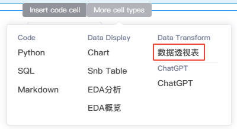
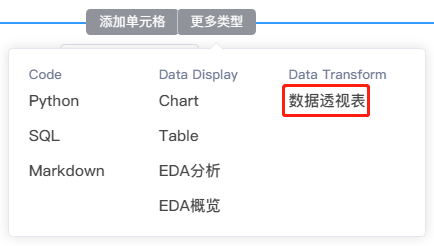

# 数据透视表
---

可视化交互方式聚合和透视数据。

数据透视表将DataFrame作为输入，根据您的配置对其进行聚合，并返回输出一个DataFrame的数据对象，该数据对象可以在应用中预览和显示或在NoteBook后续单元格中使用。

## 创建和使用数据透视表

### 创建

- 鼠标移动至代码块的下边界，当显示悬浮操作框时，单击`更多类型`，然后选择`数据透视表`：
    
<!--    -->
  

### 使用

- 左上角下拉框选择需要转换的DataFrame。DataFrame的所有列名将显示在左侧的字段选取列表中

- 将字段从选取列表中拖动到对应的配置中
  - 行：作为聚合依据的字段，垂直呈现
  - 列：作为聚合依据的字段，水平呈现
  - 值：选择需要聚合和计算的字段，并设置计算方式
 
  

- 完成配置后，点击左上角的运行单元格，右侧区域可以预览计算和转换后的数据对象

- 将输出的数据对象命名，如`df3`

> [!Tip]
> 如要聚合的DataFrame包含字段过多，可以利用左侧的`过滤字段`去模糊搜索匹配所需字段后再拖入右侧的配置区域。

## 数据透视表的原理

可参考Pandas中关于pivot_table的解释:

  
