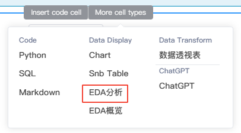
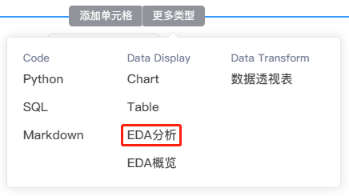
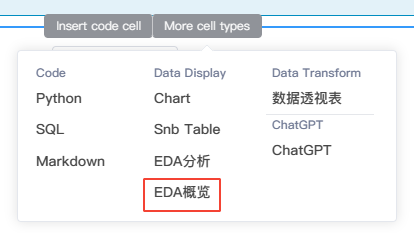
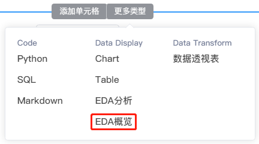

# EDA组件
---

EDA：探索性数据分析 (Exploratory Data Analysis）

## EDA分析

EDA分析组件是一个用于帮助理解和分析机器学习数据集的可视化工具。

用户可使用EDA分析组件快速探索数据集特征的分布情况，让用户能够以不同粒度查看其数据的整体情况。

### 创建EDA分析

鼠标移动至代码块的下边界，当显示悬浮操作框时，单击`更多类型`，然后选择`EDA分析`。

<!--    -->

  

### 配置过程

1. 下拉框选择数据集。
2. 主题配置区域。
3. 图表探索配置区域。
4. 图表可视化展示区域。
5. 图例区域。
6. 图表比例缩放和全屏
7. 执行分析。

## EDA概览

用户可使用EDA概览快速理解数据集的特征分布。

### 创建EDA概览

鼠标移动至代码块的下边界，当显示悬浮操作框时，单击`更多类型`，然后选择`EDA概览`。

<!--    -->
  

### 配置和展示

1. 下拉框选择数据集。
2. 数据集总览。
3. 各特征变量的值分布。
4. 散点分布图。
5. 相关系数。
6. 缺失值统计。
7. 样例记录。

