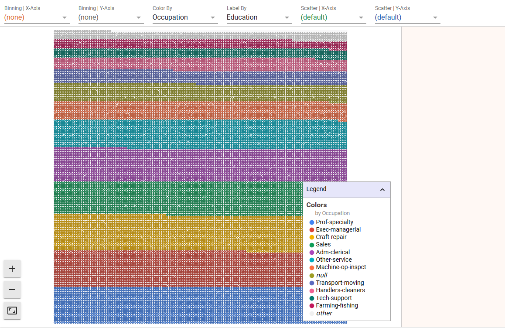
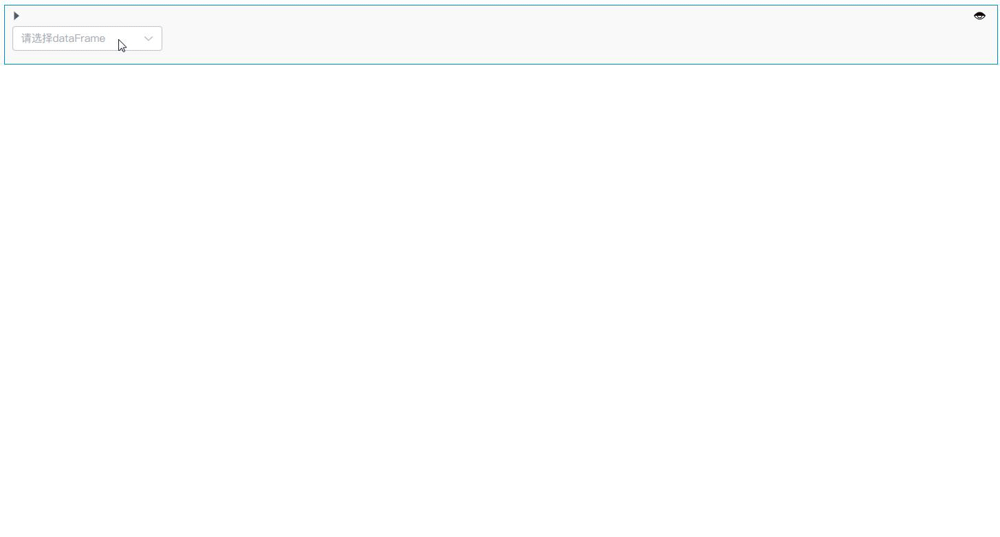

# EDA组件
---

EDA 是 Exploratory Data Analysis（探索性数据分析）的缩写。

EDA 是数据分析过程中的一项重要任务，旨在通过可视化和统计方法来理解数据集的特征、结构和关系，揭示数据中的模式、异常和潜在关联。通过对数据进行探索性分析，可以获取关于数据集的初步认识，为后续的建模、假设检验和预测建立基础。

EDA 通常涉及以下任务：

- 数据质量检查：检查数据集中是否存在缺失值、异常值或错误数据，并进行处理。
- 描述性统计分析：计算数据集的基本统计指标（如均值、中位数、标准差等）以及数据的分布情况。
- 数据可视化：使用图表、图形和图像等可视化工具展示数据的特征，以发现模式、趋势、异常值等。
- 相关性分析：探索数据变量之间的关系，通过计算相关系数或绘制散点图等方法来了解变量之间的相关性。
- 特征工程：识别和构造合适的特征，以提高后续分析或建模的效果。

## EDA分析组件

<!-- EDA分析组件提供用户用可视化的方式理解和分析机器学习数据集。

使用EDA分析组件能够快速探索数据集特征的分布情况，帮助用户以不同粒度查看数据的整体情况。 -->

EDA分析组件提供了一个交互式界面，用于探索数据集所有不同特征的数据点之间的关系。

可视化交互图表中的每个单元代表一个数据点。用户可通过按特征值在多个维度上对数据点进行分析和探索。

  

### 创建EDA分析组件

鼠标移动至单元格的下边界，当显示悬浮操作框时，单击`更多类型`，然后选择`EDA分析`。

<!--    -->

  

### 基本操作

为学习EDA分析组件的基本操作，我们用一个简单的操作案例来做说明

例：通过EDA分析组件从不同维度探索泰坦尼克船上人员的分布情况：

  

可以看到EDA组件主体有三个区域

- 顶部控制工具栏
- 主可视化区域
- 数据点信息面板

基本的使用流程如下：

1. 下拉框选择DataFrame。
2. 点击开始运行
3. 通过顶部控制工具栏中的控件来驱动探索
4. 图表探索配置区域。
5. 图表可视化展示区域。
6. 图例区域。
7. 图表比例缩放和全屏
8. 。

<!-- Dive有三个区域。顶部的控制工具栏、主可视化和数据点信息面板。
一旦数据被加载到可视化中，用户就可以通过操纵工具栏中的控件来驱动探索。共有四个部分，单击时每个部分都会展开。它们是镶嵌、颜色、显示和定位。
镶嵌面控件
Dive的主要功能是以网格形式排列记录。这被称为镶嵌，有两个方向可以独立控制：垂直（基于行）和水平（基于列）方向。
当您在任一方向上选择要镶嵌的特征时，Dive将根据该特征对项目进行挖掘。对于数值，Dive将数值范围划分为大小相等的数字段。对于字符串值，Dive将共享相同字符串值的项目放在一起，如果太多，则将这些项目放在标记为“其他”的桶中。
此外，包含空格的字符串值可以被视为一个无差别的单词包。当用户选中单词袋框时，Dive会根据最常用的单词将项目放在一起进行排列。这项功能将来可能会被彻底更改或删除。
定位控制装置
默认情况下，Dive将通过堆叠项目来排列网格的每个单元格中的项目。或者，可以将项目放置在散点图中。当“镶嵌面”设置为（无）时，这是最有用的。
具有数值的特征可用于散点图定位。值不是数字的任何项目仍将显示，但该值将强制为零。
颜色控制
使用“颜色控制”可以指定用于为各个项目着色的字段。
如果没有指定精灵图谱，Dive将选择一个特征进行着色。选择算法会优先考虑具有少量唯一值的特征，例如分类特征。
显示控件
使用“显示控制”（Display Controls）可以指定“分段”（Dive）将渲染到每个点上的内容。如果已经指定了精灵图谱，则Dive将默认显示每个点的精灵。如果不是，则Dive将选择其值最唯一的特征，然后将这些字符串渲染为圆形背景顶部的文本。
无论是否使用精灵图集，都可以使用“显示”下拉菜单以交互方式控制渲染到点的功能。 -->

## EDA概览

用户可使用EDA概览快速理解数据集的特征分布。

### 创建EDA概览

鼠标移动至单元格的下边界，当显示悬浮操作框时，单击`更多类型`，然后选择`EDA概览`。

<!--    -->
  

### 配置和展示

1. 下拉框选择数据集。
2. 数据集总览。
3. 各特征变量的值分布。
4. 散点分布图。
5. 相关系数。
6. 缺失值统计。
7. 样例记录。

