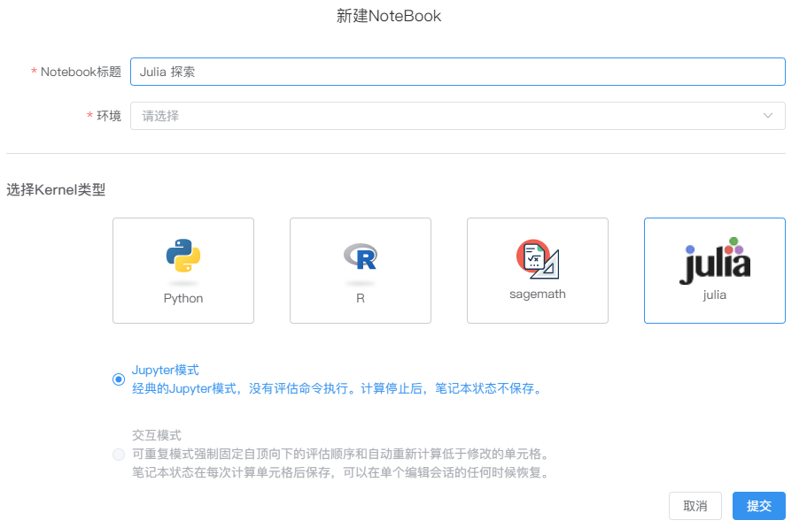

# Julia语言支持

---

## 创建NoteBook

在`新建NoteBook`对话框中选择Kernel类型为“Julia”的选项。

输入`NoteBook标题`并选择对应的环境（需满足您购买的产品拥有创建Julia语言的环境，否则无法创建），点击提交完成创建。

  

> [!warning|style:flat]
> 成功创建NoteBook后，用户无法在不同的kernel语言类型之间切换。

SNB对其他Julia内核的支持仍处于早期阶段，有些功能尚不完善，例如变量资源管理器、SQL单元格、模型视图等。

## 当前支持的功能

- MarkDown 单元格
- 收藏
- 评论
- 资源和文件管理
- 大纲目录
- 环境及调度任务
- 版本管理
- 代码仓库
- 单元格的状态
- 代码格式
- 单元格代码补全
- 团队协作编辑
- 终端
- 快捷键支持