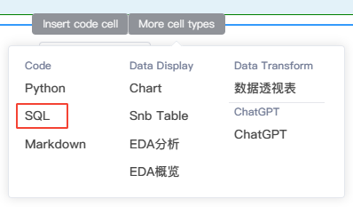
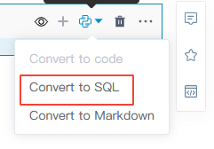
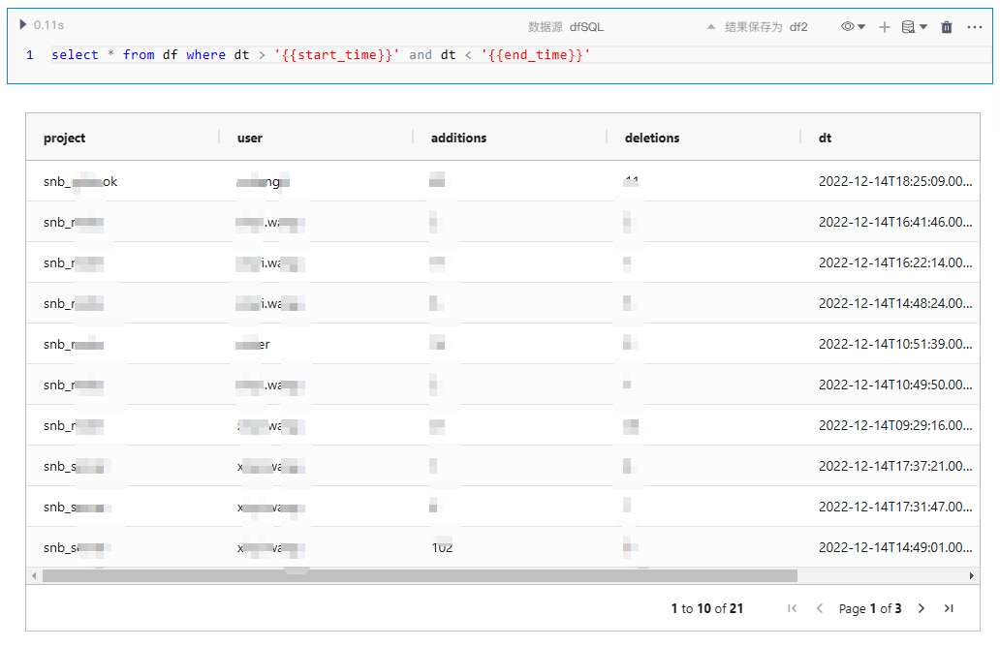

# SQL代码块
---
SmartNoteBook提供一流的SQL支持，每个SQL代码块都是一个完全成熟的查询IDE，具有自动补全、数据预览、支持dfSQL等功能。

## SQL代码块的特性/要点

使用SQL代码块会使数据查询变的非常便捷高效，区别于您之前所使用的SQL查询工具，使用SmartNoteBook编写SQL，有以下几个特性/要点：

- 支持DBSQL和dfSQL：用户既可以通过连接远程数据库或数据仓库来运行SQL查询（DBSQL），也可以直接使用SQL查询DataFrame或.csv数据格式文件（dfSQL）。SmartNoteBook将两种方式融合，能帮助您执行一些非常强大的工作流程
  
- SQL查询数据库返回的结果作为DataFrame返回

- SQL查询可以“串联”在一起：后面执行的SQL查询可以引用NoteBook中之前已执行的SQL查询结果，就像我们写复杂SQL中包含许多CTE（公共表表达式） 一样。用户可以使用这种方式将复杂SQL按照逻辑进行拆分，使整个查询过程更具可读性。

- SQL查询可以嵌入变量参数及流程控制参数：您可使用[Jinja2](http://docs.jinkan.org/docs/jinja2/templates.html)语法将NoteBook中其他代码部分定义或运行的值插入到当前的SQL查询中。这种机制可以帮助您自定义用户输入、将之前已运行的SQL或Python代码块输出作为查询条件进行参数化查询,并在SQL代码中加入流程控制（if...else.../for循环等等），从而构建由SQL提供的支持面向用户的复杂数据应用程序。


## 何时使用DBSQL或dfSQL？

- 当需要查询数据库或数据仓库时使用DBSQL

- 当查询的对象是DataFrame或.csv文件，则选用dfSQL


用户可以通过组合DBSQL和dfSQL，以更流畅的方式构建复杂的数据处理流程，例如：

- DBSQL-->Python处理-->dfSQL。用户运行DBSQL查询从数据库提取数据，然后使用Python代码对数据的某一列进行地理编码，此时数据此时已不在数据库表中，而是在Python处理后的数据放在DataFrame中，这时用户可以利用dfSQL对DataFrame进行SQL查询。
  
- 用户从.csv文件查询数据。通过dfSQL可以直接这样提取csv文件中的数据：`SELECT * FROM '文件名.csv'`

例如：

```
select * from '/home/Iris.csv'
```
或
```
select Id, SepalLengthCm, SepalWidthCm, PetalLengthCm, PetalWidthCm,Species from '/home/Iris.csv'
```

- DBSQL+DBSQL-->dfSQL。用户需要跨不同的数据源连接数据。比如用户运行了两个DBSQL查询，一个查询MySQL的数据表，另一个查询Oracle的数据表，此时可以使用dfSQL查询将两个DataFrame进行关联。

> [!NOTE]
> 如果数据量非常大的情况下不建议使用dfSQL，因为dfSQL是在内存中加载数据。

## 创建SQL代码块

创建SQL代码块的方法：

* 鼠标移动至代码块的下边界，当显示悬浮操作框时，单击`More cell types`，然后选择`SQL`。

  


* 直接单击代码块右上角的 `+` 号或者单元格下方的`Add Code Cell`，然后点击右上角的，选择`Convert to SQL`。

  

## 使用DBSQL（查询远程数据库/数据仓库)

* 创建SQL代码块
* 数据源下拉框选择已有数据源（连接数据源操作详见<a href="../WorkSpace/DataSource.md" title="数据源">数据源</a>）
* 填写结果集的名称，如`df2` （输出类型为DataFrame）
* 点击执行代码

经以上步骤我们就运行完一个DBSQL查询，并且将结果保存在了名称为df2的DataFrame中。

  


## 使用dfSQL（用SQL操作DataFrame）

* 创建SQL代码块
* 数据源下拉框选择`dfSQL`
* 输入SQL代码，表名填写DataFrame的名称，比如查询我们上面保存过的`df2`
* 填写结果集的名称，如`df3`（输出类型为DataFrame）
* 点击执行代码

经以上步骤我们就运行完一个dfSQL查询，使用SQL和Pandas DataFrame融合的方式完成了数据处理，并且将结果保存在名称为df3的DataFrame中。

  

> [!Tip]
> 关于DFSQL可以支持的一些操作和特性可参考[SQLite3 Documentation](https://www.sqlite.org/docs.html)。

## 示例

以下通过一个示例展示使用dfSQL进行数据处理：

- 通过Python代码导入数据（经纬度信息）：

```
lat =pd.read_excel('http://172.30.21.57/lat.xlsx')
lat.columns=['Province','d','d','lot','lat']
lat
```

- 通过Python代码导入全国gdp数据：

```
import pandas as pd
gdp=pd.read_excel('http://172.30.21.57/gdpData.xlsx')
gdp['per_gdp']=gdp['GDP2020']/gdp['Population2020']
gdp
```

- 通过Python代码对列计算和精度处理，将结果保存在`df2 `中
  
```
import numpy as np
df2['gdp_all_avg']=sum(df2['gdp_sum'])/sum(df2['popu_sum'])
df2['t_score']=(df2['gdp_avg']-df2['gdp_all_avg'])/(df2['gdp_std']/np.sqrt(df2['dist_count']))
df2['A']='all'
for c in ['gdp_sum','popu_sum','gdp_avg','gdp_std','gdp_all_avg','t_score']:
    df2[c]=round(df2[c],2)
df2
```

- 使用`dfSQL`，对`df2 `进行SQL查询和处理：

```
select Province,sum(GDP2020) as gdp_sum, sum(Population2020) as popu_sum,sum(GDP2020) / sum(Population2020) as gdp_avg,
count(distinct District) as dist_count,stddev(per_gdp) as gdp_std from gdp  group by Province
```

- 使用`dfSQL`，用SQL计算排名：
  
```
select Province,gdp_sum,popu_sum,gdp_avg,gdp_std,t_score as XL_Index,rank() over(partition by A order by gdp_sum desc) as gdp_rank ,
rank() over(partition by A order by popu_sum desc) as popu_rank ,rank() over(partition by A order by gdp_avg desc) as gdp_avg_rank ,
rank() over(partition by A order by t_score desc) as XL_Index_rank
from df2
```

- 使用`dfSQL`，关联gdp和经纬度数据：

```
select df3.*,lat.lat,lat.lot from df3,lat where df3.Province=lat.Province
```

## SQL参数化（SQLTemplate）

用户可以在SQL中输入参数或使用变量来进行参数化查询。

用户使用SmartNoteBook提供的SQLTemplate语法，能够实现对SQL语句的变量替换，流程控制及动态拼接。例如：
* 变量替换：
  * 一般变量

  ``` 
  {{VAR}}
  
  ```

  * 字典变量：
 
  ```
  data ={"a":100,"b":200}  
  {{data.a}} 
  {{data.b}}
  
  ```

* 判断：  
  ```
  
    ,{{a}}  
  
  
  ```

* 循环：
  ```
    
  , {{i}}
  
  
  ```

> [!Tip]
> 关于SQLTemplate的详细语法可参考[Jinja2 模板](http://docs.jinkan.org/docs/jinja2/templates.html)。


### 实例

在Python代码块中先定义两个变量：

```
start_time = '2022-07-01T00:00:00Z'
end_time = '2022-11-01T00:00:00Z'
```
在SQL代码块中引用以上变量来过滤数据：

```
select count(*)  from df where dt > '{{start_time}}' and dt < '{{end_time}}'

```

  


用if..else判断做流程控制：


```

	delete from tb_snb_code_data where dt > '{{yesterday_str}}' and dt < '{{today_str}}';

    select '昨天的记录不存在';


```

  


for循环的例子：

用Python代码写个list变量：

```
columns = ['Province', 'District', 'GDP2020']
```


然后新建SQL代码块，数据源设置为dfSQL，编写SQL代码：


```
select 2022
  
  , {{col}}
   
  from gdp_data

```

  

字典的例子：

```
data={"a":100,"b":200}
```

然后新建SQL代码块，数据源设置为dfSQL，编写SQL代码：

```
 select 
 {{data.a}}
,{{data.b}}

```


  


## SQL注释

注释用于解释SQL语​​句的各个部分，或用于防止执行SQL语句。

在SmartNoteBook中，SQL注释用`##` 双井号开始，末尾用分号`;`结束：

  

## 对T-SQL和PL/SQL的支持


- T-SQL是Transact-Structured Query Language的缩写，是微软公司用于SQL Server数据库管理系统的扩展版本。它基于ANSI SQL标准，提供了更多的扩展和特性，如存储过程、触发器、表变量和用户定义函数等。使用T-SQL语言可以对数据库中的数据进行查询、更新、插入和删除操作。T-SQL还可以用来创建、修改和管理数据库对象，如表、视图、索引等。

- PL/SQL全称为Procedural Language/SQL，是Oracle公司用于其Oracle数据库管理系统的一种专用编程语言。PL/SQL是一种基于SQL语言的高级编程语言。它具有结构化编程能力，支持面向过程编程，包括循环、条件语句、变量、常量、过程和函数等。

### 使用T-SQL

当我们连接好了SQL Sever的数据源，在执行T-SQL代码时可能会遇到报错或输出提示`非标准的DDL语句`，此时我们可以通过以下步骤来实现支持所有的T-SQL代码：

1.  添加`Python代码块`
2.  侧边栏的`数据资源`下复制所用SQL Sever数据源的连接信息
     
3.  将连接信息复制到`Python代码块`里
4.  在连接信息下方增加T-SQL语句和执行代码：

   ```
      # 数据源的连接信息
      from snb_plugin.sql.execute_sql import __smartnotebook_getengine_by_conn_id as snb_conn  
      engine=snb_conn("0242ac110004-11ed7b8d-9d8364a0-81eb", context=globals())

      # T-SQL语句

      SQL="""
      DECLARE @Number INT;
      SET @Number = 100;
      IF @Number > 100
        PRINT 'The number is large.';
      ELSE
        BEGIN
          IF @Number < 10
            PRINT 'The number is small.'
          ELSE
            PRINT 'The number is medium.';
        END ;
      """

      # 执行T-SQL语句
      conn = engine.raw_connection()
      with conn.cursor() as cursor:
        cursor.execute(SQL)
      conn.close()

   ```

### 使用PL/SQL

与执行T-SQL代码类似的，当我们连接好了Oracle的数据源，在执行PL/SQL代码时可能会遇到报错或输出提示`非标准的DDL语句`，此时我们可以通过以下步骤来实现支持所有的PL/SQL代码：

1.  添加`Python代码块`
2.  侧边栏的`数据资源`下复制所用Oracle数据源的连接信息
     

3.  将连接信息复制到`Python代码块`里
4.  在连接信息下方增加PL/SQL语句和执行代码：
   
```
  # 数据源的连接信息
  from snb_plugin.sql.execute_sql import __smartnotebook_getengine_by_conn_id as snb_conn  
  engine=snb_conn("0242ac110004-11ed7c2a-8a556732-8e72", context=globals())


  # PLSQL语句
  SQL = """
  declare
    i number(2) := 12 ;
    s varchar2(10) := 'end' ;
  begin
    IF i < 10
    THEN
    dbms_output.put_line('小于10');
    ELSIF i > 10
    THEN
    dbms_output.put_line('大于10');
    ELSE
    dbms_output.put_line('等于10');
    END IF;
    dbms_output.put_line(s);
  end;
  """

  # 执行PLSQL语句
  conn = engine.raw_connection()
  with conn.cursor() as cursor:
    cursor.execute(SQL)
    conn.commit()
```
