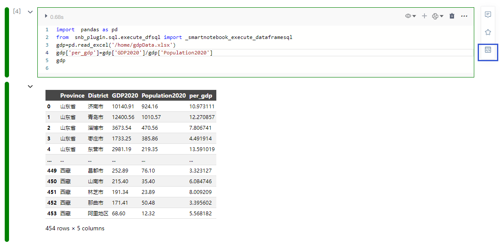

# 分享

NoteBook有很好的代码展示性，可作为“项目报告”承载研究成果，并能够以网页的形式进行分享。

在分享的内容方面，既可以整体分享NoteBook的所有内容（包含所有Cell代码块的输入输出），也可单独分享某个Cell代码块的输出。

* 分享NoteBook

  

点击`分享`后得到分享链接

  

* 分享Cell输出

选中要分享的Cell，点击右上角的悬浮按钮。

  

点击分享单元格输出的按钮即可获取分享链接

  
