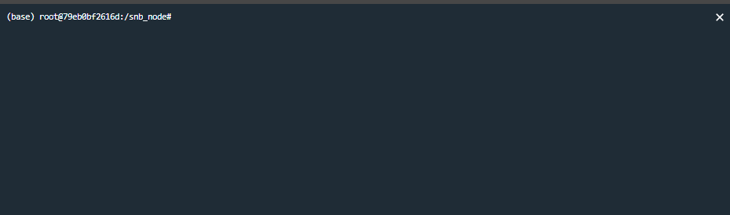

# 工具栏
---

工具栏提供对Notebook的一系列扩展操作

  

功能概览

| 主菜单 | 二级菜单 | 功能介绍 | 
| :----- | :-----| :---- | 
| 文件 | 最近打开的 | 查看最近编辑过的Notebook文档（点击可在新的标签页打开） | 
| 文件 | 分享 | 功能同Notebook右上角的`分享` 按钮，分享的操作详见<a href="./Share.md" title="分享">分享</a>| 
| 文件 | 重命名 | 点击修改Notebook上方的文件名| 
| 文件 | 导出.ipynb | 导出snb格式文件（SmartNoteBook专用格式）| 
| 文件 | 导出.snb | 导出.ipynb文件(兼容Jupyter Notebook) | 
| 工具 | 保存版本 | 保存Notebook版本，该功能参见侧边栏的<a href="./Sidebar.md/#sv" title="保存版本">版本列表-->保存版本</a>| 
| 工具 | 历史版本 | 打开`版本列表`，该功能参见侧边栏的<a href="./Sidebar.md/#sv" title="保存版本">版本列表</a> | 
| 工具 | 数据资源 | 打开`数据资源`，该功能参见侧边栏的<a href="./Sidebar.md/#ds" title="数据资源">数据资源</a>  |  
| 工具 | 目录 | 打开`目录`，该功能参见侧边栏的<a href="./Sidebar.md/#idx" title="目录">目录</a> | 
| 工具 | Packages | 打开`Packages`，该功能参见侧边栏的<a href="./Sidebar.md/#pk" title="Packages">Packages</a>| 
| 工具 | 变量预览 | 打开`变量预览`，该功能参见侧边栏的<a href="./Sidebar.md/#vr" title="变量预览">变量预览</a>| 
| 工具 | 环境 | 打开`环境`，该功能参见侧边栏的<a href="./Sidebar.md/#env" title="环境">环境</a>  | 
| 工具 | 代码片段 | 打开`代码片段`，该功能参见侧边栏的<a href="./Sidebar.md/#cd" title="代码片段">代码片段</a> | 
| 工具 | 终端 | 打开命令行界面与服务器交互 | 
| 工具 | 生成Graph | 分析代码中的变量关系生成关系图 | 
| Kernel | 中断Kernel | 中断运行正在运行的代码| 
| Kernel | 重启Kernel | 重新启动Kernel（例如一些package安装后需要重启）| 
| 运行 | 全部运行 | 运行Notebook下所有的单元格（按照Sheet顺序）| 
| 运行 | 运行当前及上方所有单元格 | 运行选中的单元格及之前所有单元格的代码（当前Sheet内） | 
| 运行 | 运行当前及下方所有单元格 | 运行选中的单元格及之后所有单元格的代码（当前Sheet内） | 
| 运行 | 运行当前sheet的所有单元格 | 运行当前sheet的所有单元格 | 
| 运行 | 清除全部输出 | 清除Notebook中所有单元格的输出（全部Sheet） | 
| 运行 | 隐藏全部输入 | 该功能参见 <a href="./Share.md/#hide" title="分享">分享-->分享报告时隐藏输入/输出</a>  | 
| 帮助 | 快捷键 | 详见<a href="./Shortcuts.md" title="快捷键">快捷键</a> | 
| 帮助 | 帮助手册 | 打开帮助手册 | 

## 终端

用户通过终端连接至容器，使用bash命令查看和操作服务器的资源（慎用）。

  

## Graph

分析代码中的变量关系生成关系图，直观展示Notebook的整体分析脉络以及单元格间的相互关系。

- 可解释性：容易看到各单元格如何相互关联，查看整个NoteBook代码逻辑的“流动”，是跟踪复杂逻辑的可视化“思维导图”。

- 性能：在模型开发过程中，这种DAG模型几乎不会产生额外的性能开销，对性能无任何影响。

## Kernel（内核）

每个NoteBook都具备底层内核，这些内核本质上是运行代码的程序。

Kernel 连接服务端的计算资源，当内核处于连接状态时，才能正常运行NoteBook中的代码。

### 中断Kernel

kernel 的中断（Kernel interrupt）是指kernel 正在运行代码中断运行（Kernel interrupt），针对notebook 内单元格（cell) 中断包括正在运行cell 和待运行的cell。
 
点击左上角的停止按钮中断Kernel

或是点击工具栏的`中断kernel`

### 重启Kernel（内核）

当环境发生变化（如环境安装了新的包），需要重启Kernel时使用。

> [!warning|style:flat]
> 重启Kernel将清除所有已存储的变量值。因此如果您在某些变量中存储了非常重要的数据，请在重启Kernel前将数据导出（比如导出文件）或保存在某个地方（比如写入数据库）。

## 代码块（cell）是如何连接在一起的

Graph是根据代码块中的参数引用自动构建的，变量引用会自动推断为链接（或“边”）。

如下图我们可以看到各个DataFrame的生成过程以及引用过程。这些联系是SmartNoteBook自动推断的，无需用户去定义。

> [!Tip]
> Graph中的代码片段用户可以随意拖动。

