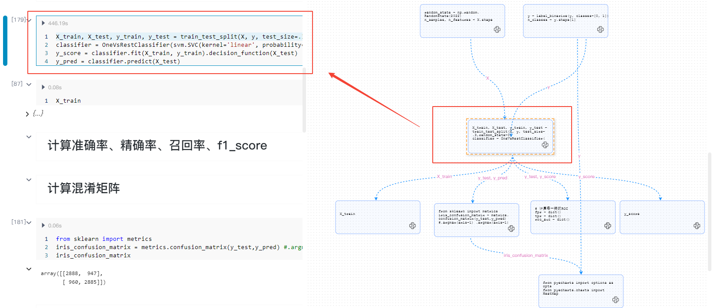
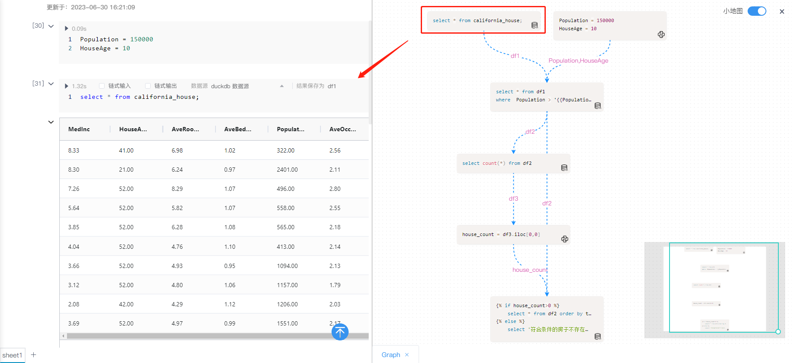
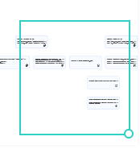

# 工具栏
---

工具栏提供对NoteBook的一系列扩展操作

  

功能概览

| 主菜单 | 二级菜单 | 功能介绍 | 
| :----- | :-----| :---- | 
| 文件 | 最近打开的 | 查看最近编辑过的NoteBook文档（点击可在新的标签页打开） | 
| 文件 | 分享 | 功能同NoteBook右上角的`分享` 按钮，分享的操作详见<a href="./Share.md" title="分享">分享</a>| 
| 文件 | 重命名 | 点击修改NoteBook上方的文件名| 
| 文件 | 导出.ipynb | 导出snb格式文件（SmartNoteBook专用格式）| 
| 文件 | 导出.snb | 导出.ipynb文件(兼容Jupyter NoteBook) | 
| 工具 | 保存版本 | 保存NoteBook版本，该功能参见侧边栏的<a href="./Sidebar.md/#sv" title="保存版本">版本列表-->保存版本</a>| 
| 工具 | 历史版本 | 打开`版本列表`，该功能参见侧边栏的<a href="./Sidebar.md/#sv" title="保存版本">版本列表</a> | 
| 工具 | 数据资源 | 打开`数据资源`，该功能参见侧边栏的<a href="./Sidebar.md/#ds" title="数据资源">数据资源</a>  |  
| 工具 | 目录 | 打开`目录`，该功能参见侧边栏的<a href="./Sidebar.md/#idx" title="目录">目录</a> | 
| 工具 | Packages | 打开`Packages`，该功能参见侧边栏的<a href="./Sidebar.md/#pk" title="Packages">Packages</a>| 
| 工具 | 变量预览 | 打开`变量预览`，该功能参见侧边栏的<a href="./Sidebar.md/#vr" title="变量预览">变量预览</a>| 
| 工具 | 环境 | 打开`环境`，该功能参见侧边栏的<a href="./Sidebar.md/#env" title="环境">环境</a>  | 
| 工具 | 代码片段 | 打开`代码片段`，该功能参见侧边栏的<a href="./Sidebar.md/#cd" title="代码片段">代码片段</a> | 
| 工具 | 终端 | 打开命令行界面与服务器交互 | 
| 工具 | 生成Graph | 分析代码中的变量关系生成关系图 | 
| Kernel | 中断Kernel | 中断运行正在运行的代码| 
| Kernel | 重启Kernel | 重新启动Kernel（例如某些package安装后需要重启）| 
| 运行 | 全部运行 | 运行NoteBook下所有的单元格（按照Sheet顺序）| 
| 运行 | 运行当前及上方所有单元格 | 运行选中的单元格及之前所有单元格的代码（当前Sheet内） | 
| 运行 | 运行当前及下方所有单元格 | 运行选中的单元格及之后所有单元格的代码（当前Sheet内） | 
| 运行 | 运行当前sheet的所有单元格 | 运行当前sheet的所有单元格 | 
| 运行 | 清除全部输出 | 清除NoteBook中所有单元格的输出（全部Sheet） | 
| 运行 | 隐藏全部输入 | 该功能参见 <a href="./Share.md/#hide" title="分享">分享-->分享报告时隐藏输入/输出</a>  | 
| 帮助 | 快捷键 | 详见<a href="./Shortcuts.md" title="快捷键">快捷键</a> | 
| 帮助 | 帮助手册 | 打开帮助手册 | 

## 终端

用户通过终端连接至容器，使用bash命令查看和操作服务器的资源（慎用）。

  

## Graph

分析代码中的变量关系生成关系图，直观展示NoteBook的整体分析脉络以及单元格间的相互关系。

- 可解释性：容易看到各单元格如何相互关联，查看整个NoteBook代码逻辑的“流动”，是跟踪复杂逻辑的可视化“思维导图”。

- 性能：在模型开发过程中，这种DAG模型几乎不会产生额外的性能开销，对性能无任何影响。
- 交互方面：
  - 点击Graph中的代码框可以快速定位到左侧的单元格
  - 代码框右下角的图标可识别代码类型
  - 线条箭头的指向代表了代码逻辑的流向，线条中间为上下关联的变量
  - Graph中的代码框可以任意拖动

右上角支持打开/关闭小地图。小地图显示Graph的预览，并且支持鼠标在小地图拖动控制显示的区域（对于Graph显示面积过大的情况会很有帮助）

<!--    -->
<!--    -->

  

<!--  -->

<!--    -->

<!--  -->

## Kernel

Kernel是一个独立于NoteBook的进程，它运行用户编写的代码并处理NoteBook中的输入和输出。Kernel会将代码执行的结果返回给NoteBook，然后NoteBook会将结果渲染成适当的格式并显示出来，可以理解为是NoteBook和代码之间的中间层。

Kernel可以支持多种编程语言，包括Python、R、Julia等，用户可以根据需要选择不同的Kernel来运行不同的代码（参考<a href="./main.md/#newnb" title="新建NoteBook">新建NoteBook时选择Kernel</a>） 。

### 中断Kernel

中断Kernel是指中断kernel正在运行的代码，针对NoteBook内正在运行的单元格和待运行的单元格。
 
### 重启Kernel

当环境发生变化（如环境安装了新的包或其他情况），需要重启Kernel时使用。

> [!warning|style:flat]
> 重启Kernel的操作将会清除所有已存储的变量值。如果用户在某些变量中保存了非常重要的数据，请在重启Kernel前将重要变量的数据保留下来。

