# 可视化组件
---

## Chart组件

Chart组件帮助用户以可视化交互方式浏览和处理数据，无需编写代码即可创建丰富的图表用于展示和分享。

利用Chart组件我们可以构建以下图表：

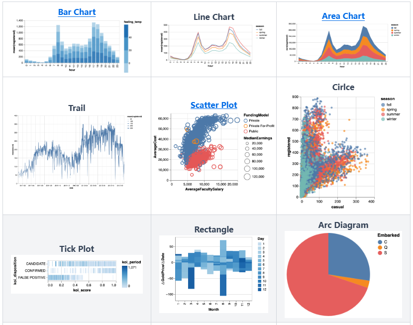  
<!-- 
<table>
  <tr>
    <td style="width: 260px; height: 250px;">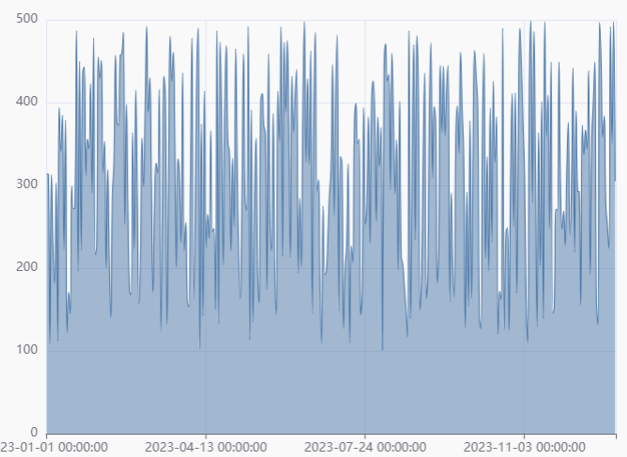</td>
    <td style="width: 260px; height: 200px;">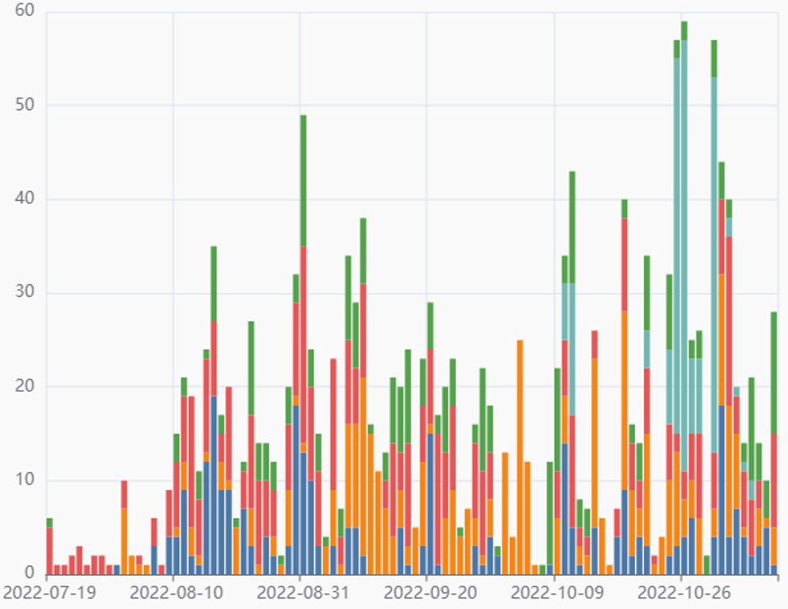</td>
  </tr>
  <tr>
    <td style="width: 260px; height: 250px;">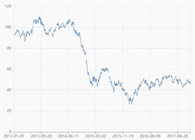</td>
    <td style="width: 260px; height: 250px;">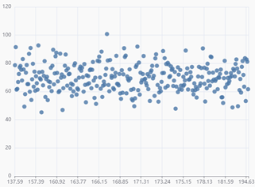</td>
  </tr>
</table> -->

Chart组件支持的图标类型包括：

* 标准Chart类型: 如柱状
* 图（bar）、折线图（line）、散点图（point）、面积图（area）
* 组合图表：如Grid组合、overlap等（开发中）
* 其他图表：如地图、箱线图（盒须图）、词云图（WordCloud）、漏斗图等（开发中）


### 创建Chart

鼠标移动至代码块的下边界，当显示悬浮操作框时，单击`更多类型`，然后选择`Chart`。

<!-- 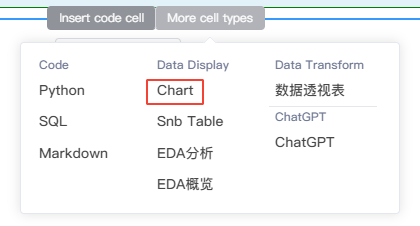   -->
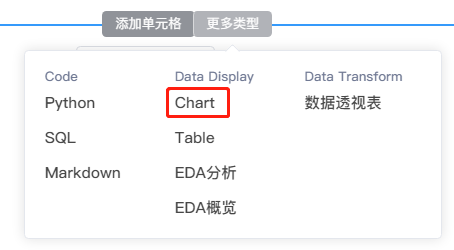  
 

<!-- 
   -->

### 基础操作

为了学习Chart的基本操作，我们创建一个简单的柱状图，分析泰坦尼克数据中`亲戚个数`与`生还数量`的情况。

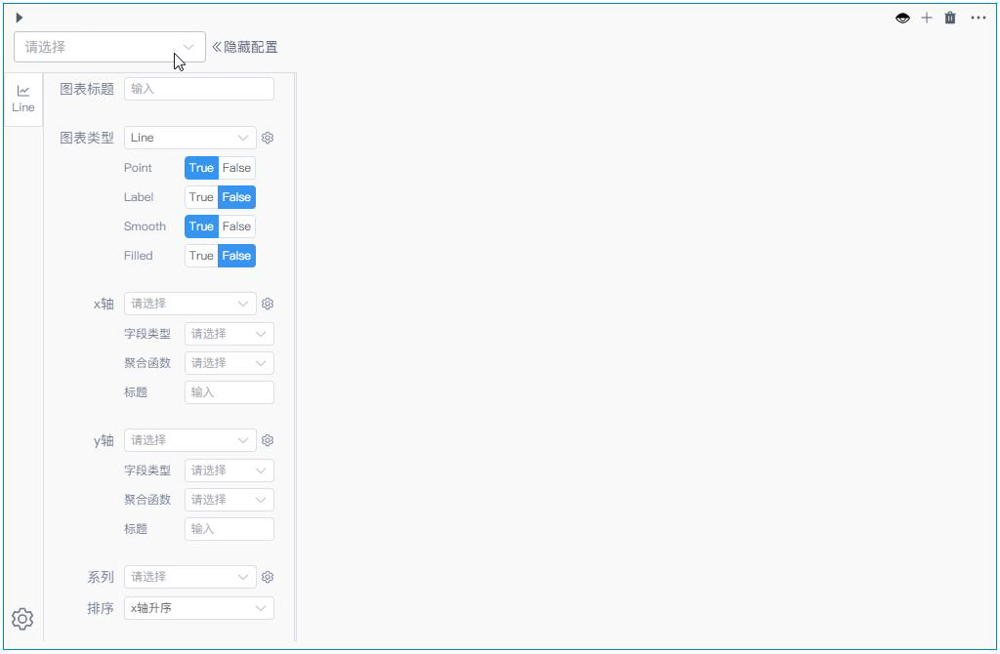 

通过上面例子，Chart组件大致操作流程如下：

1. 选择要分析的DataFrame
2. 输入标题（可选）、选择图表类型并配置图表参数
3. 选择X、Y轴字段并设置聚合函数、字段类型和格式等
4. 设置多系列和排序方式
5. 运行单元格

<!--    -->
<!-- 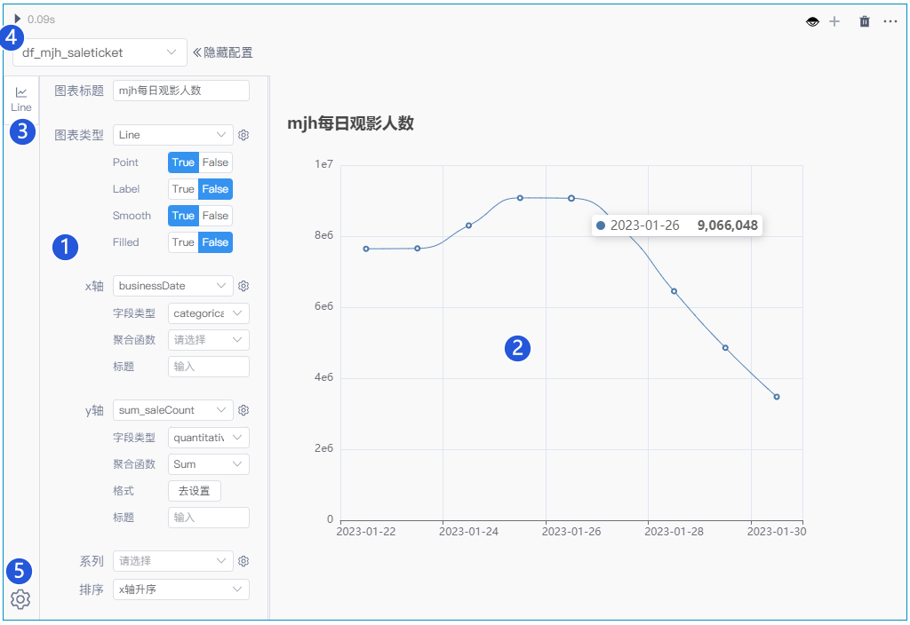   -->

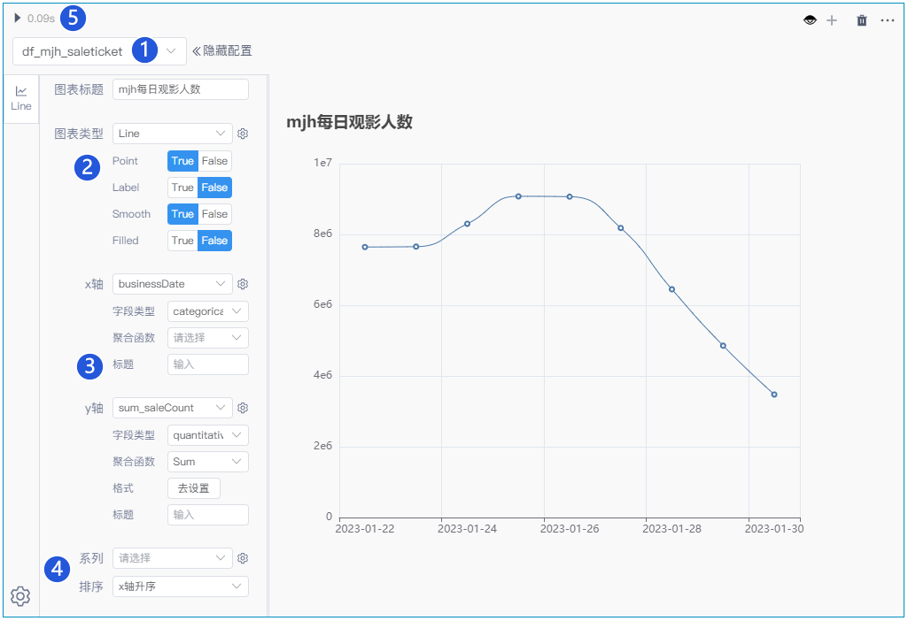  

以下我们对Chart的一些功能点做简要介绍：

### 图表类型参数

#### Bar（柱状图）

| 配置项  | 作用| 取值 | 备注 |
| :-----| :-----| :---- | :---- | 
|  Label | 设置数据系列中是否显示标签| True：显示</br>False：不显示 | 默认：False|
|  Stack | 设置数据系列中是否堆积显示| True：堆积显示</br>False：不堆积显示 | 默认：False|

#### Line（折线图）

| 配置项  | 作用| 取值 | 备注 |
| :-----| :-----| :---- | :---- | 
|  Point | 设置数据系列中的数据点是否显示圆圈| True：显示圆圈</br>False：不显示圆圈 | 默认：True|
|  Label | 设置数据系列中是否显示标签| True：显示</br>False：不显示 | 默认：False|
|  Smooth | 设置折线是否平滑| True：平滑</br>False：不平滑 | 默认：True|
|  Filled | 设置是否填充折线下方区域| True：填充</br>False：不填充 | 默认：False|

#### Point（散点图）

| 配置项  | 作用| 取值 | 备注 |
| :-----| :-----| :---- | :---- | 
|  Label | 设置数据系列中是否显示标签| True：显示</br>False：不显示 | 默认：False|
|  Size | 设置点的尺寸| 正整数| 默认：10|
|  Shape | 设置点的形状| circle：圆点</br>rect：矩形</br>roundRect：边缘平滑矩形</br>triangle：三角形</br>diamond：菱形</br>pin：图钉</br>arrow：箭头 | 默认：circle|

#### Area（面积图）

| 配置项  | 作用| 取值 | 备注 |
| :-----| :-----| :---- | :---- | 
|  Point | 设置数据系列中的数据点是否显示圆圈| True：显示圆圈</br>False：不显示圆圈 | 默认：True|
|  Label | 设置数据系列中是否显示标签| True：显示</br>False：不显示 | 默认：False|
|  Smooth | 设置折线是否平滑| True：平滑</br>False：不平滑 | 默认：True|
|  Filled | 设置是否填充折线下方区域| True：填充</br>False：不填充 | 默认：True|

### 聚合数据

对行数据使用`sum`，`count`,`max`等聚合函数进行聚合：

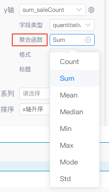  

### 更改数据类型

图表中的字段支持以下数据类型：
- quantitative：数量类型
- categorical：分类类型
- ordinal：序数类型
- time：时间类型

不同的数据类型下可以设定相应的格式显示，更改数据类型将影响数据的处理和呈现方式。

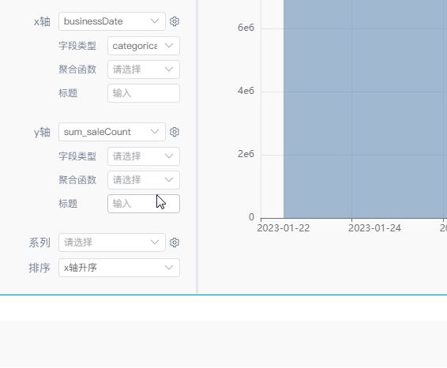  


### 排序

Chart提供了多种用于对数据排序的选项：

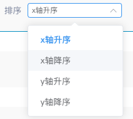  


### 多系列

当需要在一张图表上绘制多列，如果数据满足不同类型的标签共享相同的度量单位，此时可以通过添加系列来实现。例如：

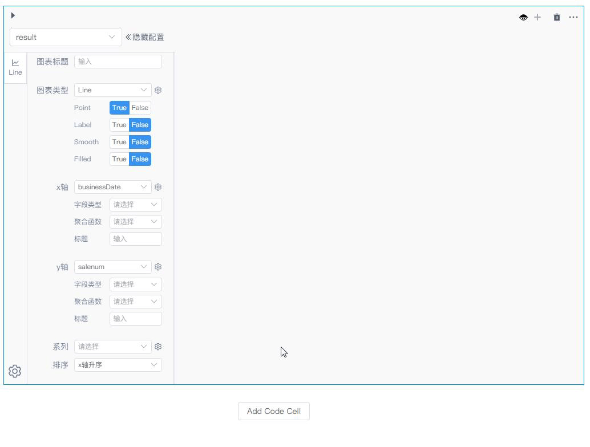  

### 显示/隐藏图例

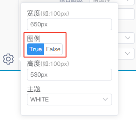  

### 设置图表宽度/高度


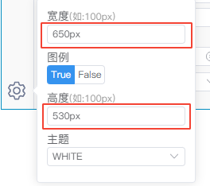  

### 主题设置

设置图表的主题样式：
- LIGHT：高亮主题
- DARK：暗黑主题
- WHITE：亮白主题

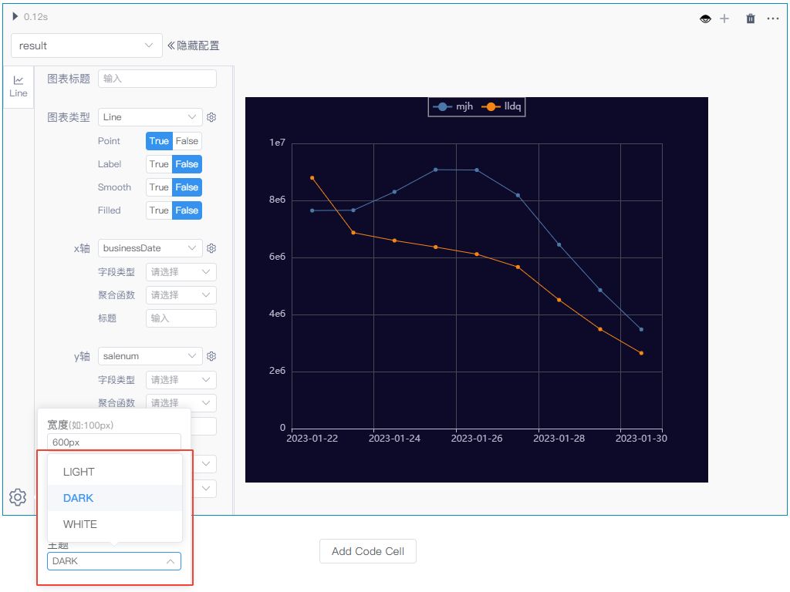  

### 隐藏/显示配置

  

### 代码拷贝

将代码拷贝到Python单元格进一步自定义图表

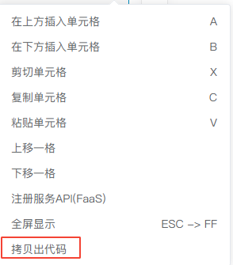  

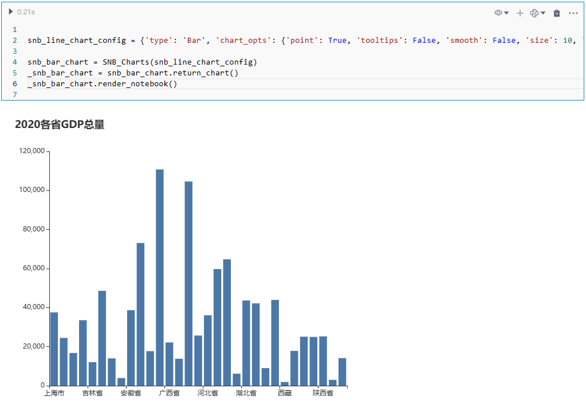  

## Chart开放API

Chart API 为您提供了一个以编程方式自定义显示图表的方式。

**样例** 

### 河流图themeRiver

```
from snb_plugin.snbcharts.SnbCharts import themeRiver

themeRiver(df, date, series, value, title='', height='550px', width='960px')
```
接口说明：
- df：数据集，类型：`pandas.DataFrame`
- date：日期参数，格式为字符串类型'2022-07-09'
- series：按照选定的维度进行展现
- value：统计数据，选择需展现的数值
- title：图表的标题
- height：高度，格式：`px` 或`百分比`
- width：宽度，格式：`px`或`百分比`

样例：

```
from snb_plugin.snbcharts.SnbCharts import themeRiver

themeRiver(temp,'day','project','count_day',height='550px', width='960px')
```

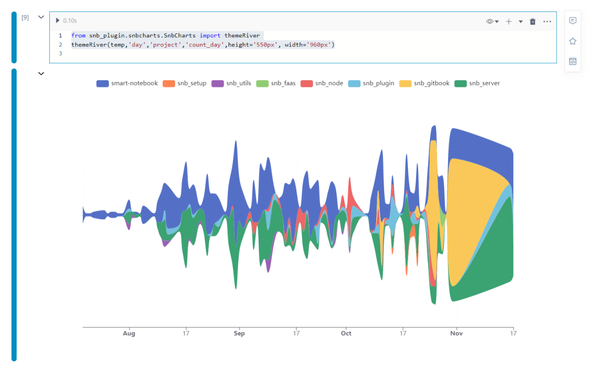  

### 散点图scatterChart

```
from snb_plugin.snbcharts.SnbCharts import scatterChart

scatterChart(df, x_col, y_col, size_col, series=None, title='', height='550px', width='960px')
```
接口说明：
- df：数据集，类型：`pandas.DataFrame`
- x_col：x轴显示列
- y_col：y轴显示列
- size_col：统计数据，选择需展现的数值
- series：按照选定的维度进行展现
- title：图表名称
- height：高度，格式：`px` 或`百分比`
- width：宽度，格式：`px`或`百分比`

样例：
```
from snb_plugin.snbcharts.SnbCharts import scatterChart

scatterChart(df,'hour','week_cn','count_hour',series=None, title='SmartNotebook', height='550px', width='960px')
```

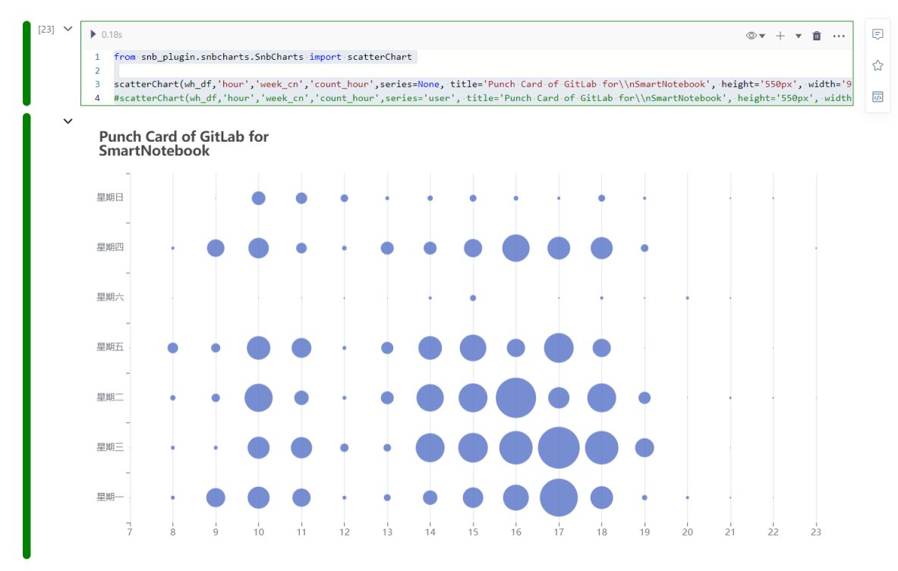  

### 散点图极坐标scatterPolarChart

```
from snb_plugin.snbcharts.SnbCharts import scatterPolarChart

scatterPolarChart(df, x_col, y_col, size_col, series=None, title='', height='550px', width='960px')
```
接口说明：
- df：数据集，类型：`pandas.DataFrame`
- x_col：x轴显示列
- y_col：y轴显示列
- size_col：统计数据，选择需展现的数值
- series：按照选定的维度进行展现
- title：图表名称
- height：高度，格式：`px` 或`百分比`
- width：宽度，格式：`px`或`百分比`

样例：

```
from snb_plugin.snbcharts.SnbCharts import scatterPolarChart

scatterPolarChart(df,'hour','week_cn','count_hour',series=None, title='SmartNotebook', height='550px', width='960px')
```

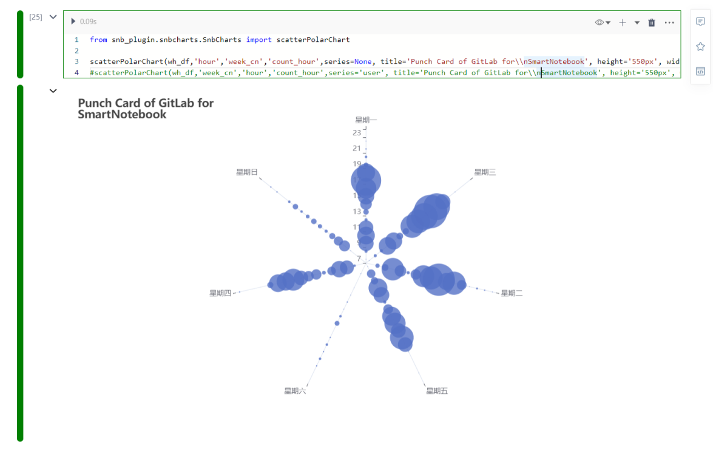  

### 热力图 heatmapChart

```
from snb_plugin.snbcharts.SnbCharts import heatmapChart

heatmapChart(df, x_col, y_col, size_col, title='', height='550px', width='960px')
```
接口说明：
- df：数据集，类型：`pandas.DataFrame`
- x_col：x轴显示列
- y_col：y轴显示列
- size_col：统计数据，选择需展现的数值
- title：图表名称
- height：高度，格式：`px` 或`百分比`
- width：宽度，格式：`px`或`百分比`

样例：
```
from snb_plugin.snbcharts.SnbCharts import heatmapChart

heatmapChart(df,'hour','week_cn','count_hour', title='SmartNotebook', height='550px', width='960px')
```

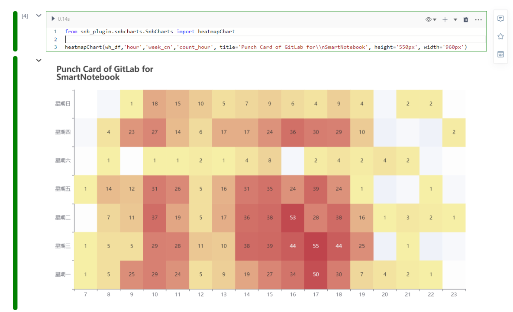  

### 雷达图radarChart

```
from snb_plugin.snbcharts.SnbCharts import radarChart

radarChart(df, column, series, value, title='', height='550px', width='960px')
```
接口说明：
- df：数据集，类型：`pandas.DataFrame`
- column：显示列
- series：按照选定的维度进行展现
- value：统计数据，选择需展现的数值
- title：图表名称
- height：高度，格式：`px` 或`百分比`
- width：宽度，格式：`px`或`百分比`

样例：
```
from snb_plugin.snbcharts.SnbCharts import radarChart

radarChart(df, "hour", "week_cn", "count_week_cn", title='SmartNotebook', height='550px', width='1600px')
```

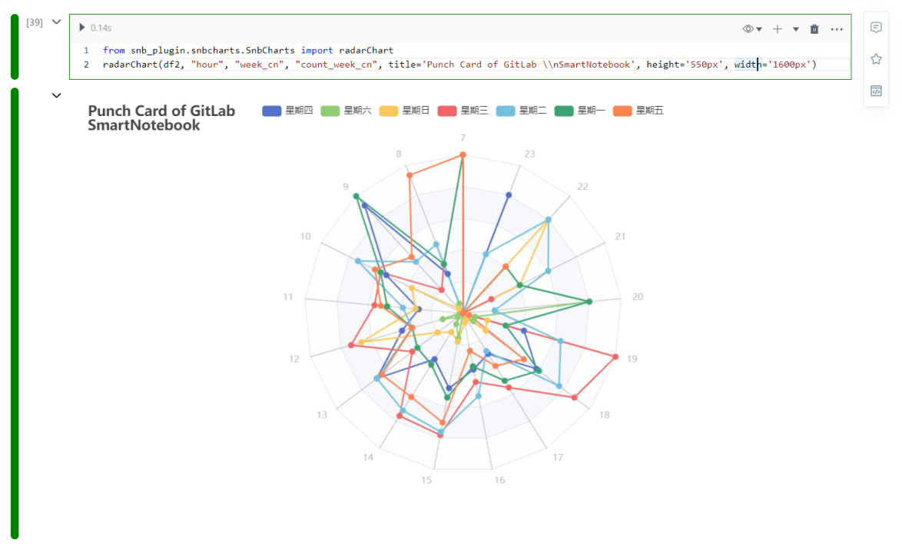  

### 盒须图boxPlot

```
from snb_plugin.snbcharts.SnbCharts import boxPlot

boxPlot(df, series, value, title='', height='550px', width='960px')
```
接口说明：
- df：数据集，类型：`pandas.DataFrame`
- series：按照选定的维度进行展现
- value：统计数据，选择需展现的数值
- title：图表名称
- height：高度，格式：`px` 或`百分比`
- width：宽度，格式：`px`或`百分比`

样例：
```
from snb_plugin.snbcharts.SnbCharts import boxPlot

boxPlot(df, 'Province', 'per_gdp', title='SmartNotebook', height='550px', width='980px')
```

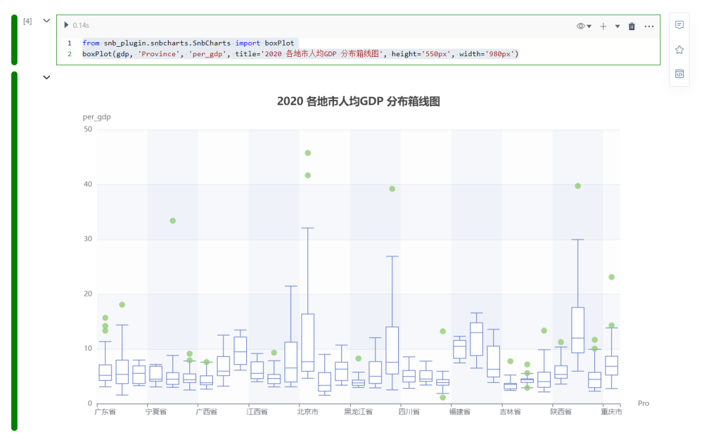  


### 桑基图(Sankey Diagram)

Sankey Diagram，用来展示数据的“流动”变化。

  - 左右两侧的矩形叫做“节点”，代表了不同的对象
  - 节点与节点之间的流线叫做“边”，代表数据的流动
  - 边的粗细与流量（流动数据的具体数值叫做“流量”）成比例，流量越大，边的线条越粗。

```
from snb_plugin.snbcharts.SnbCharts import  sankeyChart

sankeyChart(node_df,link_df,node_config={"name_col":"","value_col":"","info_col":""},
                link_config={"src_col":"","dst_col":"",
                "value_col":"","info_col":"","degree_col":""},
                title="",height="1080px",width="100%")
```
接口说明：
- node_df,link_df：数据集，类型：`pandas.DataFrame`
- node_config：节点相关配置项
  - "name_col"：设置节点对应的数据列
  - "value_col"：设置节点对应的数值（数值越大，节点的柱子越宽）
  - "info_col"：节点需显示的详细消息
- link_config：边的相关配合项
  - "src_col"：源节点的标识
  - "dst_col"：目标节点的标识
  - "value_col"：设置边对应的数值（数值越大，边的线条越粗）
  - "info_col"：边上需显示的详细消息
  - "degree_col"：控制边的透明度（数值越大，线条越明显）
- title：图表名称
- height：高度，格式：`px` 或`百分比`
- width：宽度，格式：`px`或`百分比`

样例：
```
from snb_plugin.snbcharts.SnbCharts import  sankeyChart

sankeyChart(df4,df2,node_config={"name_col":"ip","value_col":"msg_count","info_col":"info"},
                link_config={"src_col":"srcAddress","dst_col":"destAddress",
                "value_col":"s_msg_count","info_col":"info","degree_col":"opacity"},
                title="",height="1080px",width="100%")
```
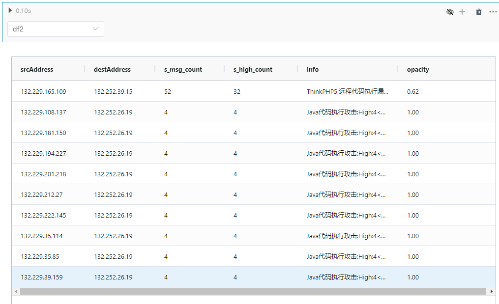  
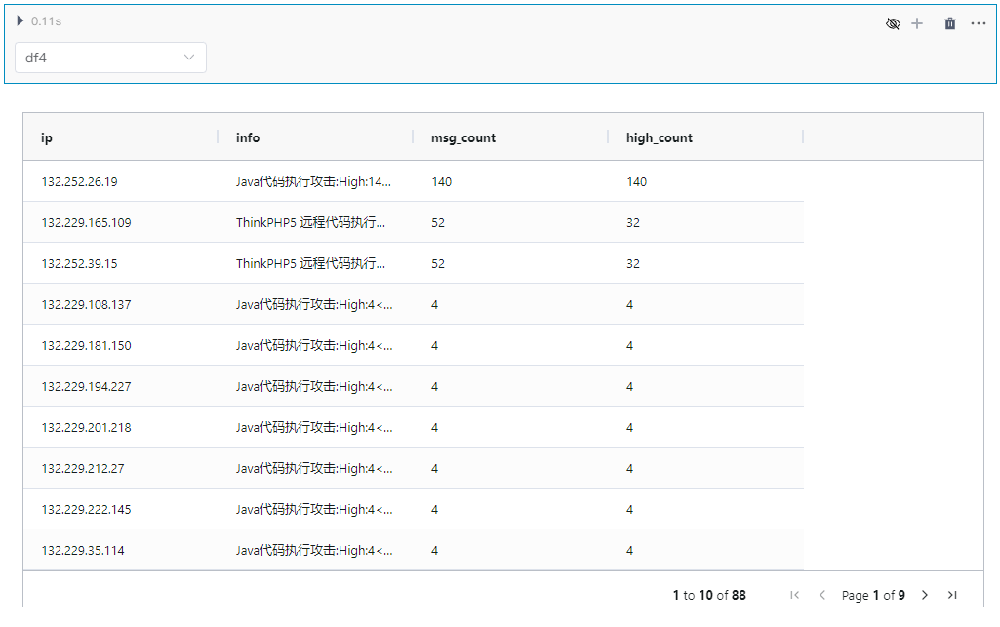  
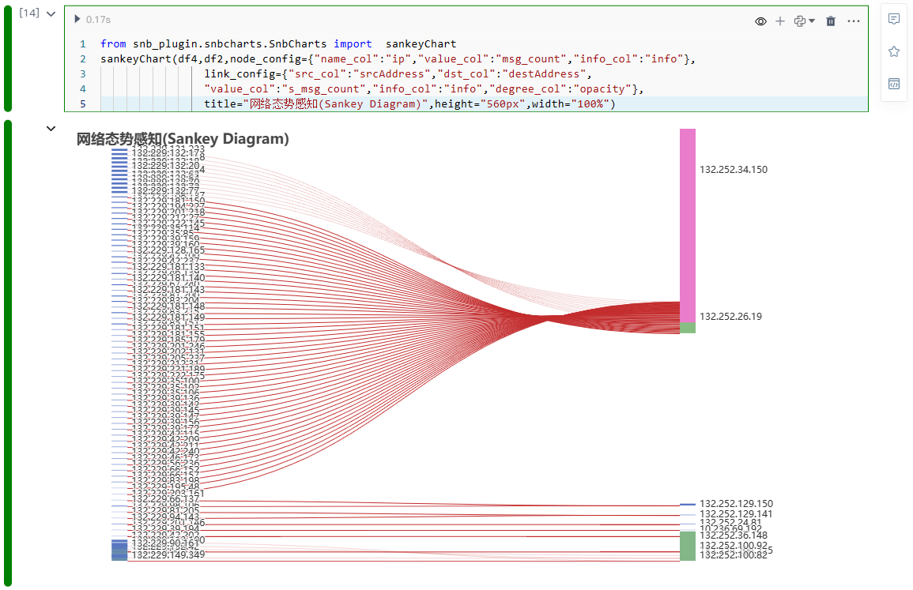  

## Table组件

Table组件除用作展示数据集，同时也具备一定的可视化交互能力，如对特征值进行条件筛选和排序。

### 创建

鼠标移动至代码块的下边界，当显示悬浮操作框时，单击`更多类型`，然后选择`Table`。

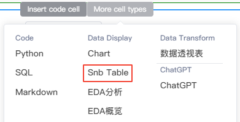  

### Table使用

* 选择数据集
* 选择字段可进行排序
* 点击字段右侧筛选按钮可进行逻辑条件筛选

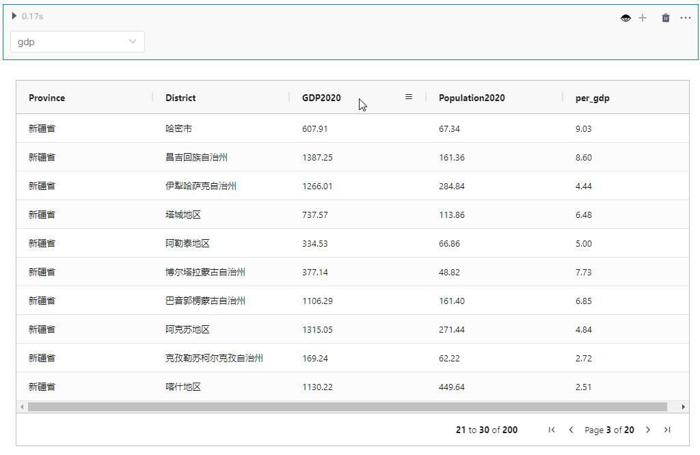  


### 通过接口自定义Table

除使用Table组件外，SNB也提供了Table的开放接口。用户也可通过Python调用__SNB_DisplayTable接口自定义显示Table

```
__SNB_DisplayTable(df,rownum=200,height="520px", width="100%",PageSize=10,nd=2)
```
接口说明：
- df：数据集，格式：`pandas.DataFrame`
- rownum：显示行数，格式：`int`
- height：高度，格式：`px` 或`百分比`
- width：宽度，格式：`px`或`百分比`
- PageSize：单页显示数量，格式：`int`
- nd：用于控制数据集中数值类型小数点后保留几位小数，格式：`int`。默认保留两位小数

