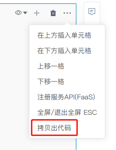

# 可视化组件
---
* `Chart`可视化组件帮助用户以交互方式浏览和聚合数据帧，从而创建丰富的可视化效果并可用于分享和展示。

  


* `Snb Table`组件帮助用户进行可视化筛选和查找数据。

  


# Chart组件

SmartNoteBook具备低代码实现可视化，目前支持的Chart类型包括

* 标准charts: bar、line、point、area
* 组合图`建设中`：Grid 组合、overlap等
* 其他`建设中`：地图、箱线图（盒须图）、WordCloud、漏斗图等

## 创建Chart

鼠标移动到代码块的下方，当显示悬浮操作框时，单击`More cell types`，然后选择`Chart`。

  

## 配置Chart

1. `Chart`配置区域
2. `Chart`显示区域
3. `Chart`类型显示
4. 执行`Chart`
5. `Chart` 主题和图例等配置

  

### 配置项

- 图表标题（非必填）
  
- 图表类型
  - Bar：条形图/柱状图/直方图
    - Tooltips：工具提示条，当鼠标停止在图表上某一处时，图表会提示该处的信息。True/False，默认False。
    - Stack：堆积选项。True/False，默认False。
  - Line：折线图
  - Point：散点图
  - Area：面积图
  
- x轴
  - 字段选择
  - 字段类型
  - 聚合函数
  - 标题（非必填）
  
- y轴
  - 字段选择
  - 字段类型
  - 聚合函数
  - 格式
  - 标题（非必填）

- 系列
  - 字段选择
  
- 排序
  - x轴升序（默认）
  - x轴降序
  - y轴升序
  - y轴降序

## 隐藏/显示配置

  

## 拷贝出代码

可将通过Chart组件制作好的图表代码拷贝出来，可直接放在Python代码块中执行：

  

  

## Chart开放API（Low code）

Chart API 为您提供了一个以编程方式自定义显示图表的方式。

### 河流图themeRiver

```
from snb_plugin.snbcharts.SnbCharts import themeRiver

themeRiver(df, date, series, value, title='', height='550px', width='960px')
```
接口说明：
- df：数据集，格式：`pandas.DataFrame`
- date：日期参数，时间序列需选择处理好的日期列
- series：按照选定的维度进行展现
- value：统计数据，选择需展现的数值
- title：图表的标题
- height：高度，格式：`px` 或`百分比`
- width：宽度，格式：`px`或`百分比`

  

样例：

```
from snb_plugin.snbcharts.SnbCharts import themeRiver

themeRiver(temp,'day','project','count_day',height='550px', width='960px')
```

### 散点图scatterChart

```
from snb_plugin.snbcharts.SnbCharts import scatterChart

scatterChart(df, x_col, y_col, size_col, series=None, title='', height='550px', width='960px')
```
接口说明：
- df：数据集，格式：`pandas.DataFrame`
- x_col：x轴显示列
- y_col：y轴显示列
- size_col：统计数据，选择需展现的数值
- series：按照选定的维度进行展现
- title：图表名称
- height：高度，格式：`px` 或`百分比`
- width：宽度，格式：`px`或`百分比`

样例：
```
from snb_plugin.snbcharts.SnbCharts import scatterChart

scatterChart(df,'hour','week_cn','count_hour',series=None, title='SmartNotebook', height='550px', width='960px')
```

  

### 散点图极坐标scatterPolarChart

```
from snb_plugin.snbcharts.SnbCharts import scatterPolarChart

scatterPolarChart(df, x_col, y_col, size_col, series=None, title='', height='550px', width='960px')
```
接口说明：
- df：数据集，格式：`pandas.DataFrame`
- x_col：x轴显示列
- y_col：y轴显示列
- size_col：统计数据，选择需展现的数值
- series：按照选定的维度进行展现
- title：图表名称
- height：高度，格式：`px` 或`百分比`
- width：宽度，格式：`px`或`百分比`

  

样例：

```
from snb_plugin.snbcharts.SnbCharts import scatterPolarChart

scatterPolarChart(df,'hour','week_cn','count_hour',series=None, title='SmartNotebook', height='550px', width='960px')
```
### 热力图 heatmapChart

```
from snb_plugin.snbcharts.SnbCharts import heatmapChart

heatmapChart(df, x_col, y_col, size_col, title='', height='550px', width='960px')
```
接口说明：
- df：数据集，格式：`pandas.DataFrame`
- x_col：x轴显示列
- y_col：y轴显示列
- size_col：统计数据，选择需展现的数值
- title：图表名称
- height：高度，格式：`px` 或`百分比`
- width：宽度，格式：`px`或`百分比`

  

样例：
```
from snb_plugin.snbcharts.SnbCharts import heatmapChart

heatmapChart(df,'hour','week_cn','count_hour', title='SmartNotebook', height='550px', width='960px')
```

### 雷达图radarChart

```
from snb_plugin.snbcharts.SnbCharts import radarChart

radarChart(df, column, series, value, title='', height='550px', width='960px')
```
接口说明：
- df：数据集，格式：`pandas.DataFrame`
- column：显示列
- series：按照选定的维度进行展现
- value：统计数据，选择需展现的数值
- title：图表名称
- height：高度，格式：`px` 或`百分比`
- width：宽度，格式：`px`或`百分比`

  

样例：
```
from snb_plugin.snbcharts.SnbCharts import radarChart

radarChart(df, "hour", "week_cn", "count_week_cn", title='SmartNotebook', height='550px', width='1600px')
```

### 盒须图boxPlot

```
from snb_plugin.snbcharts.SnbCharts import boxPlot

boxPlot(df, series, value, title='', height='550px', width='960px')
```
接口说明：
- df：数据集，格式：`pandas.DataFrame`
- series：按照选定的维度进行展现
- value：统计数据，选择需展现的数值
- title：图表名称
- height：高度，格式：`px` 或`百分比`
- width：宽度，格式：`px`或`百分比`

  

样例：
```
from snb_plugin.snbcharts.SnbCharts import boxPlot

boxPlot(df, 'Province', 'per_gdp', title='SmartNotebook', height='550px', width='980px')
```

# Snb Table组件

Snb用于对展示数据集，并具备一定的交互能力，如对特征值进行条件筛选和排序。

## 创建Snb Table

鼠标移动到代码块的下方，当显示悬浮操作框时，单击`More cell types`，然后选择`Snb Table`。

  

## 配置和展示

* 下拉框选择数据集。
* 选择字段可进行排序和条件筛选。


## 自定义Snb Table

除使用Snb Table组件外，SmartNoteBook也提供了Snb Table的开放接口。用户也可通过Python调用__SNB_DisplayTable接口自定义显示Table

```
__SNB_DisplayTable(df,rownum=200,height="520px", width="100%",PageSize=10,nd=2)
```
接口说明：
- df：数据集，格式：`pandas.DataFrame`
- rownum：显示行数，格式：`int`
- height：高度，格式：`px` 或`百分比`
- width：宽度，格式：`px`或`百分比`
- PageSize：单页显示数量，格式：`int`
- nd：用于控制数据集中数值类型小数点后保留几位小数，格式：`int`。默认保留两位小数

