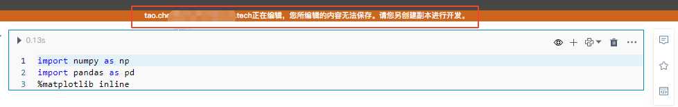

# NoteBook
---
<!-- NoteBook是一个可以在浏览器中使用的交互式笔记本文档，它的核心任务是通过将文字、代码、图表、公式、结论都整合在一个文档中，能够将整个分析过程完整清晰地表述，并能够以网页的形式进行分享。

Notebook可以实现将代码、文字完美结合起来，因此非常适合从事机器学习、数据分析等数据科学工作的人员使用。

逻辑视图的主界面由单元组成，包括“代码”单元、“标记和文本”单元、输入参数以及“显示”单元（如“表格显示”单元）。
然而，Hex在一些关键方面扩展了笔记本电脑模型： -->

NoteBook是一个可以在浏览器中使用的交互式笔记本文档。它提供了一个集成的环境，允许用户在同一个文档中编写和运行代码、添加注释、文本说明和公式、插入图表和可视化结果，并实时查看代码执行的输出。

Notebook的主界面由单元格组成，主要包括code单元格、可视化组件单元格、数据处理组件单元格。

SmartNoteBook在Notebook的易用性、环境资源以及协作等方面做了很多关键的扩展。

  

## 功能概览

| 功能 | 解释 | 
| :-----| :---- | 
| 工具栏 | 工具栏提供对文件、Kernel和终端等的一系列扩展操作。详见<a href="./Toolbar.md" title="工具栏">工具栏</a>  | 
| 侧边栏 | 侧边栏为Notebook提供一系列扩展功能。详见<a href="./Sidebar.md" title="侧边栏">侧边栏</a>   | 
| 单元格（Cell）概述 | 编写、运行、分享代码或组件的最小单元，也是最核心的单元。详见<a href="./Cell.md" title="单元格（Cell）概述">单元格（Cell）概述</a>   | 
| Python单元格 | 编写、运行、分享Python代码。详见<a href="./Python.md" title="Python单元格">Python单元格</a>   | 
| SQL单元格 | 编写、运行、分享SQL代码。详见<a href="./SQL.md" title="SQL单元格">SQL单元格</a>   | 
| MarkDown单元格 | 编写、运行、分享MarkDown代码。详见<a href="./Markdown.md" title="Markdown单元格">Markdown单元格</a>   | 
| R支持 | 编写、运行、分享R代码。详见<a href="./R.md" title="R单元格">R语言支持</a>   | 
| SageMath支持 | 编写、运行、分享SageMath代码。详见<a href="./SageMath.md" title="SageMath单元格">SageMath支持</a>   | 
| Julia支持 | 编写、运行、分享Julia代码。详见<a href="./Julia.md" title="Julia单元格">Julia语言支持</a>   | 
| EDA功能 | EDA分析组件快速探索数据集特征的分布情况。详见<a href="./EDA.md" title="EDA">EDA</a> | 
| 数据透视表 | 用可视化交互方式聚合和透视数据。详见<a href="./DataTransform.md" title="数据透视表">数据透视表</a> | 
| 可视化组件 | 帮助用户以交互方式浏览和聚合数据帧，从而创建丰富的可视化效果并可用于分享和展示。详见<a href="./Visualization.md" title="可视化组件">可视化组件</a> | 
| 评论 | 团队成员可以在每个单元格上开展评论。详见<a href="./Comments.md" title="评论">评论</a> |
| 代码收藏 | 收藏代码存放在代码片段仓库。详见<a href="./Collections.md" title="代码收藏">代码收藏</a> |  
| 分享功能 | 分享单元格或整份Notebook报告。详见<a href="./Share.md" title="分享">分享</a> | 
| 快捷键 | 键盘快捷键支持。详见<a href="./Shortcuts.md" title="快捷键">快捷键</a> | 

## 新建Notebook

当前Workspace下，点击左下按钮`新建Notebook`

  

输入标题，并依次选择环境、Kernel类型和模式后点击提交：

  

### 支持的kernel类型

  * Python
  * R
  * SageMath
  * Julia

### 模式选择

  * Jupyter模式：经典的Jupyter模式，没有评估命令执行。计算停止后，笔记本状态不保存。
  * 交互模式：可重复模式强制固定自顶向下的评估顺序和自动重新计算低于修改的细胞。笔记本状态在每次计算单元格后保存，可以在单个编辑会话的任何时候恢复。
  
### Notebook界面（空）

  

## 导入Notebook

点击左下【新建Notebook】右侧的下拉箭头，点击上传文件。  

  
 
直接拖拽或从电脑选择支持的文件（.snb或.ipynb文件）进行上传。

  

- .snb文件： SmartNoteBook专用格式类型
- .ipynb文件：Jupyter Notebook格式类型

导入后的Notebook文件将在`你的Notebook`页面列表展示。  

## 修改Notebook标题

两种方式：

1. 在Workspace下的Notebook列表页，鼠标移至名称一栏，点击编辑图标对名称进行修改

  

2. 在Notebook文档页面，双击顶部中间的标题进行修改，修改完成后鼠标移动到任意其他位置提交修改。  

  

## 添加Sheet

Notebook文档左下角可添加多个Sheet，方便用户组织结构和内容。

备注：多个Sheet共同组成一份Notebook文档，当运行全部单元格或分享Notebook文档时会按sheet的顺序依次执行或展示。

  

## 返回Workspace

单击左上方logo区域可返回至Workspace管理页面。

  

## 成员同时打开一份NoteBook

当多名团队成员同时编辑同一份Notebook文档，后打开Notebook的成员会在Notebook页面上方收到提示，无法保存修改的内容（同时编辑内容会产生冲突）：

  

## 收藏NoteBook

重要的NoteBook文件可以通过点击标题右侧收藏标记进行收藏，再次点击后会取消收藏：

  

收藏后的NoteBook会增加收藏标记，并在你的NoteBooks列表置顶显示：

  

