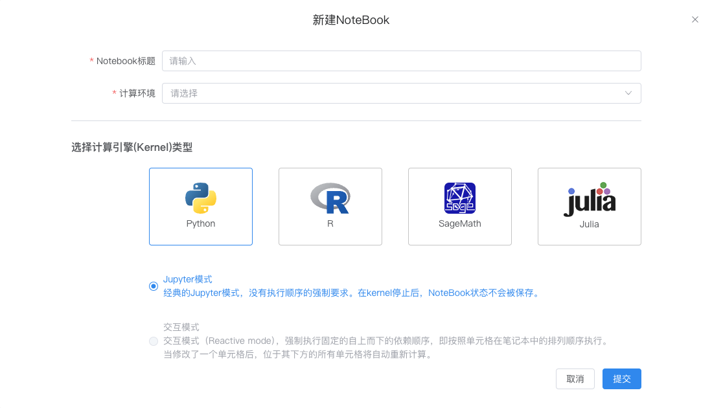
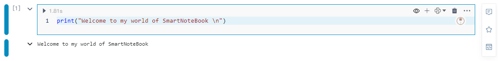
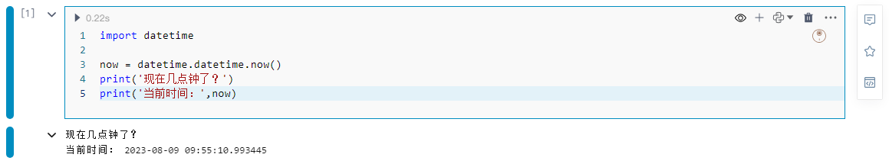
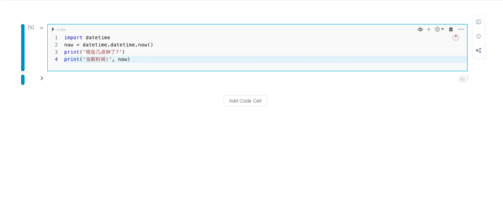
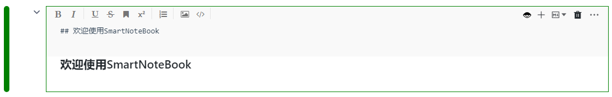
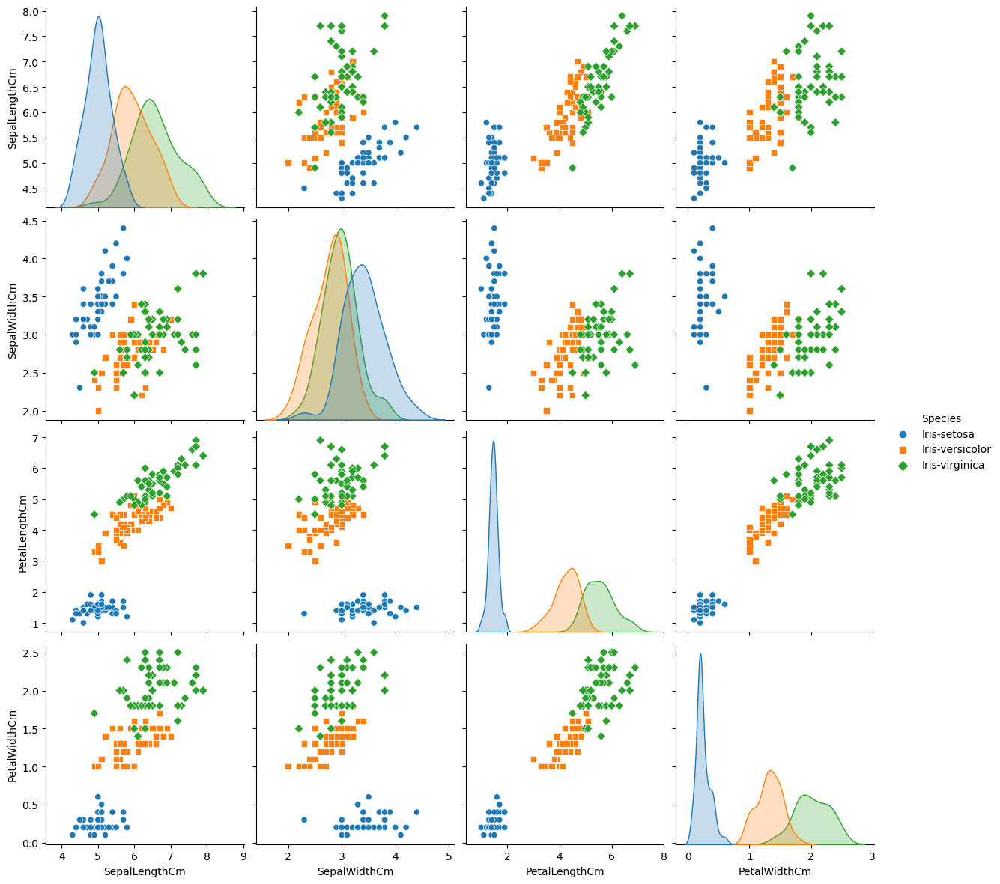
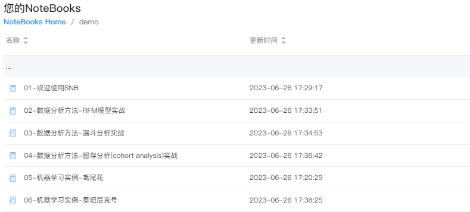
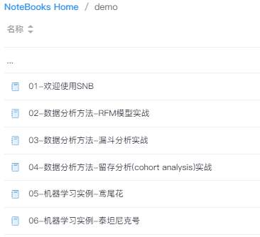

# 快速上手
---

## 概述

SmartNoteBook（产品简称：SNB） 是一款现代化的NoteBook，是开箱即用、云原生、协作式在线数据科学与分析平台。使用SNB您可以简化数据洞察和交付，帮助数据科学和业务团队共同提高数据分析效率。

您可以连接任何您所需的数据形式（如数据文件、数据仓库、图数据库、数据开放平台API等），并以一种崭新的方式开展数据分析和数据探索、建立预测模型、注册服务、创建知识图谱、数据可视化并生成数据报告或创建仪表盘...实现从数据接入到数据价值的全流程，让数据触手可及，畅通无阻！

SNB主要汇集了以下要点：

- 集成主流的机器学习框架和 AutoML 框架 
  
- 支持对多种数据科学语言的编码和环境：如 Python、SQL、R、SageMath 和 Julia 等

- 对主流数据库、数据仓库、图数据库以及数据开放平台的集成支持和管理

- 深度融合SQL 和 Python 两大最流行的数据科学语言，用户能够在数据分析过程中自由切换

- 提供零代码的数据转换和可视化分析组件
  
- 快速生成现代商业智能和交互式的数据服务和应用
  
- 模型视图(Graph)促进模型的可解释性和再现性

- 团队成员在WorkSpace中的开展实时协作
  
- “一模多用”
  
- ......


以下我们通过三个步骤快速掌握SmartNoteBook的最基础使用。

## 第一步

通过创建和编辑您的第一个NoteBook开始学习数据知识。

**在WorkSpace下创建新的NoteBook**
  
1.在WorkSpace下，单击左下方的“新建NoteBook”，您将重定向到“新建NoteBook”页面。

  

2.输入标题，并选择相应的环境，然后点击提交。

  

3.创建完成，进入到核心的NoteBook页面。

目前，您的NoteBook仅包含一个Python代码单元格。默认情况下，它会显示这样一段欢迎代码：

<!--    -->

  


**编辑笔记本**

1.我们在第一个代码单元格中，输入以下代码。

```
# 获取当前时间
import datetime

now = datetime.datetime.now()
print('现在几点钟了？')
print('当前时间：',now)
```

2.点击左上角的运行按钮  或按下快捷键 Ctrl/Shift+Enter 来运行代码块。

  

3.将鼠标悬停在单元格下边框的中间区域，选择`更多类型`我们可以看到更多的单元格类型或组件。比如我们添加一个 Markdown单元格。

  

4.在Markdown单元格中输入文本，然后按下快捷键 Ctrl/Shift+Enter 运行。

  

5.如果要完整运行整个NoteBook代码，请选择上方菜单栏的`运行`并点击`全部运行`。


## 第二步

**使用您的数据**

按照以下步骤附加csv文件数据并执行基本的分析。

1.下载鸢尾花数据集Iris.csv（此数据集据集包含150个数据样本，分为3类，每类50个数据，每个数据包含Id列、花的4个属性以及花的分类）。

2.点击WorkSpace主页右上角的的上传文件按钮，将下载的数据集上传至云端。

3.进入NoteBook，单击左侧边栏上的数据资源图标  ，在WorkSpace文件下可以看到上传的Iris.csv，点击右上角“文件一键同步到Node”，此时页面上方提示文件同步成功。

4.使用 Pandas（一种流行的 Python 库）查看数据。

在任意Python单元格中粘贴以下代码：

```
import pandas as pd

iris_data = pd.read_csv('/home/Iris.csv')
iris_data
```

运行代码单元后，输出区域将显示如下表：

  

**可视化数据集**

新建一个Python单元格，贴入以下代码：

```
import seaborn as sns
import matplotlib.pyplot as plt
%matplotlib inline

plt.figure()
sns.pairplot(iris_data.drop("Id", axis=1), hue = "Species", height=3, markers=["o", "s", "D"])
plt.show()
```

运行代码块后，会显示如下所示的图表：



## 第三步

**分享您的分析报告**

1.单击NoteBook右上角的分享图标 
。

2.复制分享链接发送分析报告。

<!-- 3.（可选）如果需要单独分享某个单元格输出，只需点击该单元格右侧的分享 <icon src="images/sharebutton.png"  style="display: inline-block;padding:0px border:0px" /> 按钮。 -->

3.（可选）如果需要单独分享某个单元格输出，只需点击该单元格右侧的分享  按钮。


## 接下来...

1. 开始发挥您的创意。您可以先查看SNB为您准备的一些demo，然后自己创建一个新的NoteBook，尽情发挥想象力。
   <!--    -->
  

2. 连接数据源或上传您自己的数据。访问`数据源`以连接数据库或数据仓库，或者上传CSV、XLS/XLSX文件。
   
3. 使用SNB提供的代码单元格和各类可视化分析组件提升效率，降低门槛。
   
4. 邀请成员一起工作，并相互分享见解。
