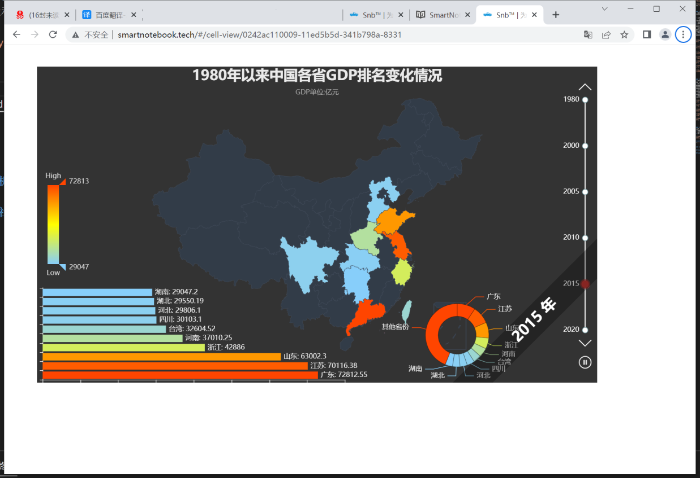

# SmartNotebook数据分析/数据科学平台介绍
--- 

联系咨询:wangxinyi@smartnotebook.tech

--- 

借助中国经济的快速发展和数据技术的演进，大数据整个行业实现了生态的完善和技术的飞速发展。大数据最初在互联网、金融领域应用，到目前相关细分领域也初具规模，有了质的飞跃。未来数据领域如何演进？我们认为未来一段时期需要在以下几方面更多关注：

- <b>信息化、数字化到数智化的转变。</b>

    信息化是从线下到线上的过程，业务逻辑并没有大的改变，但是极大的提升了业务效率。随着信息化的普及，信息化的深度也随之增强，进而达到数字化阶段，通过信息技术的发展，利用大数据领域大容量存储技术和高效的处理能力，能够将深度信息化带来的数字价值发挥出来，在海量的数据中挖掘出潜在的价值，提升企业的运营效率，快速捕捉用户痛点和需求，实现产品功能的更新迭代，提升竞争力。数据的资产化是企业和国家重视数据的表现，保障数据安全、数据高可用，也是近年来各企业、国家考虑的重点和发展发向。在数字化的基础上，目前互联网公司已经实现了智能化的转变，通过收集用户的行为数据、创建数据模型、挖掘个性化用户喜好和特征，精准化推荐用户需要的商品/内容，是互联网巨头们必备的基础服务。在外卖行业，通过外卖员的行走路线进行数据分析，既能自动规划最短路线，又实现外卖员的负载最大化，也减少了客户的等待时间，实现企业和个人的双赢，促进整个社会效率的提升。未来随着数智化的发展还将促进物联网、自动驾驶、智能物流等领域的快速发展。

- <b>数据科学和AI平台建设是企业未来发展的重心。</b>

    大数据的广泛应用体现在数据平台、数据仓库和数据中台的建设上，通过这些基础建设挖掘数据价值赋能业务，促进业务的增长。其中数据平台是基础，是存储和计算数据的基石。数据仓库是合理化数据布局，用最少的存储空间实现数据计算效率的最大化。数据中台是建设在数据平台之上，根据业务特性，搭建一站式的数据服务层，用数据赋能业务。这些是最基础的服务，能够给企业带来的价值有限。为了深入的了解业务、洞察痛点、预测行业发展趋势，数据科学和AI平台将是未来发展的重心和方向。通过它深度挖掘算法，预测业务发展规律，提前布局行业发展，实现企业平稳发展。

- <b>大数据应以业务、人为中心。</b>

    在大数据发展初期，整个行业都在关注与提升技术的先进性，虽然带来了整个行业的进步，但是多少有些舍本逐末，大数据作为一种基础服务，数据和技术是工具，有良好意识和技能的人员，利用数据和工具帮企业实现业务目标才是最终目的，在基础服务层投入较多的人力和成本，不利于企业的良好发展。大数据的发展应以业务和人为中心，这既需要合适的大数据产品或解决方案，又需要培养、提升开发人员、业务人员的数据意识和技能。

- <b>On-Premise到SaaS的转变。</b>

    On-Premise对大数据平台的搭建很方便，曾经为企业提供了便利，实现管理、监控、诊断和继承等一站式服务，但随着企业对大数据产品功能的要求逐渐增高，这种On-Premise型的服务由于迭代速度慢，版本升级困难，价格贵等因素导致使用这类服务的企业变少。因此更多的企业转向规模更大、服务效率更高、价格更低的SaaS服务。SaaS服务实现了多租户的特性，将成本降至最低；跨越时空的限制，通过互联网满足用户的需求，降低了用户购买硬件资源和聘用运维人员的费用，通过在线服务保障服务质量和服务计量的透明化，在服务的高可用方面提供了较高的保障，对企业来讲用低廉的价格，达到了以往大厂才有的服务和产品功能，在未来，SaaS的优势会越来越明显。

为了适应企业数据化、数据智能的需要，结合数据科技的趋势，研发了SmartNotebook的数据分析/数据科学平台，提升中小企业的数智化能力，赋能中小企业。以下逐步展开smartnotebook 是什么？

## SmartNoteBook是什么？

SmartNoteBook是协作的、集成的、一站式数据科学/分析环境。

SmartNoteBook是参考Jupyter notebook思想实现数据科学与分析的强大环境，深度融合`Python`(编程能力、AI能力)与`SQL`(数据处理)、可视化于一体，更高效编辑、执行和共享数据应用模型，进行数据采集、探索、机器学习、深度学习和交互可视化。开箱即用的数据科学、机器学习工具包；高效编辑器辅助和团队协作跟踪功能；通过Notebook结构化逻辑关系配合自然语言可以很好表现数据分析过程、阐述数据故事，形成数据报告，深层次的挖掘数据、释放数据价值。

## NoteBook企业发行版
基于Notebook思想和企业数据化的需求全新开发实现一套数据分析/数据科学一站式的平台(SmartNotebook),完整兼容notebook的显性的编程方式(独立代码输入块与显示输出、代码与自然语言标记交织)和Python强大的数据处理、分析和人工智能的框架能力；以适应企业数据化的需求重点实现以下扩展：

### 1. 优雅融合SQL数据处理能力：
兼容主流数据库、数据仓库、MPP、HTAP(Hybrid and AnalyticalProcessing)、大数据平台,利用强大数据基础设施和Python 融合,充分、快速挖掘数据价值。 数据源的统一配置管理、Notebook内引用及调用数据源、DataFrame与SQL互操作、Python与SQL融合等特性，极大提升数据处理效率、降低入门使用门槛。

- 隐式数据源引用：隐式引用数据源配置为数据连接(Connect)，执行包括数据入库(DataFrame入库操作)、数据处理等(DML或DDL)操作。
- SQL单元格(Cell)：选择数据源和编写SQL语句执行后结果集转为DataFrame，提升数据处理效率、降低入门使用门槛。
- dfSQL单元格(Cell)：通过SQL操作DataFrame执行数据筛选、过滤、排序、统计汇总、转换、合并等数据处理过程。
- SQL模板：SQL及dfSQL支持JinJia2 表达式模板，支持变量替换、逻辑判断、逻辑循环等逻辑控制，可以很方便的结合python 变量控制SQL执行逻辑、支持复杂数据处理逻辑。
- Markdown单元格(Cell):通过Markdown描述数据处理的流程、算法的逻辑等说明，更好阐述数据故事和模型、知识的分享。Markdown支持Latex数学公式、插图、序号列表、任务列表、表格、TOC目录等各式，丰富表达数据故事流程。

")

### 2.融合Low Code(低代码) 、Full Code、ServerLess理念
使得SmartNotebook 保持易使用、低门槛的同时，保留数据处理、数据智能化应用无限可能的高天花板。发挥Full Code灵活、扩展性强的特点；保持LowCode(低代码)的自助、低门槛和自助的特征；ServerLess(Function服务)服务模型高效、便捷的构建易维护的数据服务和AI模型服务。

- 扩展数据转换、数据展示及数据探索的低代码单元格插件，降低数据处理和建模门槛；未来会继续扩展AI/ML插件(coming soon...)。
- 图表(chart)单元格：支持柱状图、折线图、散点图等，图表是动态交互的，区别于matplotlib、Seaborn静态图；可以单独分享和汇聚到大屏仪表盘(Databoard)进行分享。
- Table单元格：对DataFrame进行数据表格展现，支持筛选、排序、格式定义、分页、列交换。
- EDA分析单元格：EDA是探索性数据分析(Exploratory Data Analysis，简称EDA),探索性数据分析（EDA）是一种分析数据集以概括其主要特征的方法，通常使用可视化方法。EDA分析单元格让您更加清晰得洞察数据，通过缩放来查看某一特定的数据。洞悉数据内部特征，帮助窥视不同特征量之间的关系，同时确保数据中没有缺失或是不符合期望的数据。
- EDA概览单元格:EDA概览一键生成数据的全貌，简单快速地进行探索性数据分析，包括是数据概要(类型、唯一值、缺失值)、分位数统计(中位数、四分位数等)、描述性统计（标准差、变异系数、偏度系数、众数、均值等）、相关性分析(Spearman's ρ、Pearson's r、Kendall's τ、Phik (φk))可视化(矩阵、色阶图)等。
- 数据透视表单元格：数据透视表(可以动态地改变它们的配置，以便按照不同方式分析数据，也可以重新行、列和值字段)单元格以可视化界面的(类似Execel 透视表 )方式交互聚合和透视数据。拖拽数据集的字段设置行(需要聚合的字段，垂直渲染)、列(需要聚合的字段，水平呈现)、值(需要聚合汇总的字段，配置聚合函数类型：求和、均值、均差等等)敏捷进行数据转换、聚合统计。

### 3.单一编程界面
- 代码块：以统一代码块(Cell)组织程序之间或数据间的逻辑关系，形成数据流动的流程图(PipeLine)， 代码块类型包括基本code类型(Python code、SQL code、Markdown)及Low Code 扩展类型(数据转换、数据展示、数据探索分析及不久后支持机器学习)、服务API。
- 辅助功能:包括节点环境package包管理、数据资源(数据文件管理、数据源管理及元数据)、目录(根据MarkDown单元格中使用的标题显示Notebook结构和代码的逻辑流程)、节点实例(展示节点实例的负载情况包括cpu、内存等资源，节点环境的切换、Notebook调度配置及调度历史)、变量预览区(变量查看器工具允许您浏览当前notebook kernel中使用的变量及其值)、版本控制(版本列表、版本回退、比对、提交;支持gitLab、gitHub)、代码片段(常用复用代码、个人收藏的代码块/代码模板)
- 模型视图:模型视图是notebook 逻辑关系的一种可视化(Graph)关系图展现，节点为单元格，边为单元格之间的引用关系(逻辑依赖关系)，模型视图提升更高效代码执行效率，同时像脑图一样辅助建模人员更好梳理和优化模型、更方便的分享模型。
- 终端管理:集成的终端web客户端允许您执行许多任务，例如在SmartNotebook中执行.py脚本，或者使用常见的bash命令访问Node节点环境和文件系统。还可以运行命令并安装需要依赖项的包。
- 调度/监控(scheduling):使用调度(scheduling)以配置时间间隔（每小时、每天、每周或每月）运行notebook。通过调度器可以定期处理数据和更新报告，同时查看和监控执行情况。

### 4.团队的交互合作
共享和协作是SmartNotebook中团队合作关键部分。包含workspace工作空间的团队协作、cell和notebook 分享、评论。
- 共享工作空间：让团队用户在您创建的工作空间上协调工作。
- 共享报告/cell：邀请其他用户实时从默认的主工作区在笔记本上进行协作。随时、多终端分享数据成果。
- 评论:在notebook和报告内对单元格进行评论互动，通过互动快速改进和优化模型。

### 5.Data/Model service(API)

数据/模型服务是快速将smartnotebook建模后的数据或模型生成API服务，通过API为其他业务系统或第三方提供服务(通过数据API的方式，提供给上层数据应用、数据门户，可视化大屏等)，是释放数据价值的最为关键的步骤。由于数据多样性和模型的复杂性，传统的定制开发API方式需要架构、开发、部署、运维等多步骤、多角色参与，整个过程复杂、成本高、运维/维护困难。近几年诞生较多的DataAPI服务平台，通过配置的方式生成API Service，提升效率、降低开发成本，但实际使用过程中也存在较多的问题，比如灵活性问题，很难应对复杂业务场景、很难应对算法模型的数据变换、处理的需要。为此SmartNoteBook开发了FaaS服务模块，Snb FaaS是函数即服务(Function-as-a-Service)的框架，通过netobook 调试函数，调试完成直接发布到Snb FaaS Node 节点上直接生成Servcie API，根据负载情况弹性扩展Node 节点。通过FaaS 方式生成Service API 既保持灵活性，又降低复杂性，有极高的弹性，维持灵活性、复杂性和弹性的统一。

## 云原生的数据分析及数据科学平台

## 模型市场及知识社区