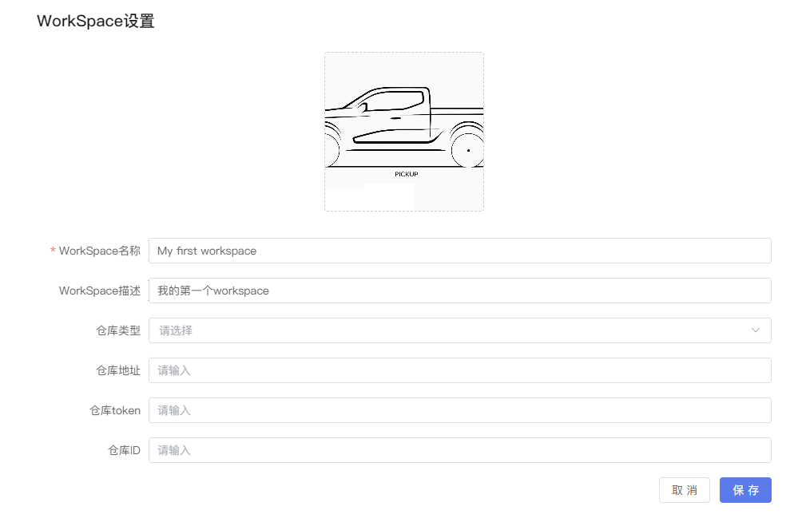
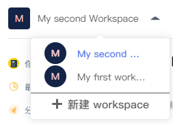

# NoteBook

切回到我们默认的Workspace空间。首先我们需要先创建一个Workspace环境，将来在这个环境下去运行我们的Notebook。

  

接下来我们需要选择机器配置和镜像类型，并输入环境名称，然后`提交`。这样我们的第一个运行环境就创建好了。

  

通过修改Workspace的名称和描述，并上传喜欢的头像，点击`保存`，我们的第一个Workspace就创建和修改完成了。

  

如果我们想再创建另外一个新的Workspace，可以点击左上角Workspace处的下拉箭头，点击`新建`

  

然后输入新的Workspace的相关信息和配置，点击`提交`，一个新的Workspace就创建好了。

 

左上角可根据需求切换Workspace

  

