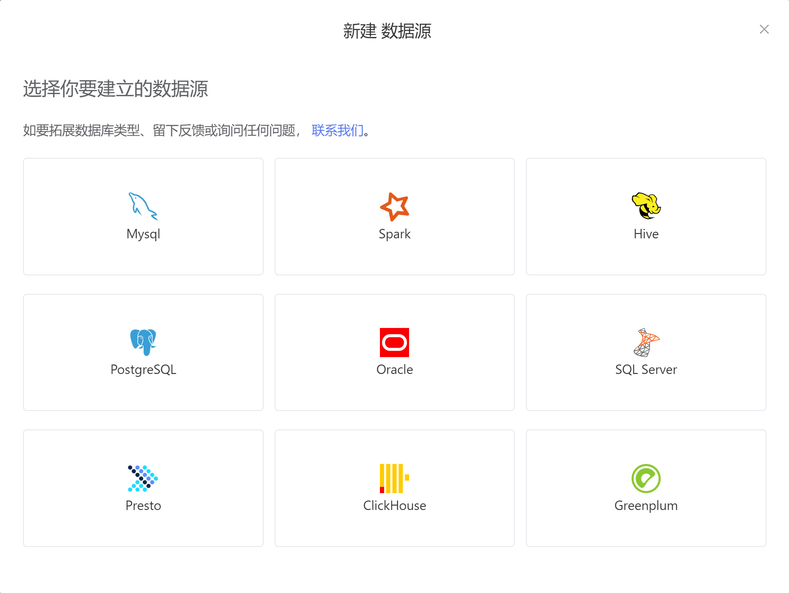

# 数据源

---

## 数据源类型

SmartNoteBook当前支持的数据源类型包括：

* MySQL：关系型数据库管理系统，由瑞典MySQL AB 公司开发，属于 Oracle 旗下产品。MySQL 是最流行的关系型数据库管理系统之一。
* Spark：通用的大数据分析引擎,具有高性能、易用和普遍性等特点。
* Hive：基于Hadoop的一个数据仓库工具，用来进行数据提取、转化、加载，这是一种可以存储、查询和分析存储在Hadoop中的大规模数据的机制。
* PostgreSQL：一种特性非常齐全的自由软件的对象-关系型数据库管理系统（ORDBMS）
* Oracle：甲骨文公司的一款关系数据库管理系统。它是在数据库领域一直处于领先地位的产品。
* SQL Server：SQL Server是由Microsoft开发和推广的关系数据库管理系统（RDBMS）。
* Presto：Facebook开发的数据查询引擎，可对250PB以上的数据进行快速地交互式分析。
* ClickHouse：俄罗斯的 Yandex 于 2016 年开源的用于在线分析处理查询（OLAP :Online Analytical Processing）MPP架构的列式存储数据库
* Greenplum：业界最快最高性价比的关系型分布式数据库，它在开源的PG(PostgreSql)的基础上采用MPP架构（Massive Parallel Processing,海量并行处理），具有强大的大规模数据分析任务处理能力。




SmartNoteBook为用户提供数据接入与管理功能，让用户可以简单高效的接入和管理数据集。


## 新建数据源

在【WorkSpace数据源】标签页，点击右上角【新建连接服务】，即可新建数据源。

###### 


## 数据库连接

用户可以在选择不同类型的数据源后，通过正确配置对应类型的数据库信息、数据库凭证后，完成创建数据库连接。

不同的数据源对应填写的配置项也会存在差异。

例如当连接MySQL数据源：


当连接Oracle数据源：


创建数据库连接时，我们会为你生成一个数据标识，相当于该数据库的云端“唯一id”。  
该数据标识你可在Notebook的侧边栏--数据资源复制获取，并可在代码中引用。

示例：


```py
from snb_plugin.sql.execute_sql import __smartnotebook_getengine_by_conn_id as snb_conn  
engine=snb_conn("0842ac110004-11ed4175-527b33a4-a5ab", context=globals())

# 使用 cursor() 方法创建一个游标对象 cursor
with engine.connect() as conn:
    #参考 gpu_df.to_sql('gpu_data',conn,if_exists='append')
```


