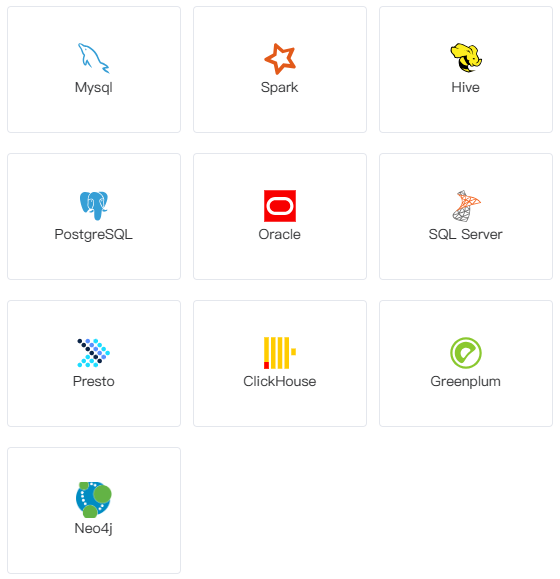
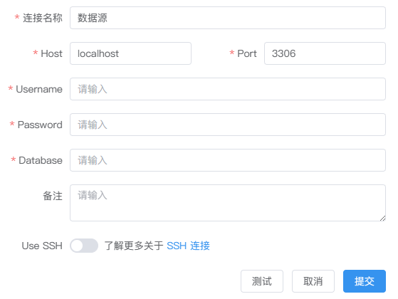
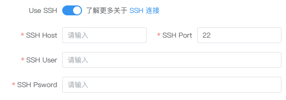

# WorkSpace数据源
---
简单、高效、无代码的与数据源建立安全链接。

<!--    -->
<!--  -->

## 数据源类型

SmartNoteBook当前经过测试已支持的数据源包括以下10种，更多的国产数据库正在接入测试中，敬请期待：

  

* `MySQL`：关系型数据库管理系统，由瑞典MySQL AB 公司开发，属于 Oracle 旗下产品。MySQL 是最流行的关系型数据库管理系统之一。
* `Spark`：通用的大数据分析引擎,具有高性能、易用和普遍性等特点。
* `Hive`：基于Hadoop的一个数据仓库工具，用来进行数据提取、转化、加载，这是一种可以存储、查询和分析存储在Hadoop中的大规模数据的机制。
* `PostgreSQL`：一种特性非常齐全的自由软件的对象-关系型数据库管理系统（ORDBMS）
* `Oracle`：甲骨文公司的一款关系数据库管理系统。它是在数据库领域一直处于领先地位的产品。
* `SQL Server`：SQL Server是由Microsoft开发和推广的关系数据库管理系统（RDBMS）。
* `Presto`：Facebook开发的数据查询引擎，可对250PB以上的数据进行快速地交互式分析。
* `ClickHouse`：俄罗斯的 Yandex 于 2016 年开源的用于在线分析处理查询（OLAP :Online Analytical Processing）MPP架构的列式存储数据库
* `Greenplum`：业界最快最高性价比的关系型分布式数据库，它在开源的PG(PostgreSql)的基础上采用MPP架构（Massive Parallel Processing,海量并行处理），具有强大的大规模数据分析任务处理能力。
* `Neo4j`：Neo4j是一个开源的，高性能的NoSQL图形数据库，

> [!Tip]
> 即将支持更多的数据源——如果您有需要优先支持的数据源，可联系我们<feedback@smartnotebook.tech>。

## 建立新的数据源连接

选择左侧导航栏的`WorkSpace数据源`，然后点击页面右上角`新建连接服务`。

我们选择需要连接的数据源图标并填写相应的连接及密码验证信息：

 

当信息填写完毕后先点击`测试`，如连接信息有误，系统会返回相应的错误提示。如返回`连接测试功能`，表明数据连接成功，此时点击`提交`，一个新的数据源连接就建好了。

  

<!-- ## 编辑连接

在数据源列表中选择所需修改的数据源，修改配置信息后单击`测试`，返回成功信息后点击`提交`。 -->

## 不同数据源的信息配置

<!-- 用户可以在选择不同类型的数据源后，通过正确配置对应类型的数据库信息、数据库凭证后，完成创建数据库连接。

不同的数据源对应填写的配置项也会存在差异。 -->

- 对于MySQL，PostgreSQL，SQL Server，ClickHouse、Greenplum和Neo4j，您需要配置：

  - 数据库主机网址地址（host）
  - 数据库端口（Port）
  - 数据库名称（Database）
  - 用户名和密码

- 对于Spark，Hive，Presto，ClickHouse和Greenplum，您需要配置：

  - 数据库主机网址地址（host）
  - 数据库端口（Port）
  - 数据库名称（Database）
  - 鉴权方式：`用户名和密码`或`无需鉴权`
  - 用户名和密码

- 对于Oracle，您需要配置：

  - 数据库主机网址地址（host）
  - 数据库端口（Port）
  - 实例名（SID）
  - 驱动类型（driver）：`Thin`/`OCI`/`OCIB`
  - 用户名和密码

- 对于Neo4j，您需要配置：

  - 数据库主机网址地址（host）
  - 数据库端口（Port）
  - 实例名（SID）
  - 驱动类型（driver）：`Thin`/`OCI`/`OCIB`
  - 用户名和密码

<!-- 
备注：当数据库连接配置完成后，我们会为你生成一个数据标识，相当于该数据库的云端“唯一id”， 如 0242ac110004-11edacf8-81c84f68-a244。该数据标识你可在Notebook的侧边栏--数据资源复制获取，并可在代码中引用。参见侧边栏->数据资源 -->

## 使用数据连接查询数据库

当建立好数据连接后，可以在Notebook中使用SQL单元格进行查询。详见<a href="../NoteBook/SQL.md" title="SQL代码块">SQL代码块</a>

## 配置SSH安全连接

对于每个数据连接，都可以配置SSH，通过加密和认证机制实现更安全的访问。

  

  - 主机地址（SSH Host）：主机名或IP地址
  - 端口号（SSH Port）：通常是22端口
  - 用户名（SSH User）
  - 密码（SSH Password）

