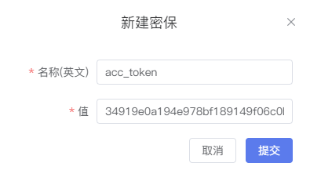

# 密保箱

SmartNoteBook为用户提供密码保护的功能，用户可以加密一些敏感信息，在使用时采用加密后的信息，防止信息泄露。

  

## 新建密保

点击右上角的`新建密保`,输入`名称（英文）`和`值`后提交。

  

## 密保列表

在密保列表我们可以重新`编辑密保`和`删除密保`。

  

## 密保的使用

单击密保名称前面的可以复制密保的使用代码，并在NoteBook中插入代码进行调用。

  
