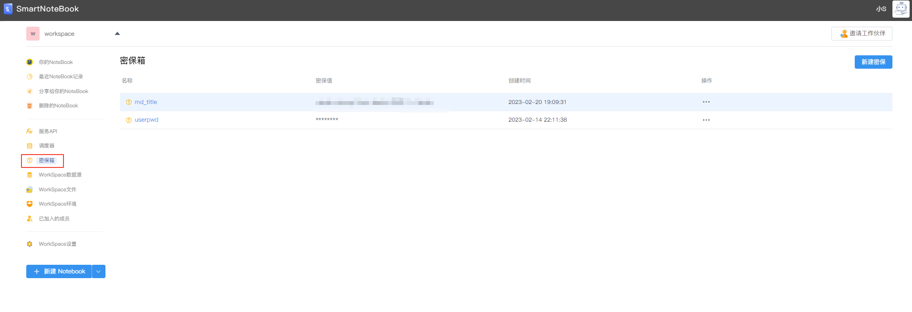
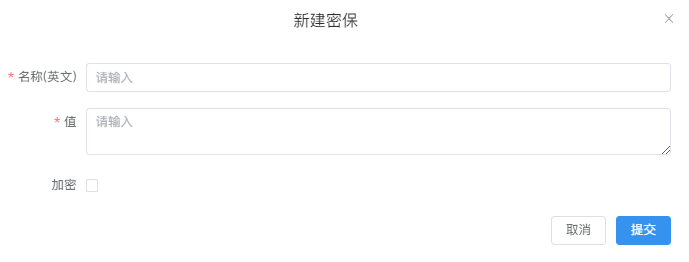
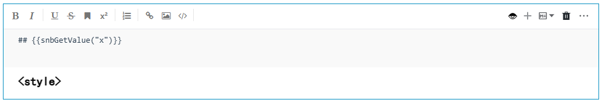

# 密保箱
---
通过将敏感值（如API令牌或重要密码）添加到密保箱来确保关键信息的机密性。后面我们可以在单元格中调用名称来访问该信息，而不是通过明文或者硬编码的方式进行调用。

如需在NoteBook中使用环境变量，也可以通过密保箱的功能进行配置，减少代码中硬编码的情况。

  

## 新建密保

点击右上角的`新建密保`,输入`名称（英文）`和`值`。

如需加密请勾选`加密`，配置完成后点击提交。

  

## 密保列表

在密保的列表处可以编辑或删除密保：

  

## 使用密保

单击密保名称可复制密保的代码，并在NoteBook的单元格中调用。

  

- 在Python单元格中使用密保：

  

- 在MarkDown中使用密保：

  

