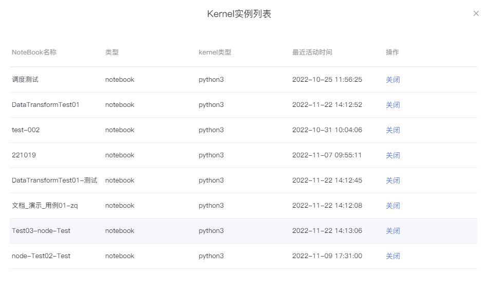

# Workspace环境
---
SmartNoteBook为用户提供`Workspace环境配置`功能，让用户可以根据不同的应用场景和需求去选择相应的环境配置和镜像类型。

## 新建环境

在`【WorkSpace环境】`标签页，单击`【新建环境配置】`，通过选择需求的型号配置和镜像类型并填写环境名称。

## 编辑环境

在`【WorkSpace环境】`标签页，选择需修改的环境，单击`【操作】`列的`【...】`，然后点击`【编辑环境】`。

## 查看和关闭

单击环境列表名称前面的  可以查看该环境下所有Kernel实例。

  

如需释放Kernel资源，可以选择NoteBook对应的Kernel，点击操作`关闭`释放资源。

## 删除环境

在`【WorkSpace环境】`标签页，找到需要删除的环境，单击`【操作】`列的`【...】`，然后点击`【删除】`即可。

> [!Warning]
> 注：环境如已被引用，需将项目完全删除后再删除环境。
