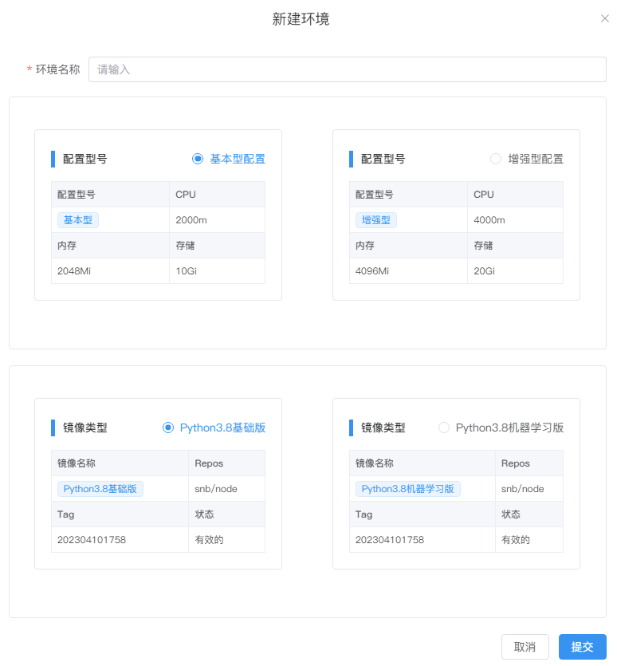
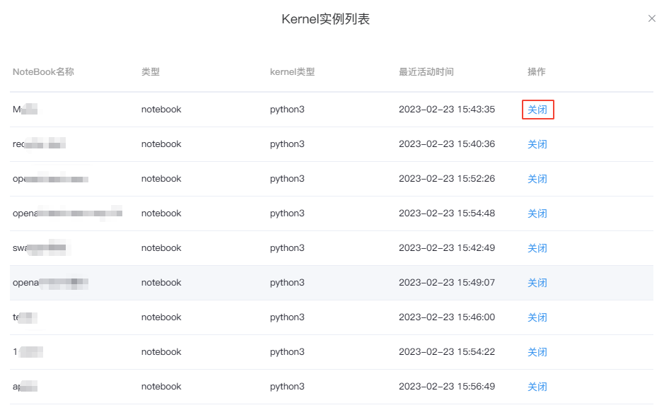
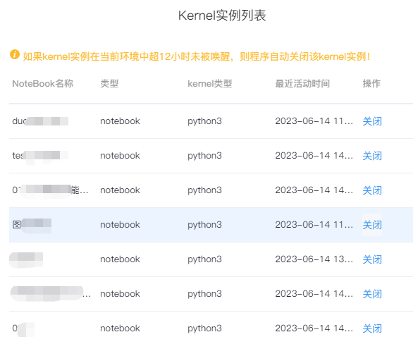

# Workspace环境
---
配置环境和镜像类型。

  

## 新建/编辑环境（专业版或企业版）

选择左侧导航栏的`环境`，单击`新建环境配置`，选择型号配置和镜像类型并填写环境名称提交。

  

如需修改环境配置，可单击`操作`列的`...`，然后点击`编辑环境`，修改完成后提交。

> [!NOTE|style:flat]
> 专业版或企业版的管理员拥有此功能权限，基础版无此功能。

## 查看和关闭Kernel实例

单击环境列表前的  可查看该环境下所有打开的Kernel实例。

<!--    -->
<!--    -->

  

如需关闭实例，可以选择相对应的NoteBook，点击右侧的`关闭`并确定。

<!--    -->
  

> [!NOTE|style:flat]
> 如果 kernel 实例在当前环境中超过 12 小时没有被使用，系统将会自动释放该 kernel 实例以节省资源。

## 环境状态

环境拥有两种状态：

- `正常`：环境按照预期的方式工作，没有出现任何错误或故障
- `异常`：环境发生了一些不寻常或不符合预期的情况，可能无法正常工作，功能可能受限或完全无法使用。

<!--    -->

## 查看环境的运行和使用状态

详见侧边栏的<a href="./Sidebar.md/#sv" title="切换环境">环境-查看配置/负载情况</a> 

## 切换环境

详见侧边栏的<a href="./Sidebar.md/#sv" title="切换环境">环境-切换环境</a> 

## 删除环境

在`WorkSpace环境`标签页，找到需要删除的环境，单击`操作`列的`...`，然后点击`删除`。

<!--    -->
  

> [!Warning]
> 注：如环境已被使用，需将此环境下所有的NoteBook删除后才可删掉环境。
