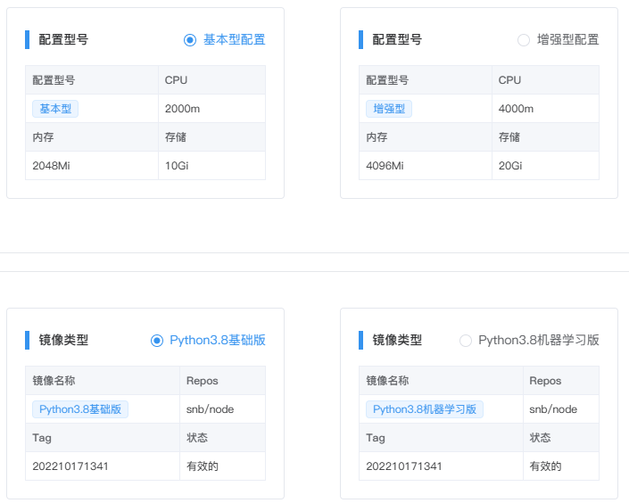

# Workspace环境
---
配置环境和镜像类型。

  

## 新建/编辑环境

在`WorkSpace环境`标签页，单击`新建环境配置`，选择型号配置和镜像类型并填写环境名称提交。

如需修改环境配置，可单击`操作`列的`...`，然后点击`编辑环境`，修改完成后提交。

> [!NOTE|style:flat]
> 基础版无法新建/编辑环境，购买专业版和企业版后管理员可新建和管理环境资源。

## 查看和关闭

单击环境列表名称前面的  可以查看该环境下所有Kernel实例。

  

在某些时候，用户可能必须停止某些正在运行的计算，最常见的情况是达到并行计算的限制。

如需释放Kernel资源，可以选择NoteBook对应的Kernel，点击`关闭`。

## 删除环境

在`WorkSpace环境`标签页，找到需要删除的环境，单击`操作`列的`...`，然后点击`删除`即可。

> [!Warning]
> 注：如环境已被使用，需将此环境下所有的Notebook删除后才可删掉环境。

## 环境配置和镜像类型

  
