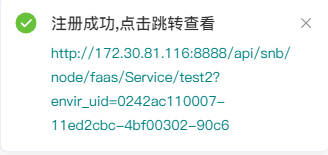

# 服务API

数据/模型服务是快速将SmartNoteBook建模后的数据或模型生成API服务，通过API为其他业务系统或第三方提供服务(通过数据API的方式，提供给上层数据应用、数据门户，可视化大屏等)，是释放数据价值的最为关键的步骤。由于数据多样性和模型的复杂性，传统的定制开发API方式需要架构、开发、部署、运维等多步骤、多角色参与，整个过程复杂、成本高、运维/维护困难。近几年诞生较多的DataAPI服务平台，通过配置的方式生成API Service，提升效率、降低开发成本，但实际使用过程中也存在较多的问题，比如灵活性问题，很难应对复杂业务场景、很难应对算法模型的数据变换、处理的需要。为此SmartNoteBook开发了FaaS服务模块，Snb FaaS是函数即服务(Function-as-a-Service)的框架，通过notebook 调试函数，调试完成直接发布到Snb FaaS Node 节点上直接生成Servcie API，根据负载情况弹性扩展Node 节点。通过FaaS 方式生成Service API 既保持灵活性，又降低复杂性，有极高的弹性，维持灵活性、复杂性和弹性的统一。

  

## 注册服务API

当我们的模型训练完成后，可以通过以下形式注册API对外提供服务。

```
import json
import urllib.request

__MODULE_NAME__ = "test2"

def getBody(request,requestHandler) -> 'HTTP':
    cityMap = {"上海":"101020100","北京":"101010100"}
    r = urllib.request.urlopen('http://www.weather.com.cn/data/sk/'+cityMap.get(requestHandler.get_argument("city"))+'.html')
    requestHandler.write(r.read().decode())
```
关于以上注册服务代码的格式约定：

* `__MODULE_NAME__`：Faas API的注册名称。该变量名固定，变量的值用户自定义
* `def getBody(request,requestHandler) -> 'HTTP' `: 函数名`getBody`用户自定义，其他为固定格式
* `requestHandler.write(r.read().decode())`:固定格式
* 除以上约定外，函数内部代码用户可自定义编写

执行以上代码块后我们先做虚拟测试检查服务是否可以正常调用

```
from snb_plugin.SnbFaaSSim import SnbSimRequest,SnbSimRequestHandler
r = SnbSimRequest()
rh = SnbSimRequestHandler()

rh.set_argument("city","上海")
getBody(r, rh)

print(rh.read())
```

调用结果
```
{"weatherinfo":{"city":"上海","cityid":"101020100","temp":"23.5","WD":"东北风","WS":"小于3级","SD":"80%","AP":"1006.4hPa","njd":"2903","WSE":"< 3","time":"17:00","sm":"1.1","isRadar":"1","Radar":"JC_RADAR_AZ9210_JB"}}
```

虚拟调用测试成功后我们就可以将代码块注册成服务，具体操作：

  

当服务成功注册后系统会提示:

  


## 管理服务API

在工作空间的`服务API`标签页下，我们可以看到已经注册的服务API列表。

  

在管理页面我们可以查看并跳转 到服务链接。

点击`...` 可进行的操作：

- `打开NoteBook`：打开服务API对应的NoteBook
- `删除服务`：删除该服务API

  


## 调用服务API

`需要增加鉴权的内容`

我们可以在浏览器中直接调用

```
http://smartnotebook.tech/api/snb/node/faas/Service/test2?envir_uid=0242ac110007-11ed2cbc-4bf00302-90c6&city=上海
```

调用结果
```
{"weatherinfo":{"city":"上海","cityid":"101020100","temp":"23.5","WD":"东北风","WS":"小于3级","SD":"80%","AP":"1006.4hPa","njd":"2903","WSE":"< 3","time":"17:00","sm":"1.1","isRadar":"1","Radar":"JC_RADAR_AZ9210_JB"}}
```