# WorkSpace成员
---
团队成员在相同的WorkSpace下开始协同工作。
<!--    -->
<!-- 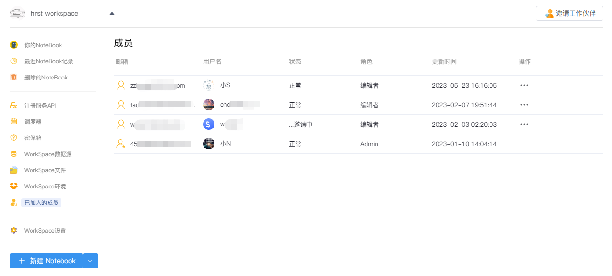   -->
<!--    -->
<!-- 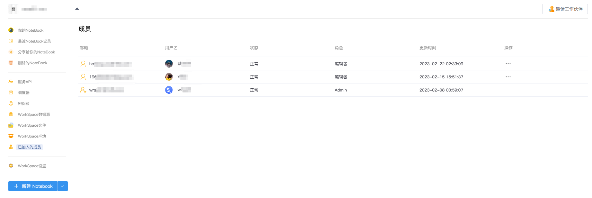   -->
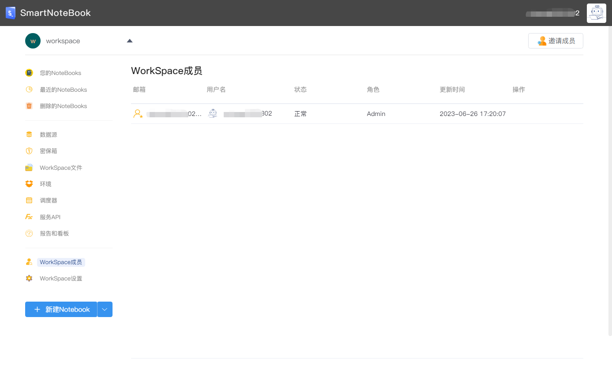  

## 邀请团队成员

单击页面右上角的按钮转到邀请页面，填写受邀请人的Email并设置其角色（编辑者/查看者），点击`发送邀请`：
<!--    -->

<!-- 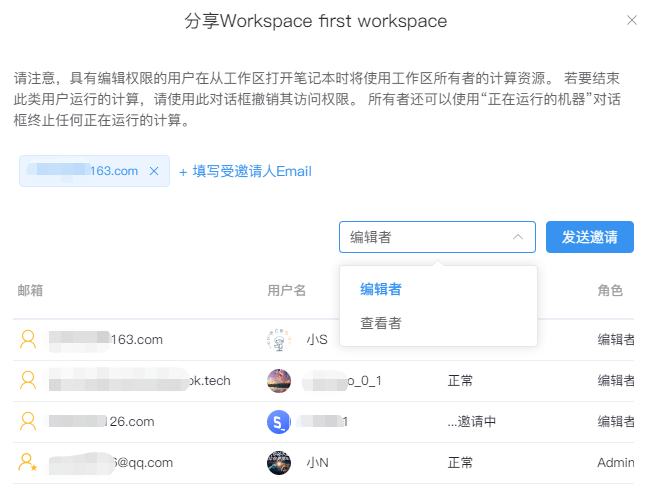   -->
  

<!-- 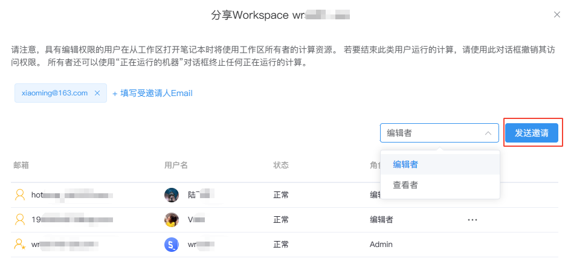   -->

发送邀请后，被邀请的团队成员状态将显示为"邀请中..."：

<!--    -->
<!--    -->
  

被邀请成员点击邮件确认后状态切换为"正常"，此时被邀请人加入该WorkSpace并获得相应的权限参与到协同工作。
<!-- 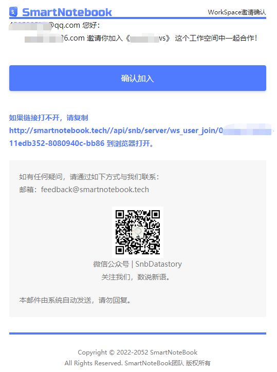   -->
  

<!--    -->

> [!NOTE|style:flat]
> 受邀请人需拥有SmartNoteBook的账号方能正常收到邀请，否则将无法正常邀请。

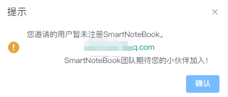  

## 修改角色权限

- 编辑者：拥有除`WorkSpace设置`以及环境资源配置外，其他一切该WorkSpace拥有者的权限（查看、新建、编辑、删除）
- 查看者：看到的功能与编辑者一致，但只拥有查看权限

管理员可以对状态正常的成员修改角色权限：

<!-- 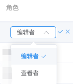   -->
  

<!-- ## 被邀请人

被邀请人收到邀请邮件后，需根据邮件提示点击`确认加入`或复制下方链接到浏览器打开，方可加入邀请人的WorkSpace。

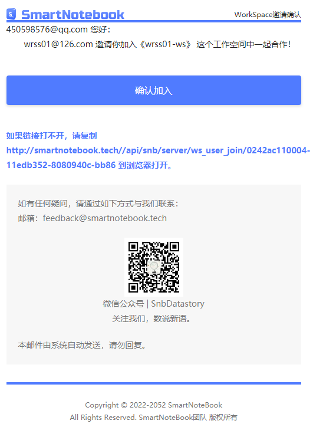   -->

## 移除成员

管理员可以在成员列表中点击`操作`-`移除`将已加入的成员移除出团队。

被移除的成员将无法看到该WorkSpace，如需重新访问，需被重新邀请。

<!--    -->
  

## 禁用

管理员可以对成员的状态进行修改（禁用）。

被禁用的成员将无法看到该WorkSpace直到状态被修改为正常状态。

<!-- 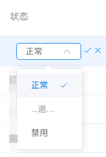   -->
  

## 协同编辑

<!-- 待协同操作功能完善后再补充该部分内容 -->

当多名团队成员同时编辑同一份NoteBook文档，后打开NoteBook的成员会在NoteBook页面上方收到提示，无法保存修改的内容（同时编辑内容会产生冲突）：

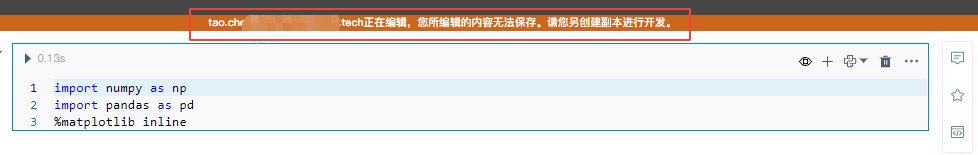  

