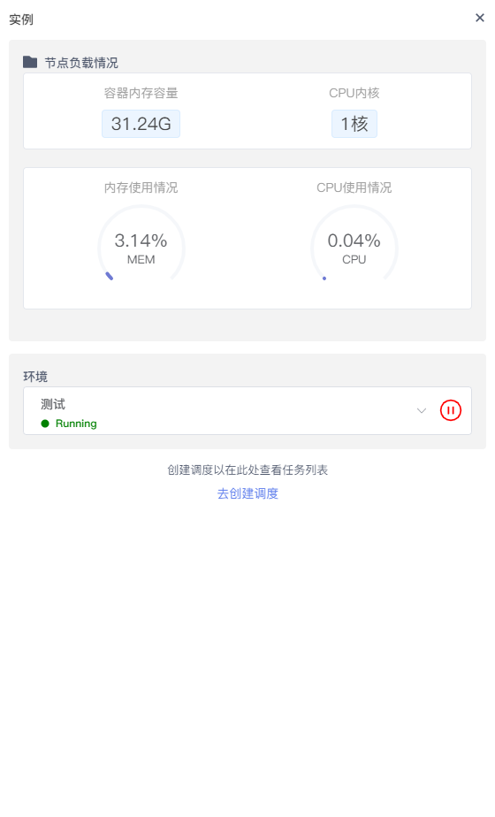
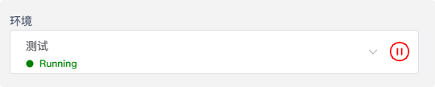

# Workspace调度器

创建调度器将会安排NoteBook按设定的计划（如每小时、每天、每周或每月间隔）重新运行。

- 调度执行时，将从上到下执行整个NoteBook的逻辑。如NoteBook中有单元格报错，会接着执行后面单元格的代码
- 当NoteBook拥有多个版本记录时，调度总是执行最新版本的NoteBook代码

# 创建调度

在NoteBook下，点击左侧 `实例` 可为NoteBook创建调度计划。 

  

您可以安排应用每小时、每天、每周或每月运行一次。

  

如设定执行的周期和时间，`每天 10:15` 开始执行

在高级设置中，可以选择配置计划运行完成时状态成功或失败的通知，以及哪些用户将收到这些通知。

   

# 查看调度历史

点击调度器列表的某条记录，可以查看该调度器执行的历史情况。在这里，您也可以查看运行报告以及下载运行结果，如需调整配置计划也可点击右侧的`调度器设置`来重设调度器的执行计划。

  

# 暂停调度

如需暂停调度的执行，可在NoteBook的环境处点击暂停按钮

  

或是在Workspace下的`配调度NoteBooks`选择需要暂停的任务点击`...`后点击`暂停调度`

  

# 删除调度

在Workspace下的`配调度NoteBooks`选择需要暂停的任务点击`...`后点击`删除调度`。

  

> [!Warning]
> 删除调度前需确认任务是否正在执行，否则会提示删除失败。

