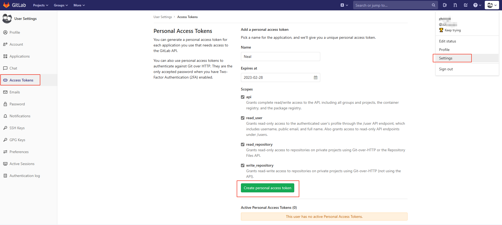

# Workspace设置
---
可以配置Workspace的头像，`名称`,`备注`,`仓库类型`,`仓库地址`,`仓库token`,`仓库id`

## 编辑/新建/切换Workspace

###  编辑当前Workspace信息

当前Workspace下点击左侧菜单栏`WorkSpace设置`-->`编辑`。

  

可修改Workspace的名称和描述，并上传喜欢的头像，点击`保存`。

| 功能 | 解释 | 
| :-----| :---- | 
| workspace 名称 | 必填 | 
| workspace 描述 | 选填 | 
| 仓库类型 | 选填， 目前支持的仓库类型：gitlab 和 github| 
| 仓库地址 | git仓库的url，如：`http://172.30.81.xxx:8000`| 
| 仓库token | git仓库的Access Token ，获取方式见下方的tips| 
| 仓库ID或目录 | git仓库的ID或目录 | 
| 分支 | git仓库分支 | 
| 测试仓库链接 | git仓库配置完成后，点击测试是否成功 |
| workspace 图标 | 单击上方的图标修改并上传新的图标 | 

> [!Tip]
> 如何获取gitlab的Access Token？

1. 登录gitlab，点击`Settings`-->`Access Tokens`，并按照页面填写信息和勾选权限后，点击下方的绿色按钮

      

2. Token创建成功，复制使用

      

## 删除

  

> [!Warning]
> 注：删除Workspace时，如该Workspace下如存在任何文件或使用记录，需将所有内容删除后才能删除。

