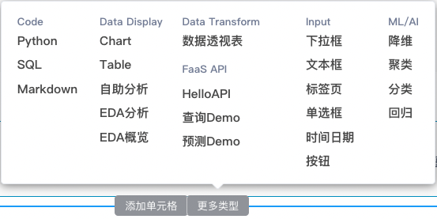

## 专题分析管理
### 添加专题分析
专题来源于自助分析组件，先添加一个“自助分析”组件，

接着选择事先准备的数据集，按需调整配置项，然后

点击该组件单元格右边的图标，在弹出的对话框中输入“专题名称”,点击“提交”，即可保存该专题。

在专题分析管理页面可以查看到已保存的专题，你可以点击进入查看或分析。

### 配置权限
在这里配置该专题分析的查看权限，设置谁可以看，只有勾选过的用户才可以查看。
