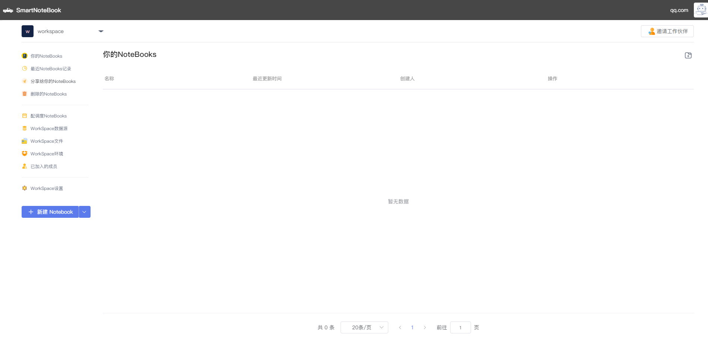
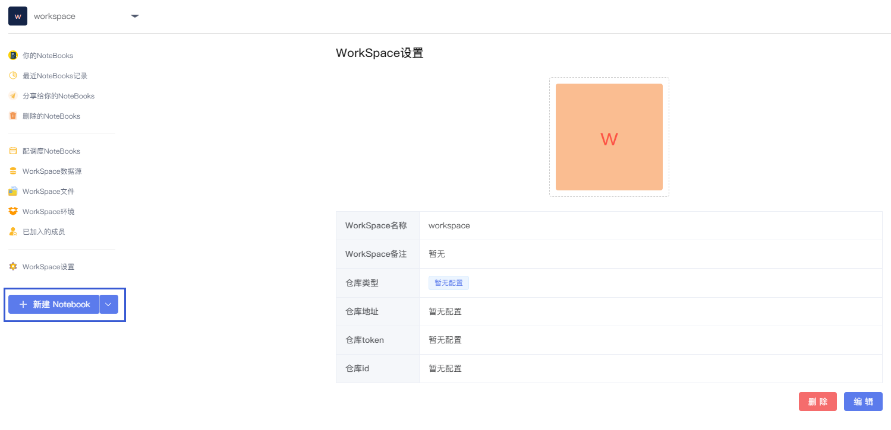
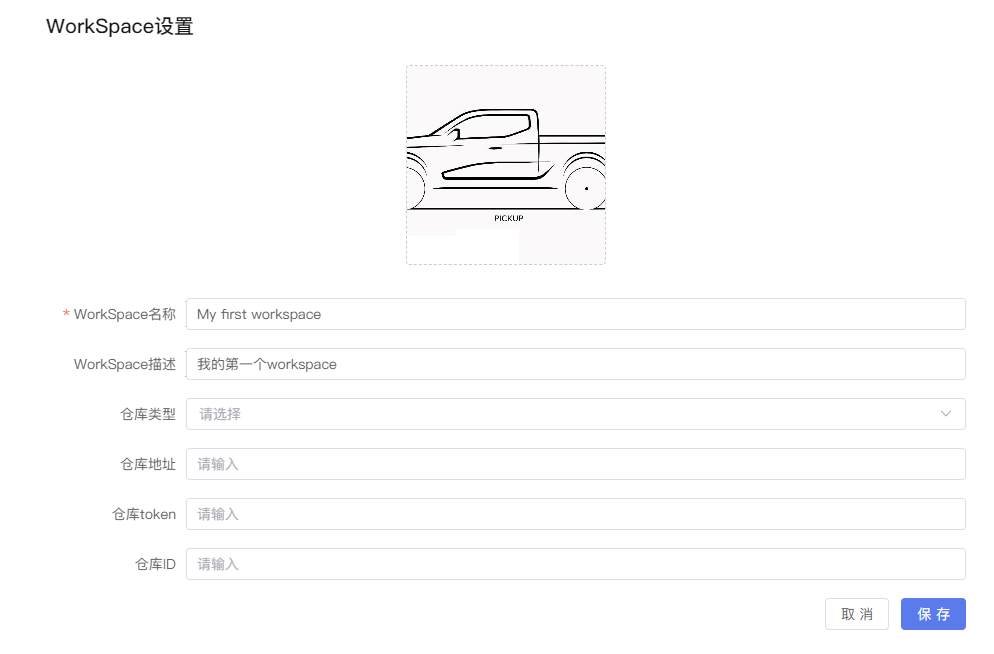
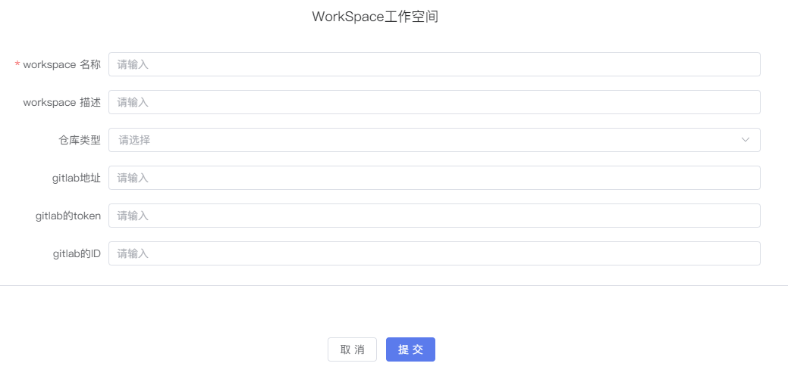

# 工作空间（Workspace）

`工作空间（workspace）`是一组用户在同一个组织下工作环境和各类资源要素的集合，如数据源的信息、文件的的上传和管理、运行环境配置等等。

## 编辑/新建/切换Workspace

账号申请成功并成功登录后，系统会自动分配一个默认的Workspace空间。

  

如需修改默认的Workspace名称，可点击`WorkSpace设置`-->`编辑`进行修改。

  

可修改Workspace的名称和描述，并上传喜欢的头像，点击`保存`。

  

如需创建一个新的Workspace，可以点击左上角Workspace处的下拉箭头，点击`新建`

  

然后输入新的Workspace的相关信息和配置，点击`提交`，一个新的Workspace就创建好了。

 

点击左上角的小三角可根据需求切换Workspace

  

## 你的NoteBooks

用来管理当前Workspace下你所有的NoteBooks文件。

### 修改NoteBooks名称

鼠标移动至文件名称区域，点击编辑图标对文件名称进行修改（也可进入NoteBook后在NoteBook的正上方修改名称）
  

### NoteBooks操作

- `新的窗口打开`：将选中的NoteBook在新的标签页打开
- `复制NoteBooks`：复制一个选中的NoteBook副本到当前目录下
- `导出.snb`：下载导出snb格式文件
- `导出.ipynb`：下载导出.ipynb文件
- `删除`：删除选中的NoteBook

  

### 新建文件夹

点击右上角的文件夹图标  可新建文件夹。

  

### 拖动NoteBooks

鼠标左键按住超过3秒，选中的NoteBook一行底色会发生变化，此时可以拖动NoteBook至文件夹，实现对NoteBooks文件和目录进行组织和管理。

  

## 最近NoteBooks记录

查看最近有操作的NoteBooks记录

## 分享给你的NoteBooks

查看其他成员分享给你的NoteBooks

## 删除的NoteBooks

查看被你删除的NoteBooks。如果误删，可在该模块下进行恢复。

## 服务API

管理已发布的API服务

## 调度器

SmartNoteBook为用户提供配置调度的功能，用户可以定期执行Notebook任务。详见<a href="./Schedule.md" title="调度器">Workspace调度器</a>

## 密保箱

SmartNoteBook为用户提供密码保护的功能，用户可以加密一些敏感信息，在使用时采用加密后的信息，防止信息泄露。详见<a href="./Encryption.md" title="密保箱">密保箱</a>

## WorkSpace数据源

SmartNoteBook为用户提供数据接入与管理功能，让用户可以简单高效的接入和管理数据集。详见<a href="./DataSource.md" title="数据源">数据源</a>

## WorkSpace文件

SmartNoteBook为用户提供文件的上传与管理功能，上传完成后可同步至notebook模型文件目录，在代码块中通过路径进行访问。详见<a href="./Files.md" title="文件">文件</a>

## WorkSpace环境

SmartNoteBook为用户提供`Workspace环境配置`功能，让用户可以根据不同的应用场景和需求去选择相应的环境配置和镜像类型。详见<a href="./Environment.md" title="环境">环境</a>

## 已加入的成员

SmartNoteBook为用户提供团队协作的功能，让用户可以邀请成员加入Workspace进行协同开发。详见<a href="./Groups.md" title="成员">成员</a>

## WorkSpace设置

可修改和设定Workspace的头像，`名称`,`备注`,`仓库类型`,`仓库地址`,`仓库token`,`仓库id`等信息。详见<a href="./Settings.md" title="设置">设置</a>