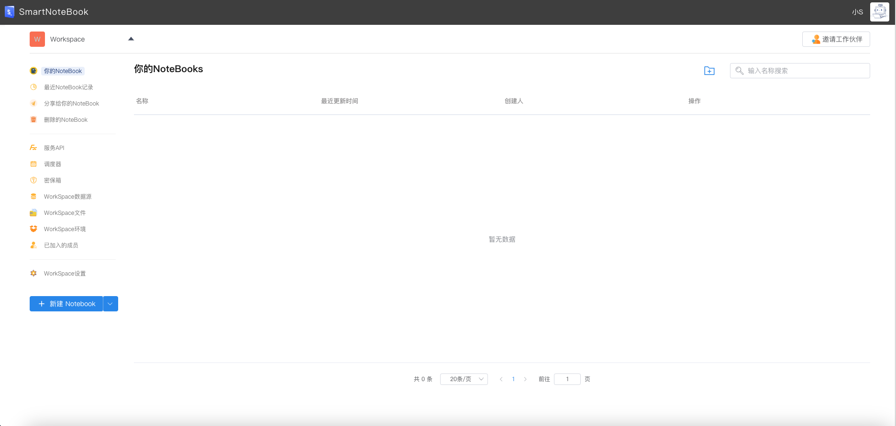
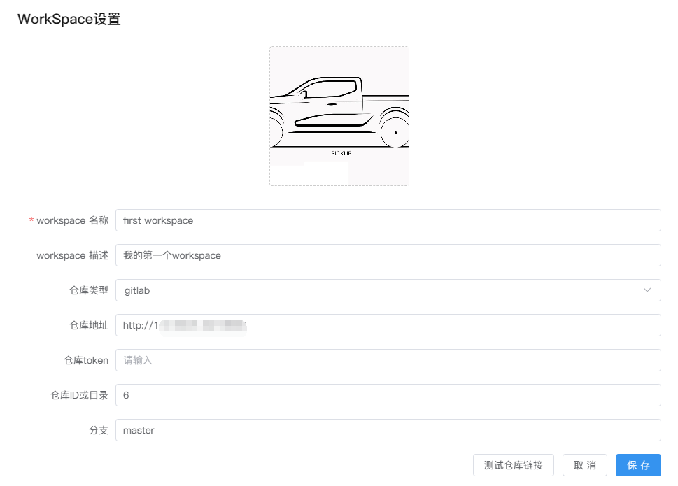
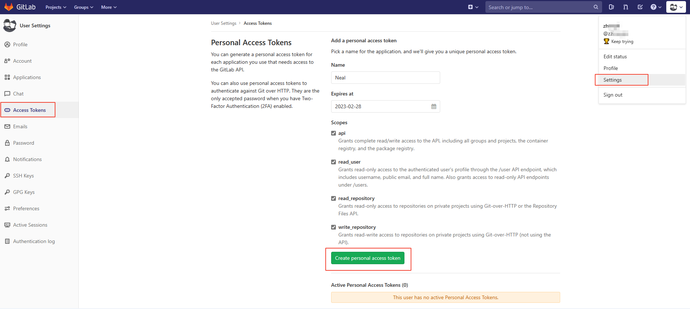
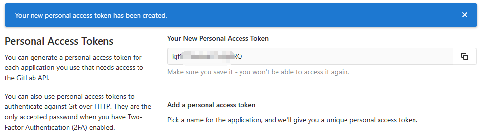
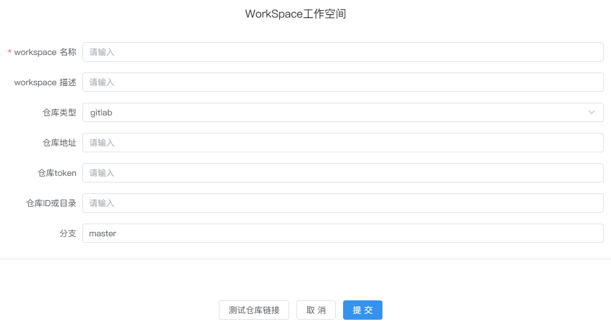
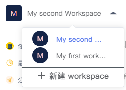
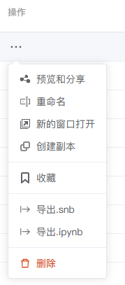
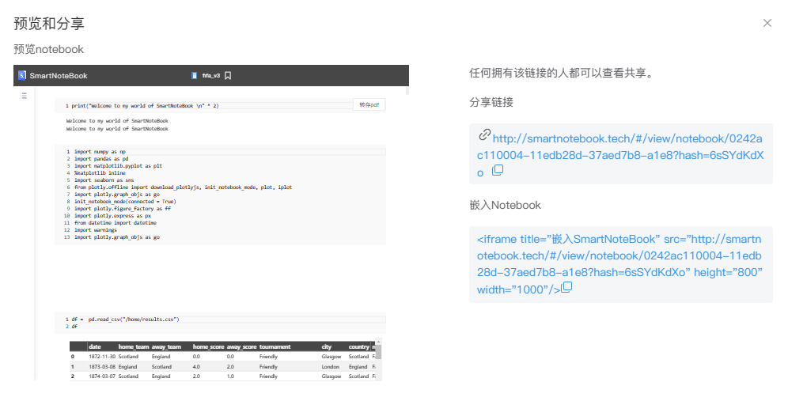

# 工作空间（Workspace）
---
`工作空间（workspace）`是SmartNoteBook的中央组织单位。

它是一组用户在同一个组织下工作环境和各类资源要素的集合，如NoteBook、数据服务、调度器和环境资源等。

  

 Workspace页面功能概览

| 功能 | 解释 | 
| :-----| :---- | 
| 你的NoteBook | Workspace下所有Notebook文档列表 | 
| 最近NoteBook记录 | 最近打开过的Notebook文档 | 
| 分享给你的NoteBook | 建设中 | 
| 删除的NoteBook | 已删除的Notebook文档 | 
| 服务API | 管理注册成功的API列表。详见<a href="./FassService.md" title="服务API">服务API</a> | 
| 调度器 | 设定调度器，定期执行Notebook。详见<a href="./Schedule.md" title="调度器">调度器</a> | 
| 密保箱 | 全局key-value配置并支持加密。详见<a href="./Encryption.md" title="密保箱">密保箱</a> | 
| WorkSpace数据源 | 管理数据源链接。详见<a href="./DataSource.md" title="数据源">WorkSpace数据源</a> | 
| WorkSpace文件 | 文件的上传与管理。详见<a href="./Files.md" title="文件">WorkSpace文件</a> | 
| WorkSpace环境 | 管理环境配置。详见<a href="./Environment.md" title="环境">WorkSpace环境</a> | 
| 已加入的成员 | Workspace下所有的成员管理。详见<a href="./Groups.md" title="成员">成员</a> | 
| WorkSpace设置 | WorkSpace信息配置。详见<a href="./Settings.md" title="设置">WorkSpace设置</a> | 

## 编辑/新建/切换Workspace

用户成功登录SmartNotebook后，会进入到系统默认分配的`Workspace`空间。

###  编辑当前Workspace信息

当前Workspace下点击左侧菜单栏`WorkSpace设置`-->`编辑`。

  

可修改Workspace的名称和描述，并上传喜欢的头像，点击`保存`。

| 功能 | 解释 | 
| :-----| :---- | 
| workspace 名称 | 必填 | 
| workspace 描述 | 选填 | 
| 仓库类型 | 选填， 目前支持的仓库类型：gitlab 和 github| 
| 仓库地址 | git仓库的url，如：`http://172.30.81.xxx:8000`| 
| 仓库token | git仓库的Access Token ，获取方式见下方的tips| 
| 仓库ID或目录 | git仓库的ID或目录 | 
| 分支 | git仓库分支 | 
| 测试仓库链接 | git仓库配置完成后，点击测试是否成功 |
| workspace 图标 | 单击上方的图标修改并上传新的图标 | 

> [!Tip]
> 如何获取gitlab的Access Token？

1. 登录gitlab，点击`Settings`-->`Access Tokens`，并按照页面填写信息和勾选权限后，点击下方的绿色按钮

      

2. Token创建成功，复制使用
      

### 创建新的Workspace

如需创建一个新的Workspace，可以点击左上角Workspace处的下拉箭头，点击`新建`

  

然后输入新的Workspace的相关信息和配置，点击`提交`，新的Workspace创建完成。

  

### 切换不同的Workspace

当用户拥有多个Workspace时（自己创建或加入别的Workspace），可点击左上小三角切换至需要的Workspace

  

## 你的NoteBooks

管理当前Workspace下所有的NoteBooks文档。

### 新建文件夹

点击右上角的文件夹图标 新建文件夹。文件夹帮助我们更好的组织和管理Notebook文档，便于归档和查找

  

### 修改文件夹/NoteBook名称

鼠标移至名称一栏，点击编辑图标对名称进行修改（修改NoteBook名称也可在进入Notebook文档后在页面上面修改）

  

### 拖动文件夹/NoteBook

鼠标左键在文件夹或Notebook文档上按住约3秒直到可以拖动，此时可以拖动文件或文件夹到其他文件夹，实现对NoteBook文件和目录的组织和管理。

  

### NoteBook的操作

点击Notebook文档操作一栏的`...`，可以看到以下操作命令：

  

| 操作 | 解释 | 
| :-----| :---- | 
| 预览和分享 | 预览文档部分内容，生成分享链接和嵌入链接 | 
| 重命名 | 重新修改Notebook文档名称 | 
| 新的窗口打开 |浏览器开启新的标签页打开此NoteBook文档| 
| 创建副本 | 在当前目录下创建文档副本| 
| 收藏 | 收藏文档后文档将显示收藏图标  并在列表中置顶显示| 
| 导出.snb | 导出snb格式文件（SmartNoteBook专用格式） | 
| 导出.ipynb | 导出.ipynb文件(兼容Jupyter Notebook) | 
| 删除 | 将文档放入`删除的Notebook` 列表|

- 预览和分享

显示Notebook的内容预览，查看和复制分享链接

复制iframe代码可将文档嵌入其他网页或Notebook的MarkDown单元格中

  

## 最近NoteBooks记录

快捷查看最近打开过的Notebook文档。

支持的操作有：

- 双击打开Notebook文档
- 新的窗口打开：浏览器开启新的标签页打开此NoteBook文档
- 导出.snb：导出snb格式文件（SmartNoteBook专用格式） | 
- 导出.ipynb：导出.ipynb文件(兼容Jupyter Notebook)

## 分享给你的NoteBooks

查看其他成员分享给你的NoteBooks（建设中）

## 删除的NoteBooks

查看删除过的NoteBooks

在操作下点击`恢复`可找回误删的Notebook文档
