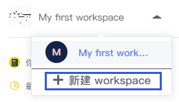

# WorkSpace（工作空间）
---

## 概述
<!-- 是什么 -->

WorkSpace（工作空间）是SNB的中央组织单位。它就像SNB的大管家，集合了团队成员在同一个组织内的各类资源要素，如NoteBook模型文件、数据资产、环境资源等等，帮助我们更好地组织和管理数据分析工作。

<!--    -->

  

<!-- 功能概览 -->

## 功能列表

| 功能 | 解释 | 
| :-----| :---- | 
| 您的NoteBooks | WorkSpace所有NoteBook模型文件列表 | 
| 最近的NoteBooks | —— | 
| 删除的NoteBooks | —— | 
| 数据源 | 数据源的连接与管理。详见<a href="./DataSource.md" title="数据源">数据源</a> | 
| 密保箱 | 配置key-value全局变量或加密敏感信息。详见<a href="./Encryption.md" title="密保箱">密保箱</a> | 
| WorkSpace文件 | 文件的上传与管理（上传到WorkSpace）。详见<a href="./Files.md" title="文件">WorkSpace文件</a> | 
| 环境 | NoteBook运行环境的配置与管理。详见<a href="./Environment.md" title="环境">环境</a> | 
| 调度器 | 用于设定并管理NoteBook模型文件的定期运行，查看运行结果。详见<a href="./Schedule.md" title="调度器">调度器</a> | 
| 服务API | 用于管理已注册的服务API、测试与使用服务API。详见<a href="./FassService.md" title="服务API">服务API</a> | 
| 报告和看板 | 查看并管理已创建的数据报告与看板。详见<a href="./Dashboard.md" title="报告和看板">报告和看板</a> | 
| WorkSpace成员 | 成员管理。详见<a href="./Groups.md" title="成员">成员</a> | 
| WorkSpace设置 | 管理WorkSpace的相关配置。详见<a href="./Settings.md" title="设置">WorkSpace设置</a> | 

<!-- 操作类型 -->

## 相关操作

用户成功登录SNB后，会进入到系统默认的`WorkSpace`工作空间。

###  修改Workspace信息

点击`WorkSpace设置`，进入WorkSpace的设置界面，然后点击`编辑`按钮。

<!--    -->
  

在这里您可以修改您自己的WorkSpace名称与描述，配置代码仓库（配置方式详见<a href="./Settings.md/#git" title="Workspace设置">WorkSpace设置</a> ），并上传您喜欢的头像。一切配置完成后记得点击`保存`。

| 功能 | 解释 | 
| :-----| :---- | 
| WorkSpace 名称 | 名称，必填项 | 
| WorkSpace 描述 | 描述，选填项 | 
| 仓库类型 | 选填配置， 目前支持的仓库类型：gitlab 和 github| 
| 仓库地址 | 配置git仓库的url，格式如：`http://172.30.81.xxx:8000`| 
| 仓库token | 配置git仓库的Access Token | 
| 仓库ID或目录 | 配置git仓库的ID或目录 | 
| 分支 | 配置git仓库的分支 | 
| 头像 | 单击上方`＋`上传新的头像 | 
| 测试仓库链接（按钮） | git仓库配置完成后，点击测试是否成功 |

### 创建新的WorkSpace

单击左上角WorkSpace的下拉箭头，点击`新建WorkSpace`

<!--    -->

  

然后输入新的WorkSpace的相关信息和配置，点击`提交`，新的WorkSpace创建完成。

  

### 切换WorkSpace

当用户拥有或加入了多个WorkSpace时，如需切换，可点击左上小三角切换至需要的WorkSpace。

  

## 你的NoteBooks

管理当前WorkSpace下所有的NoteBook模型文件。

### 新建文件夹

点击右上角的文件夹图标 新建文件夹。文件夹帮助我们更好的组织和管理NoteBook文档，便于归档和查找

  

### 修改文件夹/NoteBook名称

鼠标移至名称一栏，点击编辑图标对名称进行修改（修改NoteBook名称也可在进入NoteBook文档后在页面上面修改）

  

### 拖动文件夹/NoteBook

鼠标左键在文件夹或NoteBook文档上按住约3秒直到可以拖动，此时可以拖动文件或文件夹到其他文件夹，实现对NoteBook文件和目录的组织和管理。

  

### NoteBook的操作

点击NoteBook文档操作一栏的`...`，可以看到以下操作命令：

  

| 操作 | 解释 | 
| :-----| :---- | 
| 预览和分享 | 预览文档部分内容，生成分享链接和嵌入链接 | 
| 重命名 | 重新修改NoteBook文档名称 | 
| 新的窗口打开 |浏览器开启新的标签页打开此NoteBook文档| 
| 创建副本 | 在当前目录下创建文档副本| 
| 收藏 | 收藏文档后文档将显示收藏图标  并在列表中置顶显示| 
| 导出.snb | 导出snb格式文件（SmartNoteBook专用格式） | 
| 导出.ipynb | 导出.ipynb文件(兼容Jupyter NoteBook) | 
| 删除 | 将文档放入`删除的NoteBook` 列表|

- 预览和分享

显示NoteBook的内容预览，查看和复制分享链接

复制iframe代码可将文档嵌入其他网页或NoteBook的MarkDown单元格中

  

## 最近NoteBooks记录

快捷查看最近打开过的NoteBook文档。

支持的操作有：

- 双击打开NoteBook文档
- 新的窗口打开：浏览器开启新的标签页打开此NoteBook文档
- 导出.snb：导出snb格式文件（SmartNoteBook专用格式） | 
- 导出.ipynb：导出.ipynb文件(兼容Jupyter NoteBook)

<!-- ## 分享给你的NoteBooks

查看其他成员分享给你的NoteBooks（建设中） -->

## 删除的NoteBooks

查看删除过的NoteBooks

在操作下点击`恢复`可找回误删的NoteBook文档
