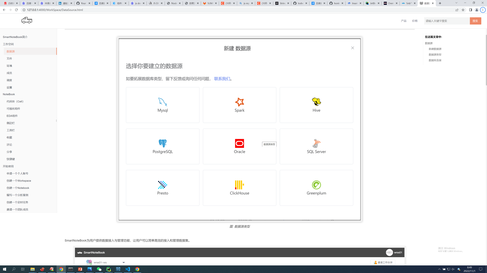
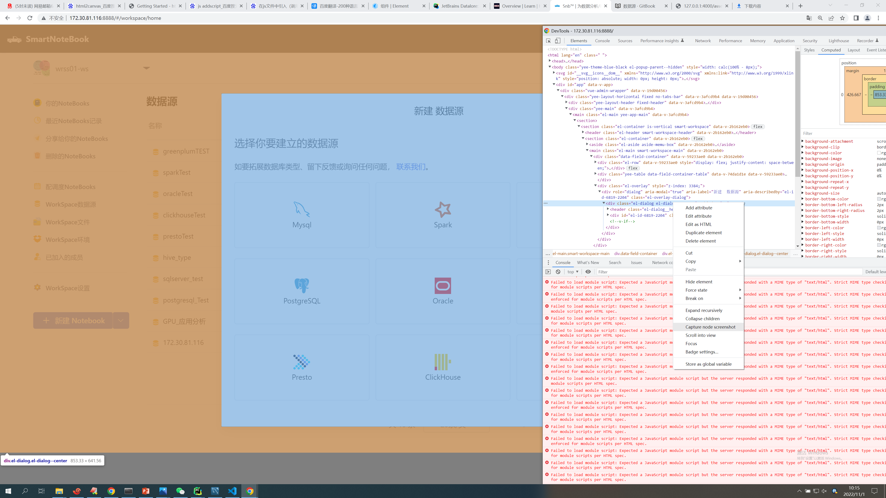

##  
gitbook.cmd install
npm run serve

## 关于图片增加图标题题(fig caption)和style


- 引入插件image-captions  ，参见book.json

- 修改 插件的index.js 代码
  - ode_modules\gitbook-plugin-image-captions\src\index.js
  - 76 行 function setImageCaption ($, img, data)  函数内添加下面代码

```js

var alt_split = data.alt.split("style=")
  if ( alt_split.length>1 ){
    data.alt=alt_split[0];
    img.attr('alt',alt_split[0]);
    img.attr('style',alt_split[1].replace(/"/g,''));
  }

```

- markdown img 的格式说明
  -  alt 添加style 样式  [支持的数据源类型 style="width: 70%;height: 70%;"]
  -  添加title 标题
-  样例
   -  
```

```

### img 标签后不能有空格


  


## 关于局部截图 
- 局部截图使用chrome dev tools: capture node screenshot
  - F12 打开dev tools
  - 选定元素 ，右键菜单：capture node screenshot


  


## 注意提醒(alert、note、tips、attention、warning)
https://github.com/fzankl/gitbook-plugin-flexible-alerts

> [!NOTE]
> An alert of type 'note' using global style 'callout'.


## sdd

> [!NOTE|style:flat]
> An alert of type 'note' using alert specific style 'flat' which overrides global style 'callout'.